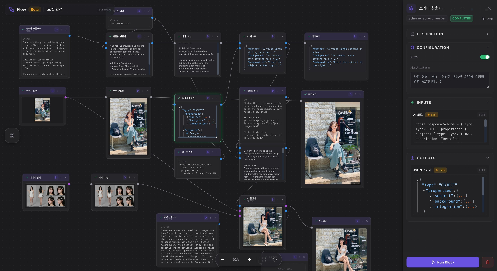
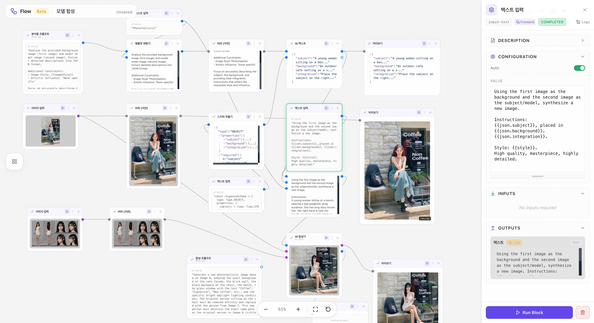
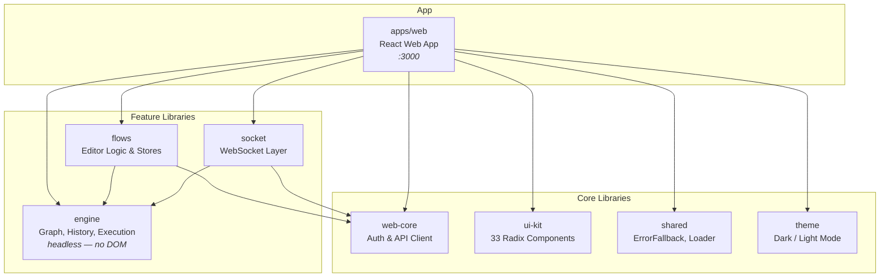

<p align="center">
  
</p>

<h1 align="center">Eureka Flow</h1>

<p align="center">
  <strong>Visual Workflow Editor for Building Data Flow Pipelines</strong>
</p>

<p align="center">
  
  
  
  
  
</p>

<p align="center">
  <a href="https://flow.eureka.codes"><strong>Live Demo</strong></a> &middot;
  <a href="#key-features">Features</a> &middot;
  <a href="#screenshots">Screenshots</a> &middot;
  <a href="#getting-started">Getting Started</a> &middot;
  <a href="#architecture">Architecture</a> &middot;
  <a href="#contributing">Contributing</a>
</p>

---

## Overview

**Eureka Flow** is a powerful, browser-based visual workflow editor for creating and executing data processing pipelines. Build complex workflows by connecting pre-built blocks, execute them in real-time, and monitor execution status through WebSocket-based live updates.

> [!TIP]
> **Try it now** — Visit **[flow.eureka.codes](https://flow.eureka.codes)** to start building workflows instantly.
> Get your API key from [Eureka Codes Console](https://console.eureka.codes) with just one click.

<details>
<summary><strong>Table of Contents</strong></summary>

- [Overview](#overview)
- [Key Features](#key-features)
- [Screenshots](#screenshots)
- [Tech Stack](#tech-stack)
- [Architecture](#architecture)
- [Getting Started](#getting-started)
- [Development](#development)
- [Building & Deployment](#building--deployment)
- [Code Style](#code-style)
- [Contributing](#contributing)
- [Related Projects](#related-projects)
- [License](#license)

</details>

## Key Features

- **Drag-and-drop editor** — Node placement on an infinite canvas with pan, zoom, and multi-select
- **100+ pre-built blocks** — Organized by category (input, process, output) with configurable parameters
- **Dual execution modes** — Frontend blocks for instant feedback, backend blocks for heavy computation
- **Real-time updates** — WebSocket integration for live node execution status tracking
- **Bezier curve connections** — Port-based typed connections between nodes
- **Undo/Redo** — Full history management with auto-layout algorithm
- **Touch gesture support** — Tablet and mobile device compatibility
- **Dark/Light theme** — System preference detection with manual toggle
- **i18n** — English & Korean language support
- **Auto-save** — Configurable toggle with LocalStorage session continuity
- **One-click API key** — Secure postMessage-based key transfer from [Eureka Codes Console](https://console.eureka.codes)

## Screenshots

<table>
<tr>
<td align="center"><strong>Dark Mode</strong></td>
<td align="center"><strong>Light Mode</strong></td>
</tr>
<tr>
<td></td>
<td></td>
</tr>
</table>

## Tech Stack

| Category      | Technology                           |
| ------------- | ------------------------------------ |
| **Framework** | React 19                             |
| **Language**  | TypeScript 5.9 (strict mode)         |
| **Build**     | Vite 7, Nx 22                        |
| **Styling**   | Tailwind CSS 3, Radix UI (shadcn/ui) |
| **State**     | Zustand 5, TanStack Query 5          |
| **Real-time** | WebSocket with self-echo prevention  |
| **Testing**   | Vitest                               |

## Architecture



`engine` has **no runtime dependencies** — no React, no store, no DOM (its only outside
imports are `import type` from the API package, erased at compile). The `lib: ["ES2022"]`
target is what enforces that, and it is why the same code runs under plain Node.

It is also the one library published outside this repo, as
**[`@lemoncloud/flow-engine`](https://www.npmjs.com/package/@lemoncloud/flow-engine)** —
ESM and CommonJS builds from one source. Inside the repo it stays `@flows/engine`
(the path alias, resolved to source); the two names are the same code.

### Project Structure

```
eureka-flow/
├── apps/
│   └── web/                    # React web application
├── libs/
│   ├── engine/                 # Headless flow engine — owns the graph, runs under plain Node
│   ├── flows/                  # Flow editor core (API, hooks, stores, types)
│   ├── socket/                 # WebSocket layer for real-time updates
│   ├── web-core/               # HTTP client, auth state, error handling
│   ├── ui-kit/                 # 33 shadcn/ui components (Radix UI)
│   ├── shared/                 # Common components (ErrorFallback, ApiKeyDialog)
│   └── theme/                  # Dark/light theme provider
├── scripts/                    # Build and deployment scripts
└── .github/                    # CI/CD workflows
```

### State Management

The graph is **not** in a store. It lives in the engine document (`createFlowEngine`,
`@flows/engine`), and `useEngineMirror` pushes it into `useCanvasStore` one way.

> **Write to the engine, read from the store.** Nothing reads the store and writes it back,
> so the two cannot disagree. See [`docs/engine/GUIDE.md`](docs/engine/GUIDE.md).

Four Zustand stores manage the rest:

| Store               | Purpose                                                        |
| ------------------- | -------------------------------------------------------------- |
| `useCanvasStore`    | Projection of the engine's graph, plus viewport/selection/drag |
| `useFlowsStore`     | Flow metadata: blockRegistry, flowName, saveStatus, baseline   |
| `useWebSocketStore` | WebSocket: connectionStatus, subscribers                       |
| `useWebCoreStore`   | Auth: apiKey, isAuthenticated, profile                         |

### Data Flow

```
FlowEditorPage (orchestrator)
├── engine = createFlowEngine(...)   ← owns the graph
├── useFlows hook (flow CRUD operations)
├── useBlocks hook (block registry loading)
├── useInitFlowSocket hook (WebSocket callbacks)
│
├── Header (file operations, save status)
├── Sidebar (block library by category)
├── WorkflowCanvas (imperative canvas ref)
│   ├── useEngineMirror(engine) → useCanvasStore   ← one way
│   ├── NodeBlock (status: IDLE → READY → RUNNING → COMPLETED/ERROR)
│   └── ConnectionLine (SVG bezier curves)
└── DetailPanel (selected node configuration)
```

A run is not an edit: `engine.applyRuntime` lands outside history and `toSnapshot` drops it,
so running a node leaves nothing for the next save to send.

### Node Execution

| Mode         | Description           | Flow                                                  |
| ------------ | --------------------- | ----------------------------------------------------- |
| **Frontend** | Executes in browser   | `EXECUTE_FUNCTIONS[type]` → `runNode(id, { output })` |
| **Backend**  | Server-side execution | `runNode(id)` → WebSocket notification → UI refresh   |

### Path Aliases

```typescript
@flows/engine     // libs/engine/src/index.ts
@flows/flows      // libs/flows/src/index.ts
@flows/socket     // libs/socket/src/index.ts
@flows/web-core   // libs/web-core/src/index.ts
@flows/ui-kit     // libs/ui-kit/src/index.ts
@flows/shared     // libs/shared/src/index.ts
@flows/theme      // libs/theme/src/index.ts
@flows/lib/utils  // libs/ui-kit/src/utils/index.ts
```

## Getting Started

### Prerequisites

| Tool        | Version  | Notes                                |
| ----------- | -------- | ------------------------------------ |
| **Node.js** | v22.15.1 | Use `nvm use` — `.nvmrc` is included |
| **Yarn**    | 1.22+    | Classic Yarn                         |

### Installation

```bash
# Clone the repository
git clone https://github.com/lemoncloud-io/eureka-flow.git
cd eureka-flow

# Use the correct Node version
nvm use

# Install dependencies
yarn install

# Copy environment template
cp .env.example .env.local

# Start development server
yarn web:start
```

The app will be available at `http://localhost:3000`.

### Using the Live Service

1. Visit **[flow.eureka.codes](https://flow.eureka.codes)**
2. Click "Create New Key" to open the [Eureka Codes Console](https://console.eureka.codes)
3. Sign in and generate your API key
4. The key is automatically transferred back to Eureka Flow
5. Start building your workflows!

## Development

```bash
# Development
yarn web:start              # Start dev server on port 3000
yarn lint                   # Run ESLint
yarn lint:fix               # Run ESLint with auto-fix
yarn prettier               # Format code with Prettier

# Testing
yarn web:test               # Run tests
npx nx test flow-engine     # Headless engine specs (no DOM)
yarn engine:demo            # load → add → undo → redo → save → run, in Node, no browser

# Utilities
yarn clean:cache            # Clear build caches
yarn graph                  # View Nx dependency graph
```

> [!TIP]
> Run `yarn graph` to visualize the dependency graph of all libraries.

## Building & Deployment

### Build

```bash
yarn web:build              # Build web application
yarn web:build:dev          # Build for development environment
yarn web:build:prod         # Build for production environment
```

### Deploy

Deployment uses AWS S3 + CloudFront:

```bash
yarn web:deploy:dev         # Deploy to DEV
yarn web:deploy:prod        # Deploy to PROD
```

> [!WARNING]
> Local deployment requires `.env.deploy` configuration. Copy from `.env.deploy.example` and fill in your AWS settings.

<details>
<summary><strong>Environment Variables</strong></summary>

**App configuration** (`apps/web/.env.*`):

| Variable           | Description                              |
| ------------------ | ---------------------------------------- |
| `VITE_ENV`         | Environment identifier (`DEV` or `PROD`) |
| `VITE_PROJECT`     | Project name (`FLOWS`)                   |
| `VITE_API_URL`     | API endpoint URL                         |
| `VITE_WS_ENDPOINT` | WebSocket endpoint URL                   |
| `VITE_CODES_URL`   | Eureka Codes console URL                 |

**AWS deployment** (`.env.deploy`):

| Variable                  | Description                         |
| ------------------------- | ----------------------------------- |
| `AWS_PROFILE_NAME`        | AWS CLI profile name                |
| `BUCKET_NAME`             | S3 bucket name for deployment       |
| `DEV_CF_DISTRIBUTION_ID`  | CloudFront distribution ID for DEV  |
| `PROD_CF_DISTRIBUTION_ID` | CloudFront distribution ID for PROD |

</details>

### CI/CD

GitHub Actions workflows are configured for automated deployment:

| Workflow           | Trigger           | Description                                   |
| ------------------ | ----------------- | --------------------------------------------- |
| `deploy-dev.yml`   | Push to `develop` | Build & deploy to DEV                         |
| `deploy-prod.yml`  | Push to `main`    | Build, deploy to PROD & create GitHub release |
| `force-deploy.yml` | Manual dispatch   | Force deploy on demand                        |

<details>
<summary><strong>Required GitHub Secrets</strong></summary>

| Secret                    | Description            |
| ------------------------- | ---------------------- |
| `AWS_ACCESS_KEY_ID`       | AWS access key         |
| `AWS_SECRET_ACCESS_KEY`   | AWS secret key         |
| `AWS_DEFAULT_REGION`      | AWS region             |
| `BUCKET_NAME`             | S3 bucket name         |
| `DEV_CF_DISTRIBUTION_ID`  | CloudFront ID for DEV  |
| `PROD_CF_DISTRIBUTION_ID` | CloudFront ID for PROD |
| `VITE_DEV_API_URL`        | DEV API URL            |
| `VITE_DEV_WS_ENDPOINT`    | DEV WebSocket URL      |
| `VITE_DEV_CODES_URL`      | DEV Eureka Codes URL   |
| `VITE_PROD_API_URL`       | PROD API URL           |
| `VITE_PROD_WS_ENDPOINT`   | PROD WebSocket URL     |
| `VITE_PROD_CODES_URL`     | PROD Eureka Codes URL  |

</details>

<details>
<summary><strong>API Key Flow</strong></summary>

```
┌─────────────────────┐     postMessage      ┌──────────────────────┐
│    Eureka Flow      │ <──────────────────> │   Eureka Codes       │
│ (flow.eureka.codes) │      (API Key)       │(console.eureka.codes)│
└─────────────────────┘                       └──────────────────────┘
         │                                              │
         │ 1. Click "Create New Key"                    │
         │ ────────────────────────────────────────────>│
         │                                              │
         │                          2. User signs in    │
         │                             & creates key    │
         │                                              │
         │ 3. API key sent via postMessage              │
         │ <────────────────────────────────────────────│
         │                                              │
         │ 4. State validation for security             │
         │                                              │
         ▼
   Key stored locally
   Ready to use!
```

</details>

## Code Style

- **Named exports only** (no default exports)
- **Arrow functions**: `const fn = (): Type => {}`
- **4-space indentation**, single quotes, ES5 trailing commas
- **TypeScript strict mode** enabled
- **ESLint** enforces import ordering (React → `@flows/*` → relative → types)

## Contributing

1. Fork the repository
2. Create your feature branch (`git checkout -b feature/amazing-feature`)
3. Commit your changes using [Conventional Commits](https://www.conventionalcommits.org/) (`git commit -m 'feat: add amazing feature'`)
4. Push to the branch (`git push origin feature/amazing-feature`)
5. Open a Pull Request

## License

This project is licensed under the Apache License 2.0. See the [LICENSE](LICENSE) file for details.

---

## Related Projects

- **[Eureka Codes](https://console.eureka.codes)** — API key management and developer console
- **[Eureka Flows API](https://www.npmjs.com/package/@lemoncloud/eureka-flows-api)** — TypeScript types for the Flows API

---

<p align="center">
  Made with 💜 by <a href="https://github.com/lemoncloud-io">LemonCloud</a>
</p>

<p align="center">
  <a href="https://lemoncloud.io">Website</a> &middot;
  <a href="https://github.com/lemoncloud-io">GitHub</a>
</p>
