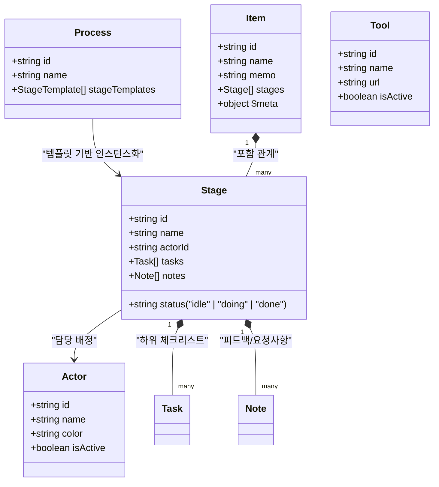

# 📋 'process' 피처 개발 가이드 및 구조 정리

본 문서는 `apps/web/src/app/features/process` 폴더를 중심으로 개발을 원활하게 시작하고 확장하기 위한 디렉터리, 컴포넌트, 상태 모델, API 및 개발 추천 로드맵 가이드입니다.

---

## 🎯 1. 'process' 피처 도메인 개요

`process` 피처는 **칸반 스타일의 워크플로우 오케스트레이터 및 항목 관리자**입니다.
사용자는 이곳에서 프로세스 템플릿을 정의하고, 이를 실제 비즈니스 항목(Item)으로 구체화한 뒤, 각 단계(Stage)와 태스크(Task)를 수행해 나갑니다.

### 🔄 핵심 도메인 개념 (Core Concept)



---

## 📂 2. 디렉터리 구조 분석

`apps/web/src/app/features/process`는 매우 깨끗한 레이어 아키텍처로 모듈화되어 있습니다.

```
process/
├── components/                 # 피처 전용 UI 컴포넌트 (32개 파일)
├── consts/                     # 내비게이션 및 단계 상태 관련 상수
│   ├── index.ts
│   ├── nav-items.ts            # 좌측 사이드바 구조 및 아이콘 바인딩
│   └── stage-status.ts
├── hooks/                      # 컴포넌트 편의용 로컬 React 훅
│   ├── index.ts
│   ├── useCurrentActor.ts      # 현재 로그인/선택된 액터 상태 관리
│   ├── useFlowExecution.ts     # 프론트엔드 노드 및 백엔드 파이프라인 연동 실행
│   ├── useToolUrl.ts           # 연동 도구 URL 파싱 및 주입
│   └── useTrySample.ts         # 체험용 샘플 데이터 자동 로딩
├── pages/                      # 각 라우트별 메인 페이지 컴포넌트
│   ├── ActorManagerPage.tsx    # 담당 액터(Agent/Persona) 관리 대시보드
│   ├── DashboardPage.tsx       # 전체 진행 통계 및 액션 필요 항목 현황판
│   ├── ItemBoardPage.tsx       # 전체 진행 항목 목록 및 다음 액션 추천 카드
│   ├── ItemDetailPage.tsx      # 단계 카드, 상세 태스크 및 노트 상세 실행 뷰
│   ├── ProcessEditorPage.tsx   # 프로세스 템플릿 단계 및 선행 단계 편집기
│   ├── ProcessListPage.tsx     # 프로세스 템플릿 목록 조회 및 신규 인스턴스 생성
│   ├── ToolManagerPage.tsx     # 각 단계에서 사용할 인티그레이션 도구(Tool) 관리
│   └── index.ts
└── index.ts                    # 피처 외부로 내보내는 통합 Entry Point
```

---

## 💻 3. 핵심 페이지(Pages) 역할 및 상세 설명

### 🔗 3.1. [DashboardPage.tsx](./pages/DashboardPage.tsx)

- **역할**: 워크플로우 진행 상황과 팀의 부하를 모니터링하는 첫 화면.
- **주요 기능**:
    - **액터 필터 필즈([ActorFilterPills.tsx](./components/ActorFilterPills.tsx))**: 특정 액터로 필터링하여 상태값 계산.
    - **통계 카드**: 전체, 진행 중(Doing), 완료(Done), 미결 요청 사항(Requests)의 정량화된 숫자 표시.
    - **다음 필요 조치 리스트([NextActionRow](./pages/DashboardPage.tsx#L193))**: 진행 완료되지 않은 항목 중 즉시 행동이 필요한 태스크들을 모아 클릭 시 상세 화면으로 라우팅.
    - **팀 워크로드 보드**: 액터별 배정된 활성 태스크 수 시각화.

### 🔗 3.2. [ItemBoardPage.tsx](./pages/ItemBoardPage.tsx)

- **역할**: 생성된 항목(Item)들을 카드 형태로 추적하는 메인 워크 보드.
- **주요 기능**:
    - **히어로 추천 액션([HeroAction](./pages/ItemBoardPage.tsx#L25))**: 현재 담당자에게 배정된 가장 우선순위가 높은 단일 가이드를 최상단에 카드 형태로 크게 부각하여 빠른 실행을 도모.
    - **신규 항목 생성([NewItemDialog.tsx](./components/NewItemDialog.tsx))**: 등록된 프로세스 템플릿을 골라 즉시 실재 워크아이템으로 생성 및 실행.

### 🔗 3.3. [ItemDetailPage.tsx](./pages/ItemDetailPage.tsx)

- **역할**: 가장 정밀한 상호작용이 발생하는 메인 액션 플레이스.
- **주요 기능**:
    - **상태 바**: 전체 진행도(Progress) 및 개별 단계의 현황 가시화.
    - **단계 카드 리스트([StageCard.tsx](./components/StageCard.tsx))**: 아코디언 타입으로 전체 단계를 정렬하고, 선행 단계 관계를 트래킹.
    - **상세 사이드 패널([StageDetailPanel.tsx](./components/StageDetailPanel.tsx))**:
        - 특정 단계 카드 클릭 시 열리는 우측 드로어(Drawer).
        - 하위 체크 태스크 리스트(`TaskList`) 관리 및 토글.
        - 코멘트/QA 요청 사항 피드백(`NoteForm`, `NoteList`)을 남기고 **Resolve/Reopen** 처리 가능.
        - 해당 단계에 연동된 **자동화 도구/API 호출([ToolAction.tsx](./components/ToolAction.tsx))** 트리거.

### 🔗 3.4. [ProcessEditorPage.tsx](./pages/ProcessEditorPage.tsx) & [ProcessListPage.tsx](./pages/ProcessListPage.tsx)

- **역할**: 단계적 흐름 자체를 구성하는 템플릿 에디터 계층.
- **주요 기능**:
    - 단계의 순서, 이름, 담당 액터(`actorId`), 필수 활용 도구(`toolId`), 그리고 선행하여 완료되어야 하는 상위 단계(`dependencyStageIds`)를 직관적으로 설계 및 검증.

---

## 🔌 4. API 클라이언트 및 상태 통신 계층

이 피처는 글로벌 모노레포 라이브러리인 [`libs/flows`](../libs/flows) 내부의 프로세스 엔진과 긴밀히 통신합니다.

### 4.1. 서버 상태 관리 (React Query Hooks)

다음과 같은 훅들이 라이브러리 인터페이스(`@flows/flows`)에서 제공됩니다:

- **프로세스(Templates)**: `useProcesses()`, `useProcess(id)`, `useApplyProcessMutation()` (템플릿으로 아이템 생성)
- **항목(Items)**: `useItems()`, `useItem(id)`, `useCreateItemMutation()`, `useUpdateItemMutation()`
- **단계 및 태스크**: `useChangeStageStatusMutation()`, `useAddNoteMutation()`, `useResolveNoteMutation()`, `useChangeTaskStatusMutation()`
- **액터 및 도구**: `useActors()`, `useTools()`

### 4.2. 모의 서버 데이터 (Mock Data Layer)

백엔드 연동이 미비하거나 프론트엔드 단독 테스트가 필요한 경우, 시스템은 [mockApi.ts](../libs/flows/src/api/process/mockApi.ts)와 [mockData.ts](../libs/flows/src/api/process/mockData.ts)로 연결되는 프록시를 통해 매끄럽게 모킹 데이터를 반환합니다.

---

## 🛠️ 5. 개발 시작을 위한 추천 로드맵 (Roadmap)

`process` 피처 개발에 착수하실 때, 아래 순서로 영역을 점진적으로 다루는 것을 강력하게 권장합니다:

1.  **로컬 서버 실행**:

    ```bash
    yarn web:start
    ```

    - 브라우저에서 `http://localhost:3000/dashboard` 및 `http://localhost:3000/items`로 접근하여 현 레이아웃을 둘러보세요.

2.  **새로운 체크리스트/태스크 필드 기능 개발**:
    - 단계를 구성하는 태스크 구조에 추가적인 특성(예: 마감기한, 중요도 등)을 더하려면 `libs/flows/src/types/process/task.ts`에 타입을 추가한 후, [TaskList.tsx](./components/TaskList.tsx) 및 [StageDetailPanel.tsx](./components/StageDetailPanel.tsx)를 수정하세요.
3.  **단계 간 오토 레이아웃 및 자동 진행 흐름 개선**:
    - 선행 단계 완료 시 다음 단계를 자동으로 `"doing"` 상태로 전이시키는 제어는 [useStageQueries.ts](../libs/flows/src/hooks/process/useStageQueries.ts) 내부의 비즈니스 로직에 포함되어 있습니다. 이 전이 방식을 튜닝하여 비즈니스 효율을 극대화해 보세요.

---

## 🌟 6. 프로세스 네비게이터 고급 기능 명세 (Premium Features)

프로세스 네비게이터 모듈에 고도화되어 적용된 핵심 고급 기능 및 구현 디테일 가이드입니다.

### 🖼️ 6.1. 고성능 1:1 이미지 업로드 및 최대 512px 리사이징 엔진 (`image.ts`)

- **구현 파일**: [image.ts](../apps/web/src/app/features/process/utils/image.ts)
- **동작 방식**:
    1.  **정사각형(1:1) 센터 크롭**: 사용자가 첨부, 드래그 앤 드롭 또는 클립보드로 붙여 넣은 이미지 파일의 가로/세로 중 작은 길이를 기준으로 중앙을 잘라내어 정사각형 형태로 자동 보정합니다.
    2.  **최대 512px 축소/확장**: 고화질 원본 이미지의 크기를 가로/세로 최대 `512px` 크기로 다운사이징 또는 스케일 업하여 리소스를 가볍게 유지합니다.
    3.  **고품질 압축 및 Base64 반환**: HTML5 Canvas의 2D 렌더링 컨텍스트(`imageSmoothingQuality = 'high'`)를 이용해 고품질 크롭 후 `image/jpeg` 포맷(품질 90%)의 Data URL로 저장해 데이터 크기를 획기적으로 줄입니다.
- **클립보드 및 드래그 앤 드롭 연동**:
    - **복사(Copy)**: "썸네일 복사" 클릭 시 브라우저 버전에 따라 바이너리 `ClipboardItem`을 직접 클립보드에 쓰거나(Figma, Slack 등 디자인 협업 도구에 즉시 붙여넣기 가능) 텍스트 Data URL로 Fallback 처리해 범용적인 복사 편의성을 제공합니다.
    - **붙여넣기(Paste)**: 상세 아바타 및 신규 생성 카드 드롭존 영역 어디서나 `Ctrl+V` (또는 `Cmd+V`) 및 이미지 드래그 드롭을 감지해 프로세스 엔진에 즉시 파이프라인하여 리사이징 처리합니다.

### 📊 6.2. 고성능 Ellipsis 페이지네이션 및 캐시 스캐닝 동기화

- **구현 컴포넌트**: [ItemBoardPage.tsx](../apps/web/src/app/features/process/pages/ItemBoardPage.tsx)
- **페이지네이션 UI**:
    - 중간 범위 페이지(`page - 1`, `page`, `page + 1`)와 경계값(`1` 및 `totalPages`)을 유기적으로 배치하고, 생략 영역을 `...` (Ellipsis) 블록으로 수려하게 렌더링하는 명품 인터랙티브 페이지네이션 바를 제공합니다.
- **낙관적 캐시 스캐닝 (Optimistic Scan)**:
    - 새 아이템의 등록, 삭제, 또는 이름 변경 시 단순히 활성 페이지의 쿼리만 무효화하는 것이 아닙니다. `qc.getQueryCache().findAll()` 스캐너를 통해 활성화된 모든 필터링/정렬 기준의 아이템 목록 쿼리 세트를 실시간으로 스캔하고 즉각 캐시를 동기화하여 화면 전환 시의 딜레이가 전혀 존재하지 않도록 보장합니다.

### 👤 6.3. 전역 'Set as me' (나로 지정) 상태 및 다국어 콘솔 에러 클리어

- **구현 훅**: [useCurrentActor.ts](../apps/web/src/app/features/process/hooks/useCurrentActor.ts)
- **동작 명세**:
    - 사용자가 담당자 목록에서 특정 담당 카드의 "나로 지정(Set as me)"을 활성화하면 Zustand 전역 스토어인 `useCurrentActorStore`에 배정되어 `localStorage`에 영속 보존됩니다.
    - 나로 지정된 담당자 카드는 시각적으로 `Current` 배지와 부드러운 하이라이트 효과가 부여되며, 상단 공통 네비게이션 헤더의 드롭다운 영역과 항상 실시간 싱크됩니다.
    - 노트 작성 및 태스크 추가 시 나로 지정된 사용자의 ID가 기본 작성자(`actorId`) 속성에 자동으로 연동 탑재됩니다.
- **다국어(i18n) 안전성 보장**:
    - 콘솔창을 어지럽히던 각종 i18n 경고(네비게이션, 대시보드, 스테레오 타입 누락 등)에 대한 번역 키 매핑을 `en/common.json`, `ko/common.json` 리소스 사전에 완벽히 전수 보강했으며, 모든 배지 및 리스트 요소에 `t` 헬퍼 함수를 둘러 콘솔 오염을 원천 차단했습니다.

### 🪵 6.4. 무중단 개발 편의용 로깅 프록시 (`LoggingProcessApiWrapper`)

- **구현 파일**: [loggingWrapper.ts](../libs/flows/src/api/process/loggingWrapper.ts)
- **동작**:
    - 개발 및 단위 테스트 단계에서 발생하는 모든 `ProcessApi` 데이터 입출력 및 LATENCY(ms) 단위를 모니터링하기 위해 API 인터셉터 래퍼를 구성했습니다.
    - 원래의 비즈니스 파일(`mockApi.ts`)의 코드에는 한 줄의 디버그용 출력 코드도 침범하지 않는 무중단(Zero-touch) 패턴으로 개발되어 있으며, 브라우저 콘솔에서는 가독성 높은 색상 뱃지 그룹 형태로, Vitest 터미널 환경에서는 깔끔한 텍스트 줄바꿈 형태로 유동적으로 감지해 가독성 높은 디버깅 로그를 출력합니다.

### 📋 6.5. 템플릿 복제 및 ID 리맵핑 엔진 명세 (ProcessApi.apply)

- **정의 및 계약**: [interface.ts](../libs/flows/src/api/process/interface.ts) 및 [mockApi.spec.ts](../apps/web/src/__tests__/process/mockApi.spec.ts)
- **핵심 비즈니스 흐름**:
  템플릿(Process)을 기반으로 실행 단위인 항목(Item)을 인스턴스화할 때, DAG(Directed Acyclic Graph)의 정합성을 보장하기 위해 다음과 같은 딥 카피 및 식별자 재생성 파이프라인이 구동됩니다.
    1.  **Item 고유 식별자 할당**: 새 아이템 생성을 위해 `item-${timestamp}` 포맷의 식별자를 생성합니다.
    2.  **독립된 Stage ID 생성**: 정적 템플릿의 단계 ID(예: `stage-1`)를 실시간 활성 아이템 단위의 전역 고유 ID인 `s{order}-${randomString}` (예: `s1-a8d2f1`) 형식으로 자동 매핑하여 충돌을 회방합니다.
    3.  **스테이지 데이터 초기화**:
        - 부모 `itemId` 및 `processId` 관계를 바인딩합니다.
        - 단계의 기본 상태(`status`)를 일괄 `'todo'`로 재설정합니다.
        - 생성일 및 수정일 타임스탬('createdAt', 'updatedAt')를 즉시 갱신합니다.
    4.  **DAG 의존성 정합성 수립 (Dependency Stage ID Mapping)**:
        - 가장 치명적인 연산으로, 이전 템플릿 시절 가지고 있던 선행 단계 ID 목록(`dependencyStageIds`)을 새롭게 매핑 생성된 신규 Stage ID 목록으로 일대일 변환/체인 링킹 처리하여 의존성 방향 그래프의 정합성을 깨뜨리지 않고 완벽하게 이식합니다.

---

## 🏗️ 7. 멀티티어 API 설계 패턴 (mockApi, proxyApi, realApi)

프로세스 엔진 모듈의 통신 및 데이터 무결성을 보장하기 위해 도입된 **멀티티어 API 아키텍처(Multi-Tier API Architecture)**의 디자인 패턴, 역할 분담 및 설계 검토 내용입니다.

이 구조는 단순한 네트워크 클라이언트를 넘어, **프론트엔드와 백엔드가 동일한 스펙 계약(Contract)을 공유하고 독립적으로 병렬 개발**할 수 있도록 고안되었습니다.

```mermaid
flowchart TD
    subgraph Client [클라이언트 레이어 (Frontend)]
        UI[React UI Components] --> Queries[React Query / Hooks]
    end

    subgraph API_Bridge [통합 API & 계약 브릿지]
        Queries --> RealAPI["realApi.ts (프로덕션 어댑터)"]
        Queries -.->|"테스트 / 개발 모킹"| MockAPI["mockApi.ts (인메모리 스펙 엔진)"]

        RealAPI --> ProxyAPI["proxyApi.ts (createProxyApi)"]
        MockAPI --> MockData["mockData.ts (인메모리 DB)"]
    end

    subgraph Network [네트워크 레이어]
        ProxyAPI -->|"proxyCall()"| ProxyClient["proxyClient.ts (네트워크/테스트 라우터)"]
    end

    subgraph Server [서버 레이어 (Backend)]
        ProxyClient -->|"HTTP POST /api/proxy"| ServerGateway[서버 게이트웨이]
        ServerGateway --> SharedProxy["proxyApi.ts (서버측 동일 공유)"]
        SharedProxy --> ServerBiz["서버 비즈니스 서비스"]
    end

    style MockAPI fill:#f9f,stroke:#333,stroke-width:2px
    style ProxyAPI fill:#bbf,stroke:#333,stroke-width:2px
    style RealAPI fill:#bfb,stroke:#333,stroke-width:2px
```

### 📂 7.1. 각 파일의 역할 및 명확한 범위 (Roles & Boundaries)

#### 1️⃣ [mockApi.ts](../libs/flows/src/api/process/mockApi.ts) - **실행 가능한 비즈니스 스펙 (Executable Reference Specification)**

- **역할**: 단순히 정적인 JSON 모킹 데이터를 돌려주는 더미 API가 아닙니다. 백엔드가 궁극적으로 구현해야 하는 **비즈니스 로직과 물리적인 데이터 변이(Mutations) 규칙을 그대로 탑재한 브라우저 인메모리 가상 백엔드**입니다.
- **주요 범위**:
    - `mockData.ts`를 인메모리 데이터베이스 삼아 등록, 조회, 수정, 삭제(CRUD)의 논리 흐름 처리.
    - 프로세스 복제(`apply`) 시 고유 식별자 할당, 타임스탬프 리프레시, 태스크 초기화 및 **의존성 맵핑(DAG 정합성 재생성) 로직의 실질적 구현**.
    - 상태값 변경 검증 및 예외 규격(예: 필수 필드 유효성, 존재하지 않는 리소스에 대한 예외 처리) 동작.
- **아키텍처적 가치**: 백엔드 개발자에게는 **"이 코드에 구현된 규칙 그대로 데이터가 정합성을 유지하며 가공되어야 한다"를 보여주는 명확한 Executable Specification(동작 사양서)** 역할을 합니다.

#### 2️⃣ [proxyApi.ts](../libs/flows/src/api/process/proxyApi.ts) - **API 계약 및 엔드포인트 라우팅 맵퍼 (Contract Bridge & Router)**

- **역할**: 통신의 입출력 규격을 선언하고 이를 하나의 통일된 프록시 핸들러(`ProxyClient`)에 주입 가능한 구조로 결합해 주는 **중간 단계 연결 고리(Contract Bridge)**입니다.
- **주요 범위**:
    - `ProcessApi` 인터페이스의 각 도메인 메서드(processes, items, stages 등)를 제네릭 프록시 클라이언트 함수 `client(type, cmd, id, param, body)` 포맷으로 변환해 주는 맵핑 구조 제공.
    - 프론트엔드와 백엔드가 **동일한 TypeScript 코드 파일인 `proxyApi.ts`를 공유**하여 사용합니다.
- **아키텍처적 가치**: 클라이언트와 서버가 완전히 동일한 `proxyApi.ts` 코드를 공유하므로, API 경로 구조나 엔드포인트 명세가 수정될 경우 양측 모두 컴파일 타임에 즉시 오류를 감지할 수 있습니다. API 계약 불일치(Contract Drift) 문제를 원천 차단하는 핵심 뼈대입니다.

#### 3️⃣ [realApi.ts](../libs/flows/src/api/process/realApi.ts) - **프로덕션 환경 네트워크 연결 어댑터 (Production Adapter)**

- **역할**: 프로덕션 빌드에서 실제 백엔드 서버 인프라로 HTTP 통신을 실어 나르는 **어댑터(Adapter)** 계층입니다.
- **주요 범위**:
    - `createProxyApi` 스켈레톤의 콜백으로 `proxyCall`을 주입하여 HTTP 네트워크 통신 바인딩.
    - 클라이언트-서버 간 데이터 변환을 책임지는 아답터 함수(`toServer`, `fromServer`) 호출을 통해, 네트워크 데이터 인코딩/디코딩 책임 담당.
- **아키텍처적 가치**: 비즈니스 규칙(`mockApi`)이나 API 계약 매핑(`proxyApi`)에 대한 어떠한 로직도 담고 있지 않는 순수한 **스켈레톤(Skeleton) 어댑터**입니다. 이 덕분에 코드가 매우 얇고 간결하게 유지되며(단 20여 줄), 외부 통신 의존성 분리가 매우 우수합니다.

---

### 🧐 7.2. 디자인 패턴 검토 및 아키텍처 평가 (Architectural Evaluation)

#### 👍 주요 장점 (Strengths)

1. **타이트한 API 계약 일관성 (No Contract Drift)**:
    - 프론트엔드와 백엔드가 `proxyApi.ts`와 데이터 타입(`types/process/index.ts`)을 공유함으로써, 통신 규격이 느슨하게 관리되면서 발생하는 런타임 통신 에러를 100% 예방합니다.
2. **백엔드 병목이 없는 오프라인 우선 개발 (Zero-Block / Offline-First)**:
    - 신규 피처 요구사항이 발생했을 때, 프론트엔드 개발자는 `mockApi.ts`에 로직을 먼저 완벽히 시뮬레이션 구현하여 UI 화면 구성을 완전히 완료할 수 있습니다.
    - 백엔드는 프론트엔드가 이미 검증 완료한 `mockApi.ts` 비즈니스 스펙 코드를 레퍼런스 가이드 삼아 고대로 이식하여 개발 속도를 압도적으로 올립니다.
3. **고해상도 통합 테스트 신뢰성 (High-Fidelity Automated Testing)**:
    - Vitest 환경에서 가짜 MSW나 깨지기 쉬운 HTTP 네트워크 모킹을 사용하지 않고, 오직 `mockApi`의 완벽한 상태 상태 변이를 타겟팅한 통합 테스트([realApi.spec.ts](../apps/web/src/__tests__/process/realApi.spec.ts))를 구동할 수 있습니다. 실제 백엔드가 구동되지 않은 CLI 환경에서도 실제 프로덕션 코드와 99.9% 동일하게 작동하는 시나리오 테스트(75개 이상)를 완벽하게 보장할 수 있습니다.

#### ⚠️ 아키텍처 정합성을 위한 설계 고려사항 및 유지 가이드

- **동일 코드 동기화 제어**:
    - `mockApi.ts`와 `proxyApi.ts`는 프론트엔드와 백엔드 간에 논리적으로 **완벽한 "동일(Identical) 코드 복제품"**이어야 합니다. 따라서 한쪽에서 스펙을 변경할 경우 다른 쪽에 자동으로 동기화되거나 공유 패키지(`libs/flows`) 형태로 빌드되어 양측 모두에 참조되도록 패키지 참조 관계를 올바르게 유지해야 합니다.
- **Adapters 레이어의 명확한 관리**:
    - 클라이언트에서 쓰는 복잡한 가상 엔티티 객체와 서버에서 통신 payload로 쓰는 순수 데이터 구조(JSON) 간에 불일치가 커질 경우, [adapters.ts](../libs/flows/src/api/process/adapters.ts)를 통해서만 정밀하게 변환 작업을 수행하고 핵심 `proxyApi` 명세는 가볍게 유지하십시오.
