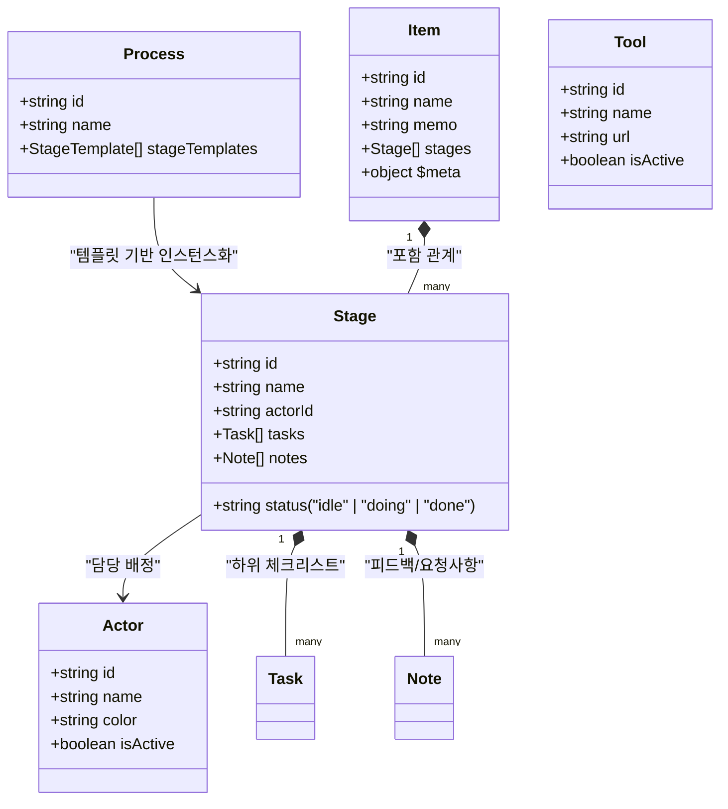

# 📋 'process' 피처 개발 가이드 및 구조 정리

본 문서는 `apps/web/src/app/features/process` 폴더를 중심으로 개발을 원활하게 시작하고 확장하기 위한 디렉터리, 컴포넌트, 상태 모델, API 및 개발 추천 로드맵 가이드입니다.

---

## 🎯 1. 'process' 피처 도메인 개요

`process` 피처는 **칸반 스타일의 워크플로우 오케스트레이터 및 항목 관리자**입니다.
사용자는 이곳에서 프로세스 템플릿을 정의하고, 이를 실제 비즈니스 항목(Item)으로 구체화한 뒤, 각 단계(Stage)와 태스크(Task)를 수행해 나갑니다.

### 🔄 핵심 도메인 개념 (Core Concept)



---

## 📂 2. 디렉터리 구조 분석

`apps/web/src/app/features/process`는 매우 깨끗한 레이어 아키텍처로 모듈화되어 있습니다.

```
process/
├── components/                 # 피처 전용 UI 컴포넌트 (32개 파일)
├── consts/                     # 내비게이션 및 단계 상태 관련 상수
│   ├── index.ts
│   ├── nav-items.ts            # 좌측 사이드바 구조 및 아이콘 바인딩
│   └── stage-status.ts
├── hooks/                      # 컴포넌트 편의용 로컬 React 훅
│   ├── index.ts
│   ├── useCurrentActor.ts      # 현재 로그인/선택된 액터 상태 관리
│   ├── useFlowExecution.ts     # 프론트엔드 노드 및 백엔드 파이프라인 연동 실행
│   ├── useToolUrl.ts           # 연동 도구 URL 파싱 및 주입
│   └── useTrySample.ts         # 체험용 샘플 데이터 자동 로딩
├── pages/                      # 각 라우트별 메인 페이지 컴포넌트
│   ├── ActorManagerPage.tsx    # 담당 액터(Agent/Persona) 관리 대시보드
│   ├── DashboardPage.tsx       # 전체 진행 통계 및 액션 필요 항목 현황판
│   ├── ItemBoardPage.tsx       # 전체 진행 항목 목록 및 다음 액션 추천 카드
│   ├── ItemDetailPage.tsx      # 단계 카드, 상세 태스크 및 노트 상세 실행 뷰
│   ├── ProcessEditorPage.tsx   # 프로세스 템플릿 단계 및 선행 단계 편집기
│   ├── ProcessListPage.tsx     # 프로세스 템플릿 목록 조회 및 신규 인스턴스 생성
│   ├── ToolManagerPage.tsx     # 각 단계에서 사용할 인티그레이션 도구(Tool) 관리
│   └── index.ts
└── index.ts                    # 피처 외부로 내보내는 통합 Entry Point
```

---

## 💻 3. 핵심 페이지(Pages) 역할 및 상세 설명

### 🔗 3.1. [DashboardPage.tsx](./pages/DashboardPage.tsx)

- **역할**: 워크플로우 진행 상황과 팀의 부하를 모니터링하는 첫 화면.
- **주요 기능**:
    - **액터 필터 필즈([ActorFilterPills.tsx](./components/ActorFilterPills.tsx))**: 특정 액터로 필터링하여 상태값 계산.
    - **통계 카드**: 전체, 진행 중(Doing), 완료(Done), 미결 요청 사항(Requests)의 정량화된 숫자 표시.
    - **다음 필요 조치 리스트([NextActionRow](./pages/DashboardPage.tsx#L193))**: 진행 완료되지 않은 항목 중 즉시 행동이 필요한 태스크들을 모아 클릭 시 상세 화면으로 라우팅.
    - **팀 워크로드 보드**: 액터별 배정된 활성 태스크 수 시각화.

### 🔗 3.2. [ItemBoardPage.tsx](./pages/ItemBoardPage.tsx)

- **역할**: 생성된 항목(Item)들을 카드 형태로 추적하는 메인 워크 보드.
- **주요 기능**:
    - **히어로 추천 액션([HeroAction](./pages/ItemBoardPage.tsx#L25))**: 현재 담당자에게 배정된 가장 우선순위가 높은 단일 가이드를 최상단에 카드 형태로 크게 부각하여 빠른 실행을 도모.
    - **신규 항목 생성([NewItemDialog.tsx](./components/NewItemDialog.tsx))**: 등록된 프로세스 템플릿을 골라 즉시 실재 워크아이템으로 생성 및 실행.

### 🔗 3.3. [ItemDetailPage.tsx](./pages/ItemDetailPage.tsx)

- **역할**: 가장 정밀한 상호작용이 발생하는 메인 액션 플레이스.
- **주요 기능**:
    - **상태 바**: 전체 진행도(Progress) 및 개별 단계의 현황 가시화.
    - **단계 카드 리스트([StageCard.tsx](./components/StageCard.tsx))**: 아코디언 타입으로 전체 단계를 정렬하고, 선행 단계 관계를 트래킹.
    - **상세 사이드 패널([StageDetailPanel.tsx](./components/StageDetailPanel.tsx))**:
        - 특정 단계 카드 클릭 시 열리는 우측 드로어(Drawer).
        - 하위 체크 태스크 리스트(`TaskList`) 관리 및 토글.
        - 코멘트/QA 요청 사항 피드백(`NoteForm`, `NoteList`)을 남기고 **Resolve/Reopen** 처리 가능.
        - 해당 단계에 연동된 **자동화 도구/API 호출([ToolAction.tsx](./components/ToolAction.tsx))** 트리거.

### 🔗 3.4. [ProcessEditorPage.tsx](./pages/ProcessEditorPage.tsx) & [ProcessListPage.tsx](./pages/ProcessListPage.tsx)

- **역할**: 단계적 흐름 자체를 구성하는 템플릿 에디터 계층.
- **주요 기능**:
    - 단계의 순서, 이름, 담당 액터(`actorId`), 필수 활용 도구(`toolId`), 그리고 선행하여 완료되어야 하는 상위 단계(`dependencyStageIds`)를 직관적으로 설계 및 검증.

---

## 🔌 4. API 클라이언트 및 상태 통신 계층

이 피처는 글로벌 모노레포 라이브러리인 [`libs/flows`](../libs/flows) 내부의 프로세스 엔진과 긴밀히 통신합니다.

### 4.1. 서버 상태 관리 (React Query Hooks)

다음과 같은 훅들이 라이브러리 인터페이스(`@flows/flows`)에서 제공됩니다:

- **프로세스(Templates)**: `useProcesses()`, `useProcess(id)`, `useApplyProcessMutation()` (템플릿으로 아이템 생성)
- **항목(Items)**: `useItems()`, `useItem(id)`, `useCreateItemMutation()`, `useUpdateItemMutation()`
- **단계 및 태스크**: `useChangeStageStatusMutation()`, `useAddNoteMutation()`, `useResolveNoteMutation()`, `useChangeTaskStatusMutation()`
- **액터 및 도구**: `useActors()`, `useTools()`

### 4.2. 모의 서버 데이터 (Mock Data Layer)

백엔드 연동이 미비하거나 프론트엔드 단독 테스트가 필요한 경우, 시스템은 [mockApi.ts](../libs/flows/src/api/process/mockApi.ts)와 [mockData.ts](../libs/flows/src/api/process/mockData.ts)로 연결되는 프록시를 통해 매끄럽게 모킹 데이터를 반환합니다.

---

## 🛠️ 5. 개발 시작을 위한 추천 로드맵 (Roadmap)

`process` 피처 개발에 착수하실 때, 아래 순서로 영역을 점진적으로 다루는 것을 강력하게 권장합니다:

1.  **로컬 서버 실행**:
    ```bash
    yarn web:start
    ```

    - 브라우저에서 `http://localhost:3000/dashboard` 및 `http://localhost:3000/items`로 접근하여 현 레이아웃을 둘러보세요.
2.  **새로운 체크리스트/태스크 필드 기능 개발**:
    - 단계를 구성하는 태스크 구조에 추가적인 특성(예: 마감기한, 중요도 등)을 더하려면 `libs/flows/src/types/process/task.ts`에 타입을 추가한 후, [TaskList.tsx](./components/TaskList.tsx) 및 [StageDetailPanel.tsx](./components/StageDetailPanel.tsx)를 수정하세요.
3.  **단계 간 오토 레이아웃 및 자동 진행 흐름 개선**:
    - 선행 단계 완료 시 다음 단계를 자동으로 `"doing"` 상태로 전이시키는 제어는 [useStageQueries.ts](../libs/flows/src/hooks/process/useStageQueries.ts) 내부의 비즈니스 로직에 포함되어 있습니다. 이 전이 방식을 튜닝하여 비즈니스 효율을 극대화해 보세요.
