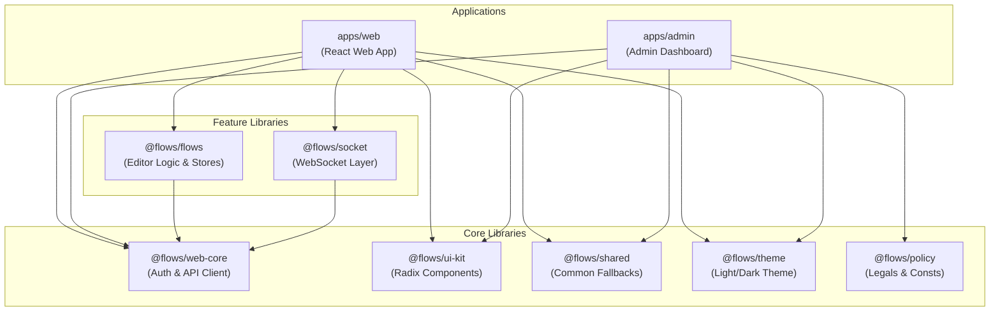

# 🗺️ Eureka Flow 프로젝트 구조 및 아키텍처 가이드

Eureka Flow는 데이터 흐름 파이프라인을 시각적으로 설계하고 실행하는 강력한 브라우저 기반의 Visual Workflow Editor입니다. 본 문서는 프로젝트의 전체 디렉터리 구조, 모노레포 아키텍처, 주요 모듈의 역할, 상태 관리 패턴, 빌드 및 배포 인프라를 상세히 설명합니다.

---

## 🚀 1. 기술 스택 요약 (Tech Stack)

| 구분                 | 기술 (Technology)                                             | 설명 / 특징                                                       |
| :------------------- | :------------------------------------------------------------ | :---------------------------------------------------------------- |
| **Framework**        | [React 19](../package.json#L77)                               | 최신 React 19 아키텍처 채택                                       |
| **Language**         | [TypeScript 5.9](../package.json#L136)                        | 엄격한 Strict Mode 및 정적 타입 안정성 보장                       |
| **Build & Monorepo** | [Vite 7](../package.json#L138), [Nx 22](../package.json#L130) | 초고속 빌드 및 효율적인 다중 패키지(Monorepo) 관리                |
| **Styling**          | Tailwind CSS 3, Radix UI                                      | Utility-first 스타일링 및 웹 접근성을 준수하는 원시 컴포넌트 조합 |
| **State Management** | [Zustand 5](../package.json#L91), TanStack Query 5            | 가벼운 전역 상태 관리 및 효율적인 서버 상태 캐싱                  |
| **Real-time**        | WebSocket                                                     | 실시간 실행 상태 반영을 위한 실시간 데이터 동기화                 |
| **Testing**          | [Vitest](../package.json#L140)                                | 빠르고 가벼운 단위/통합 테스트 프레임워크                         |

---

## 📂 2. 디렉터리 구조 개요 (Directory Structure)

본 프로젝트는 **Nx**와 **Yarn Workspaces**를 기반으로 설계된 모노레포 구조로, 다중 애플리케이션(`apps/*`)과 기능별 라이브러리(`libs/*`)로 명확히 나뉘어 관리됩니다.

```
eureka-flow/
├── .github/                    # GitHub CI/CD 워크플로우 및 이슈/PR 템플릿
├── apps/                       # 실행 가능한 웹 애플리케이션
│   ├── admin/                  # 관리자용 웹 대시보드
│   └── web/                    # 사용자용 Eureka Flow 메인 에디터 앱
├── libs/                       # 애플리케이션 간 공유 및 계층별 모듈 라이브러리
│   ├── flows/                  # 플로우 에디터 핵심 비즈니스 로직 및 상태 관리
│   ├── policy/                 # 법적 정책 문서(개인정보처리방침 등) 및 상수
│   ├── shared/                 # 공통 UI 모듈 (Fallback, Dialog 등)
│   ├── socket/                 # 실시간 통신을 위한 WebSocket 계층
│   ├── theme/                  # 다크/라이트 테마 제어 프로바이더
│   ├── ui-kit/                 # 33종의 Shadcn/ui 스타일 및 Radix 원시 UI 컴포넌트
│   └── web-core/               # HTTP API 클라이언트 및 인증 상태 관리
├── scripts/                    # 배포 및 버전 관리 유틸리티 쉘 스크립트
├── package.json                # 루트 의존성 정의 및 Nx 통합 스크립트
└── tsconfig.base.json          # TypeScript 공통 설정 및 경로 별칭(Alias) 지정
```

---

## 🏗️ 3. 모노레포 의존성 및 흐름 (Architecture Dependency Graph)

프로젝트 내부 라이브러리는 Nx의 경로 단축 별칭(Path Aliases)을 통해 결합도를 낮추고 모듈성을 유지하며 상호작용합니다.



---

## 💻 4. 애플리케이션별 상세 분석 (Applications Detail)

### 🔗 4.1. Eureka Flow 사용자용 에디터 [apps/web](../apps/web)

React 기반의 웹 인터페이스 메인 애플리케이션으로, 무한 캔버스를 포함한 워크플로우 빌더 역할을 수행합니다.

- **주요 진입점 및 설정**:
    - [index.html](../apps/web/index.html): 애플리케이션 HTML 프레임
    - [src/main.tsx](../apps/web/src/main.tsx): 렌더링 시작점 및 React 19 마운트
    - [src/styles.css](../apps/web/src/styles.css): Tailwind CSS 프레임워크 로드 및 글로벌 테마 정의
    - [vite.config.mts](../apps/web/vite.config.mts): 빌드 및 포트번호(3000) 구성
- **컴포넌트 및 기능 구성 (`src/app`)**:
    - [src/app/app.tsx](../apps/web/src/app/app.tsx): 메인 라우터 정의
    - [src/app/providers.tsx](../apps/web/src/app/providers.tsx): 전역 상태, 테마, i18n, Toast 및 쿼리 프로바이더 통합
    - `src/app/features/`: 기능별 페이지 및 로직 분류
        - `landing/`: 소개 랜딩 페이지
        - `home/`: 저장된 플로우 대시보드 및 목록 관리
        - `flows/`: 캔버스 드래그앤드롭 기반 메인 에디터 화면
        - `tutorial/`: 최초 사용자를 위한 대화형 가이드 튜토리얼
        - `mobile-editor/`: 모바일 터치 제스처 최적화 에디터 뷰

### 🔗 4.2. 관리자 대시보드 [apps/admin](../apps/admin)

플로우 사용량, 다국어 리소스 변경 내역, 배포 상태 등을 관리하기 위한 백오피스용 독립 애플리케이션(3001 포트)입니다.

---

## 📦 5. 라이브러리 계층 상세 분석 (Libraries Detail)

### 🔗 5.1. 에디터 상태 및 흐름 코어 [libs/flows](../libs/flows)

에디터의 캔버스 렌더링, 노드 드래그 앤 드롭, 블록 종류 관리 및 에디터 비즈니스 로직의 심장부입니다.

- `consts/`: 블록 스펙 및 카테고리 정의 상수
- `stores/`: 캔버스 렌더링 및 이력 관리를 위한 핵심 Zustand 상태 정의
- `hooks/`: 컴포넌트가 직접 호출하여 동작을 제어할 수 있는 React 커스텀 훅 세트
- `utils/`: 오토 레이아웃 알고리즘 및 벡지에 곡선 좌표 생성 도구

### 🔗 5.2. 실시간 웹소켓 연동 계층 [libs/socket](../libs/socket)

노드가 서버 환경에서 비동기 실행될 때, 백엔드로부터 완료 이벤트를 전달받아 캔버스를 실시간으로 리프레시하고 세션을 유지합니다.

- **자가 에코 방지(Self-echo Prevention)** 기술이 탑재되어 브라우저 본인이 트리거한 불필요한 중복 메시지를 걸러냅니다.

### 🔗 5.3. API 통신 및 인증 관리 [libs/web-core](../libs/web-core)

HTTP REST API 호출, JWT 인증, API Key의 저장과 갱신, 세션 보존 등을 담당합니다.

- `useWebCoreStore`를 통해 로그인 여부 및 사용자 프로필 데이터를 전역적으로 관리합니다.

### 🔗 5.4. 고품질 UI 빌딩 블록 [libs/ui-kit](../libs/ui-kit)

Radix UI 원형에 맞춤형 스타일 및 애니메이션을 입힌 총 33종의 고품질 원시 컴포넌트가 내장되어 일관된 디자인 시스템을 유지합니다.

- 다크/라이트 테마 완벽 호환, 접근성 표준 준수, 미세 애니메이션 적용

### 🔗 5.5. 공통 컴포넌트 [libs/shared](../libs/shared)

애플리케이션 전반에 적용되는 에러 바운더리(`ErrorFallback`), 안전한 API Key 전달용 팝업(`ApiKeyDialog`), 공통 가상 스피너 스켈레톤 등이 구성되어 있습니다.

### 🔗 5.6. 테마 및 정책 [libs/theme](../libs/theme) 및 [libs/policy](../libs/policy)

- `theme`: Tailwind 및 `next-themes`를 기반으로 시스템 모드 자동 감지 및 강제 라이트/다크 수동 변경 제어.
- `policy`: 이용 약관 및 개인정보 처리방침 텍스트를 컴포넌트 형태로 내장하여 법적 요구사항 만족.

---

## 🗄️ 6. 핵심 상태 관리 (State Management Stores)

Eureka Flow는 Zustand 프레임워크를 기반으로 아래와 같이 도메인 관심사별로 상태(Store)를 분할하고 필요시 교차 통신을 하도록 설계되었습니다.

| 스토어명 (Zustand Store)   | 정의 위치                                                                                            | 담당 역할                                                                                       |
| :------------------------- | :--------------------------------------------------------------------------------------------------- | :---------------------------------------------------------------------------------------------- |
| **`useCanvasStore`**       | [libs/flows/src/stores/useCanvasStore.ts](../libs/flows/src/stores/useCanvasStore.ts)                | 화면 내 노드 좌표, Bezier 커브선, 뷰포트 확대/축소 비율, 다중선택, 드래그 상태 관리             |
| **`useFlowsStore`**        | [libs/flows/src/stores/useFlowsStore.ts](../libs/flows/src/stores/useFlowsStore.ts)                  | 현재 에디터가 작업 중인 플로우 이름, 로딩된 컴포넌트 블록 레지스트리 목록, 자동저장 활성화 유무 |
| **`useWebSocketStore`**    | [libs/socket/src/stores/useWebSocketStore.ts](../libs/socket/src/stores/useWebSocketStore.ts)        | 서버 소켓 연결 상태(CONNECTED, DISCONNECTED), 실시간 업데이트 이벤트 구독자 분배                |
| **`useWebCoreStore`**      | [libs/web-core/src/stores/useWebCoreStore.ts](../libs/web-core/src/stores/useWebCoreStore.ts)        | 개발자 API 키 발급 및 브라우저 세션 보존, API 엔드포인트 바인딩 정보 관리                       |
| **`useCurrentActorStore`** | [apps/web/src/.../useCurrentActor.ts](../apps/web/src/app/features/process/hooks/useCurrentActor.ts) | 현재 선택된 액터 정보("Set as me") 저장 및 브라우저 `localStorage` 영속화 연동                  |

---

## ⚙️ 7. 빌드, 배포 및 자동화 워크플로우 (Build & CI/CD Pipeline)

### 7.1. 주요 Nx 모노레포 명령어

- **로컬 실행**:
    - [apps/web](../apps/web): `yarn web:start` (Port 3000)
    - [apps/admin](../apps/admin): `yarn admin:start` (Port 3001)
- **코드 품질 관리**:
    - ESLint 일괄 검사: `yarn lint`
    - 코드 포맷팅 일괄 수정: `yarn prettier`
- **모듈 의존성 가시화**:
    - `yarn graph` 명령어 실행 시 Nx 인터랙티브 맵을 통해 패키지 간의 순환 참조나 오염관계를 한눈에 시각적으로 모니터링할 수 있습니다.

### 7.2. CI/CD 및 AWS 클라우드 배포 스크립트

- 배포는 전적으로 AWS S3와 CloudFront 인프라를 활용합니다.
- **실행 쉘 스크립트**:
    - [scripts/deploy.sh](../scripts/deploy.sh): 빌드 산출물을 S3 버킷에 동기화하고 CloudFront 캐시 무효화(Invalidation)를 제어하는 핵심 유틸리티.
- **GitHub Actions 워크플로우**:
    - [deploy-dev.yml](../.github/workflows/deploy-dev.yml): `develop` 브랜치 변경사항 발생 시 자동 DEV 환경 빌드 및 배포
    - [deploy-prod.yml](../.github/workflows/deploy-prod.yml): `main` 브랜치 릴리즈 시 자동 PROD 환경 빌드 및 배포, 릴리즈 태깅 처리
    - [force-deploy.yml](../.github/workflows/force-deploy.yml): 필요시 수동(Workflow Dispatch)으로 정밀 제어 가능한 비상용 배포 파이프라인
