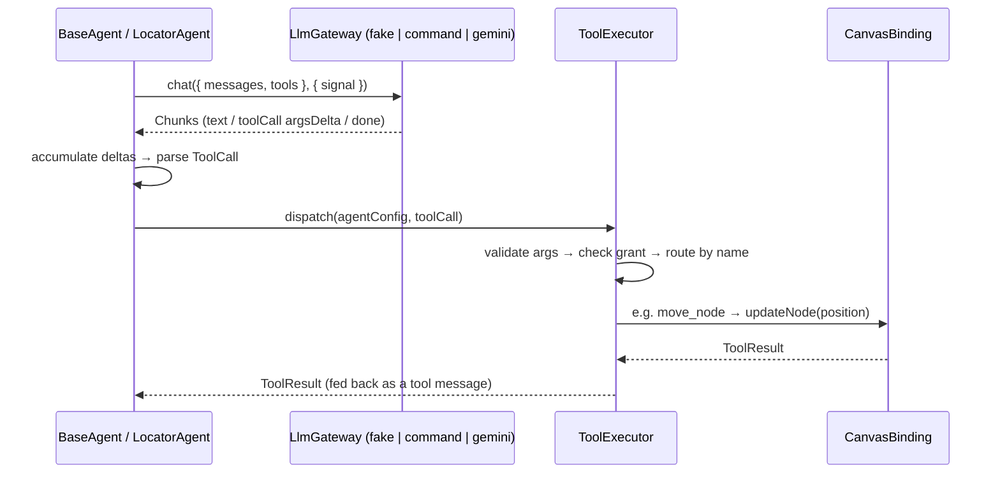

# LlmGateway — Shared Contract and Providers

## 1. Summary

The LLM access layer is now one shared contract, reconciled between the W04 gateway work
and the locator-agent design: `LlmGateway.chat()` — provider-neutral chat messages and
tool definitions in, an async stream of `Chunk`s (text deltas, tool-call arg deltas, a
final `done`) out. `BaseAgent`/`LocatorAgent` and the `ToolExecutor` consume exactly this
contract; the fake gateway proves the tool-call path deterministically; Gemini 2.5 Flash
is the first HTTP provider behind it, text-only for now.

The former W04 `LlmGatewaySupportable.complete()` interface is retired — one contract,
no duplicate surface.

## 2. The shared contract

```ts
interface LlmGateway {
    /** Optional capability metadata; absent means unspecified — do not assume tool support. */
    readonly capabilities?: LlmGatewayCapabilities; // { toolCalls: boolean }
    chat(req: ChatRequest, opts?: { signal?: AbortSignal }): AsyncIterable<Chunk>;
}

interface ChatRequest {
    messages: ChatMessage[]; // roles: system | user | assistant | tool
    tools: ToolDef[]; // JSON-Schema parameters + required capability
    stream?: boolean;
}

interface Chunk {
    text?: string;
    toolCall?: { id: string; name: string; argsDelta: string };
    done?: boolean;
    usage?: { inputTokens?: number; outputTokens?: number }; // on the done chunk when reported
}
```

Capability metadata answers "can this gateway/model emit tool calls?" before a request is
built: the fake gateway declares `{ toolCalls: true }`, Gemini declares
`{ toolCalls: false }` and rejects requests carrying tool definitions or tool messages.

## 3. How a tool call flows



Verified deterministically (no real provider): a scripted fake-gateway response carrying
`move_node { nodeId, by: { dx: 10, dy: 0 } }` flows through the executor and moves the
text-input node 10px right — the meeting's verification case — and the same call is
denied when the agent lacks the `canModifyCanvas` grant. The current canvas tool set is
`list_nodes` + `move_node`; property/name/color tools are a later slice.

## 4. Implementations

| Gateway                   | Where                            | Tool calls           | Notes                                                             |
| ------------------------- | -------------------------------- | -------------------- | ----------------------------------------------------------------- |
| `createFakeGateway`       | `libs/agent/src/llm/fakeGateway` | yes (scripted)       | Deterministic test double; backs the agent/executor suites.       |
| `createCommandLlmGateway` | `apps/web` (Lucas)               | yes (parsed command) | Offline dev gateway — no network, no key; drives the panel today. |
| `createGeminiLlmGateway`  | `libs/agent/src/llm`             | **no** (text-only)   | First HTTP provider; see §5.                                      |

## 5. Gemini provider (text-only)

- Implements `chat()` over the **HttpRequest port** — never global `fetch`; a backend
  proxy becomes a `baseUrl` override or another port implementation, with no gateway change.
- Auth via the `x-goog-api-key` **header** — never in the URL; the key appears in neither
  error messages (error bodies are key-redacted before throwing) nor traces (trace
  redaction also guards secret-looking fields). Test-verified.
- Uses the Agent Environment for tracing and time; cancellation flows through the
  request's `AbortSignal`.
- System messages map to `systemInstruction`; assistant turns to the `model` role.
- The provider call is not streamed: the response is yielded as one text chunk, then a
  `done` chunk carrying usage tokens.
- `capabilities.toolCalls = false`; requests with tool definitions or tool messages are
  rejected loudly. Gemini tool calling is not implemented and not claimed.

## 6. Future providers and the proxy backend (TODO)

- **Provider targets behind the same contract:** OpenAI (GPT), Claude, OpenRouter,
  DeepSeek, GLM, Qwen. None are implemented yet.
- **Proxy backend:** OpenAI (and likely others) cannot be called reliably from the
  browser due to CORS and key-security constraints. Direction: a backend proxy —
  adapting **eureka-flows-api** together with Claire — reached through the same
  HttpRequest port. Not built yet; deliberately deferred until a provider that requires
  it is scheduled.
- **Capability backfill:** the app's `createCommandLlmGateway` does not declare
  `capabilities` yet (the field is optional for compatibility); worth adding when touched.

## 7. Verification status (honest scope)

- Unit + integration tests: **133 passing** across the merged lib (environment, storage
  contract, http port, gemini gateway, self-check, canvas tools, executor, locator/base
  agent, fake-gateway→executor).
- Typecheck, `nx build agent`, and `nx build web` pass on the reconciled branch.
- **No live provider call has been made** — Gemini behavior is verified against scripted
  HTTP responses only.
- **No full editor E2E has been run.** The Environment self-check
  (`runAgentEnvironmentSelfCheck`) remains callable in the browser as a smoke check for
  localStorage and trace; a real editor/E2E pass is a follow-up validation step.
