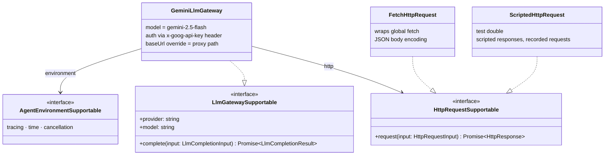
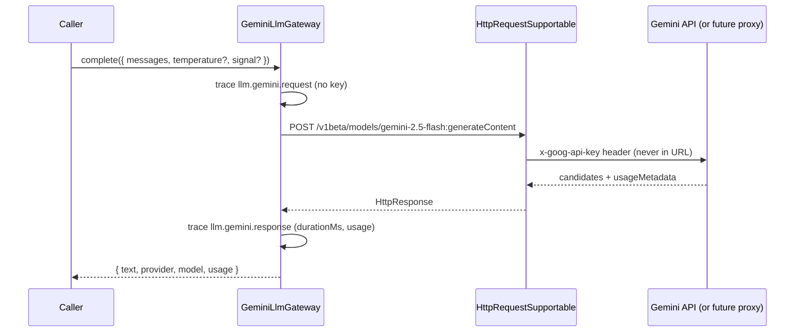

# LlmGateway Foundation

## 1. Summary

This slice adds the minimal LLM access layer on top of the Agent Environment: a narrow
`LlmGatewaySupportable` completion contract, a Gemini 2.5 Flash provider as the first
implementation, and an `HttpRequestSupportable` port so gateways never call the global
`fetch` directly. It also adds a runtime self-check for the Environment's base services
(storage and trace), callable in the browser runtime.

Gateways depend only on the Agent Environment (tracing, time, cancellation) and the HTTP
port. GPT, Claude, and OpenRouter follow later as further implementations of the same
contract; this slice deliberately ships one provider.

## 2. Requirements

- Simple LlmGateway built on the Environment ✓
- First provider: Gemini 2.5 Flash ✓
- HttpRequest interface designed and implemented ✓
- Environment self-check for base services (localStorage, trace) ✓
- CORS/proxy problem addressed at the design level (see §3) ✓
- Future providers (GPT, Claude, OpenRouter) accounted for in the contract, not built ✓

## 3. Problem: provider APIs and the browser

Some provider APIs cannot be called reliably from the browser: CORS policies and key
exposure make direct calls fragile or unsafe. The team direction is a backend proxy, but
building it now would be premature.

The HTTP port absorbs this. `LlmGatewaySupportable` talks to `HttpRequestSupportable`;
when the proxy exists, it becomes either a different base URL or another implementation of
the same port — gateway code does not change. Gemini is the first provider target for
this slice. Direct browser calls can be attempted through `FetchHttpRequest` when provider
CORS and key-handling constraints allow it, but the production direction still favors a
backend proxy.

## 4. Main interfaces



## 5. Completion sequence



Errors carry the HTTP status and a short body snippet; the API key appears in neither
error messages nor trace entries (trace redaction also guards secret-looking fields).

## 6. Real-browser self-check

`runAgentEnvironmentSelfCheck(environment)` verifies the base services in the runtime the
environment actually runs in: a storage write/read/remove round-trip under a `selfcheck:`
key (cleaned up afterwards) and a trace emit/flush. It reports per-check status and never
throws. In the real browser:

```ts
import { createBrowserAgentEnvironment, runAgentEnvironmentSelfCheck } from '@flows/agent';

const result = await runAgentEnvironmentSelfCheck(createBrowserAgentEnvironment());
// { ok: true, runtime: 'browser', checks: [{ name: 'storage', ok: true, ... }, { name: 'trace', ok: true, ... }] }
```

## 7. Completed in this slice

- [x] `HttpRequestSupportable` port with fetch-backed and scripted (test) implementations
- [x] `LlmGatewaySupportable` completion contract
- [x] Gemini 2.5 Flash gateway: header auth, system-instruction mapping, usage mapping,
      status-carrying errors, request/response tracing
- [x] `baseUrl`/implementation override as the future proxy path
- [x] Environment self-check for storage and trace, callable in the browser; real
      editor/E2E execution remains a follow-up validation step
- [x] 60 tests passing (18 new) and typecheck clean

## 8. Intentionally out of scope for this slice

The following are deferred by design, not missing:

- [ ] GPT, Claude, and OpenRouter providers (same contract, later slices)
- [ ] Backend proxy server (design direction only; the port already accommodates it)
- [ ] Streaming responses and tool/function calling
- [ ] Orchestrator, ToolExecutor, LocatorAgent, CanvasBinding (Lucas's W04 scope)
- [ ] Agent Panel / UI surface

## 9. Acceptance criteria

- [x] `LlmGatewaySupportable` and `HttpRequestSupportable` follow the team `*Supportable` style
- [x] The gateway performs no direct `fetch`/global access; network flows only through the injected port
- [x] The API key travels in the `x-goog-api-key` header — never in the URL, errors, or traces (test-verified)
- [x] A proxy can be introduced via `baseUrl` or a new port implementation with zero gateway changes (test-verified)
- [x] Self-check passes on the virtual environment and is callable against the browser environment
- [x] Typecheck, `npx nx test agent` (60 tests), `npx nx build agent`, and `npx nx build web` pass

## 10. Next step

Wire the gateway into the future Orchestrator/ToolExecutor execution context alongside
Lucas's LocatorAgent work, add the second provider behind the same contract, and start the
minimal proxy backend once a provider that requires it (e.g. OpenAI) is scheduled.
