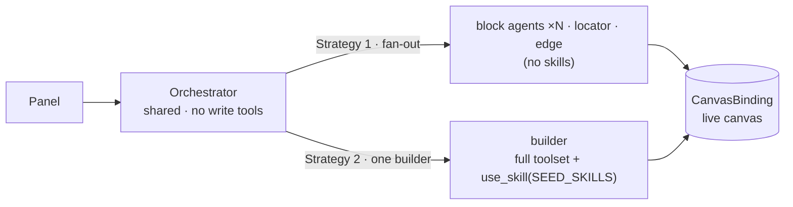

# Browser Agent — docs

In-browser flow agents for the Eureka Flow editor: chat agents that read your flow and edit it for you.
The DOM-free core is `@flows/agent` (`libs/agent`), including the `CanvasBinding` over the `FlowEngine`
that owns the graph; the editor wiring lives in `apps/web/src/app/features/flows/` (panel, hooks,
generate-API gateway).

## Architecture at a glance

You talk to the **Panel**, which drives the **orchestrator** — the main agent that owns the turn. The
orchestrator runs a think/act loop — ask the **LlmGateway**, run tool calls through the one
**ToolExecutor** (which checks permissions), repeat until the model is done — but carries no write tools
of its own: it delegates edits by spawning **specialist** sub-agents — **block agents** (one per block
type, owning that block's whole lifecycle: add / configure / rename / delete), **operation agents**
(locator = move, edge = connect/disconnect), and the composition **builder** (builds a whole multi-block flow
from a plan) — that reach the live canvas through a single shared seam, the
**CanvasBinding**. The persisted **SessionState** is what the Panel renders from.

```
Panel → Orchestrator → LlmGateway (think)
                     → spawn → Specialists (block agents · per type / locator / edge / builder)
                                 → ToolExecutor → tools → CanvasBinding → live canvas (act)
                     → SessionState → Panel (render)
```

**Two comparable strategies, one foundation.** The orchestrator, loop, tools and permission model are the
same however the editing gets done; the **roster you expose** picks the design — **Strategy 1** fans work
out to narrow specialists (block agents · locator · edge; no skills); **Strategy 2** hands the whole plan to
one **builder** that carries the full toolset + `use_skill` playbooks and builds it alone. The
[eval-benchmark](design/eval-benchmark.md) scores the two head-to-head.



The full model — components, the turn loop, interfaces, permissions — is in
[design/architecture.md](design/architecture.md).

## What's here

**[design/](design/)** — the shared architecture.

- [architecture.md](design/architecture.md) — the shared model every agent is built from (read this first).
- [canvas-binding.md](design/canvas-binding.md) — the CanvasBinding over the `FlowEngine`: what it reads,
  how an edit is checkpointed, and why permissions are not enforced there.

**[agents/](agents/)** — the concrete agents.

The **orchestrator** is the entry agent the Panel talks to; it holds no write tools and delegates every edit
to the specialists it spawns over the shared CanvasBinding. The orchestrator model is covered in the design
docs (start with [architecture.md](design/architecture.md)); the specialists come in three kinds, and the full
roster + coverage lives in **[agents/README.md](agents/README.md)**:

- **Block agents** — one per block type, owning that block's whole lifecycle (**add / configure / rename /
  delete**). A block that earns domain knowledge gets a named specialist (e.g. [generator.md](agents/generator.md));
  every other type is served by a generic [blockAgent.md](agents/blockAgent.md) synthesized from the catalog.
- **Operation agents** — cross-block: [locator.md](agents/locator.md) (**move**) and [edge.md](agents/edge.md)
  (**connect / disconnect**).
- **The composition builder** — the orchestrator hands it a whole multi-block **plan** and it builds the
  (sub-)flow itself (add · wire · configure · lay out), pulling on-demand playbooks via `use_skill`. Spec
  co-located with its code: [`libs/agent/src/agents/builder.md`](../../libs/agent/src/agents/builder.md).

The operation-split [node.md](agents/node.md) (add/delete) and [property.md](agents/property.md) (config/rename)
agents are **retired** — the block agent now owns their work. Each page is thin; behavior is specified
canonically in the harness docs (`design/harness-*`).

**[foundations/](foundations/)** — shared infrastructure, both built.

- [environment.md](foundations/environment.md) — the runtime capability boundary (storage / trace / time /
  cancellation).
- [llm-gateway.md](foundations/llm-gateway.md) — the `LlmGateway` contract + Gemini provider + HTTP port.

## Running the live evals

The `@flows/agent` suite is deterministic and offline by default — `yarn nx test @flows/agent` scripts
every tool call through a fake gateway and makes no network calls. The **live evals** hand the
orchestrator and its specialists a real function-calling Gemini gateway and check only the outcome + the
graph oracle, so the model itself decides the tool calls (a case can legitimately fail when the model
misbehaves — that is the signal).

Live specs are **opt-in**: they run only when `RUN_LIVE` is set. A key in `.env.local` is _not_ enough on
its own, so `nx test` and CI never trigger them.

1. Put your key in the repo-root `.env.local` (gitignored) — the specs load it on import, so no inline
   prefix is needed:

    ```
    GEMINI_API_KEY=...
    # optional: GEMINI_MODEL=gemini-2.5-pro   (defaults to gemini-2.5-flash)
    ```

2. Run with `RUN_LIVE=1`:

    ```bash
    # orchestrator + specialists, end-to-end (the harness scenarios)
    RUN_LIVE=1 npx vitest run libs/agent/src/__tests__/harness/scenarios/integration.live.spec.ts

    # one scenario by name
    RUN_LIVE=1 npx vitest run libs/agent/src/__tests__/harness/scenarios/integration.live.spec.ts -t A1

    # a single specialist's eval
    RUN_LIVE=1 npx vitest run libs/agent/src/__tests__/harness/scenarios/locator.live.spec.ts
    RUN_LIVE=1 npx vitest run libs/agent/src/__tests__/harness/scenarios/property.live.spec.ts

    # headless smoke test (real key/HTTP/Node path); the offline control case runs without RUN_LIVE
    RUN_LIVE=1 npx vitest run libs/agent/src/__tests__/headless-gemini.smoke.spec.ts
    ```

    A bigger model or the per-turn chat log:

    ```bash
    RUN_LIVE=1 GEMINI_MODEL=gemini-2.5-pro npx vitest run .../integration.live.spec.ts
    RUN_LIVE=1 LIVE_VERBOSE=1 npx vitest run .../integration.live.spec.ts -t A1     # truncated turns
    RUN_LIVE=1 LIVE_VERBOSE=full npx vitest run .../integration.live.spec.ts -t A1  # verbatim
    ```

Without `RUN_LIVE` (or without a key), every live spec skips and the suite stays offline.

## Reading order

New here? Read **[design/architecture.md](design/architecture.md)** (the shared model, including the
orchestrator that owns the turn), then the locator specialist it spawns,
**[agents/locator.md](agents/locator.md)**; for the shared infra, the two
**[foundations/](foundations/)** docs. Package overview: [`libs/agent/README.md`](../../libs/agent/README.md).
