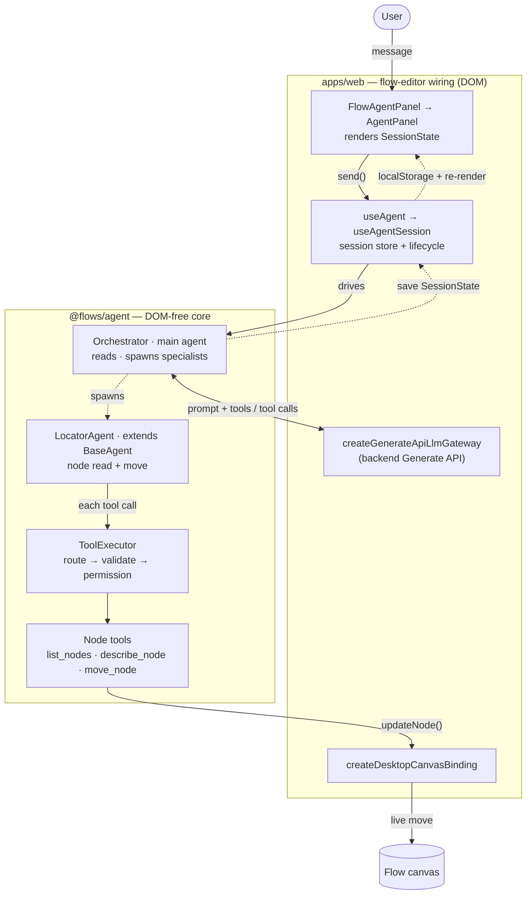

# Locator agent

> **The move specialist.** The locator **moves one existing node** to a concrete position —
> `move_node({ nodeId, by })` (relative) or `move_node({ nodeId, to })` (absolute), applied straight to the
> live canvas. It is **spawned by the orchestrator**, never talked to directly: the orchestrator resolves
> the target node and the distance, and the locator executes. It builds on the
> [shared agent architecture](../design/architecture.md). This page is its shipped-status summary — its
> behavior and oracles are specified canonically in the harness docs below.

## Canonical specs

The locator's behavior lives in the harness design set; this page does not restate it:

- **Persona** — `LOCATOR_SYSTEM_PROMPT` in
  [locatorAgent.ts](../../../libs/agent/src/agents/locatorAgent.ts): move-only scope, exactly-one-of
  `by`/`to`, coordinate signs, and **no default nudge** — the locator never invents a distance; the
  orchestrator supplies it.
- **Behavior & oracles** — [harness-scenarios.md](../design/harness-scenarios.md): how the moves are
  verified, and the scenario specs (A1 single move, A4 fan-out, P1 partial turn) it points to.
- **Tools & the turn loop** — [harness-spec.md §8](../design/harness-spec.md) and
  [architecture.md](../design/architecture.md) (the shared think/act loop, `ToolExecutor`, permissions).

## What it is

A move-only specialist: it changes a node's `position` and nothing else — it never creates, deletes,
connects, or reconfigures. A request naming several nodes becomes several `move_node` calls in one turn,
one node per call. Position is a frontend-only property, so a move is a single synchronous
`CanvasBinding.updateNode(id, { position })` — no server write — checkpointed for undo like a user drag.

Move semantics: **relative** (`by`) uses canvas-coordinate signs — right `dx = +n`, left `dx = −n`, up
`dy = −n`, down `dy = +n` (diagonals combine); **absolute** (`to`) sets the position verbatim; origin is
top-left, positions may go negative (no clamping). `move_node` validates exactly one of `by`/`to`, that the
node exists, and that the result is finite. It carries an exact amount handed down by the orchestrator; a
task with no amount is a malformed briefing it reports, not a move it guesses.

```ts
// The move tool's input — exactly one of `by` (relative) or `to` (absolute).
interface MoveNodeArgs {
    nodeId: string; // resolved id of the node to move
    by?: { dx: number; dy: number }; // relative delta in px, canvas coords
    to?: XY; // absolute destination in px
}
```

## Tools

| Tool            | Kind   | Notes                                                                               |
| --------------- | ------ | ----------------------------------------------------------------------------------- |
| `list_nodes`    | read   | `binding.readGraph()` → `NodeLocation[]`; the palette of movable targets            |
| `describe_node` | read   | one node in detail; rides along with `list_nodes` in the read provider              |
| `move_node`     | mutate | `MoveNodeArgs` → `binding.updateNode(id, { position })`; requires `canModifyCanvas` |

All three come from `tools/nodeTools.ts`, split across the **read** provider (`list_nodes` +
`describe_node`) and the **move** provider (`move_node`). `move_node` requires `canModifyCanvas`, gated at
the executor against **both** the agent's grant and the user's flow-role (a viewer is denied).

## UI / layout

The **Agent Panel is docked on the right** whenever a flow is open (it mounts once the flow has an id) —
there is no open/close toggle. The canvas occupies the remaining width to its left (a fixed-width docked
column, not an overlay). Opening a flow rehydrates its persisted session, so the conversation is there too.

## What shipped

Two pieces: **`libs/agent` (`@flows/agent`)**, a DOM-free, node-testable agent core; and the
**flow-editor wiring (`apps/web`)** — an always-present, right-docked chat panel that shrinks the canvas.



The user talks to the **orchestrator** (via `useAgent`), which spawns the locator on demand — the
locator itself lives only in the lib. The app implements the lib's two seams — `LlmGateway`
(`createGenerateApiLlmGateway`, the backend Generate API) and `CanvasBinding` (the desktop binding);
the turn loop itself never touches the DOM.

### Definition of done — verified behavior

The locator's contract. Each line is verified in code — at the locator unit unless a coverage note points elsewhere:

- **Relative move (`by`)** — moves in the correct direction (canvas signs). _(Node isolation — no other node moves — is integration **A1**.)_
- **Absolute move (`to`)** — sets the exact destination. _(Move math at [`moveSemantics.spec.ts`](../../../libs/agent/src/__tests__/canvas/moveSemantics.spec.ts) + the live spec; not duplicated at the agent unit.)_
- **Target not found** — reports and moves nothing (including recovery when the model guesses a bad id).
- **No distance given** — does NOT move (no default nudge); asks for an exact distance.
- **Ambiguous reference** — asks which node; moves nothing.
- **Several nodes in one turn** — one `move_node` call each.
- **Pure question** — answers without moving.
- **Permission gate** — without `canModifyCanvas` the move is denied. _(Verified once at the executor — [`toolExecutor.spec.ts`](../../../libs/agent/src/__tests__/tools/toolExecutor.spec.ts) — plus `move_node`'s `requires: canModifyCanvas`; not duplicated at the agent unit.)_

Where these live:

- **Deterministic (always runs):**
  [`scenarios/locator.spec.ts`](../../../libs/agent/src/__tests__/harness/scenarios/locator.spec.ts) —
  fake-gateway scripts driving the locator directly (plus the BaseAgent lifecycle/robustness it exercises:
  abort, iteration cap, gateway error, concurrent-send, per-call status, transcript persistence). Move math +
  arg validation are in
  [`__tests__/canvas/moveSemantics.spec.ts`](../../../libs/agent/src/__tests__/canvas/moveSemantics.spec.ts).
- **Live (key-gated, real LLM):**
  [`scenarios/locator.live.spec.ts`](../../../libs/agent/src/__tests__/harness/scenarios/locator.live.spec.ts)
  — hands the locator a real gateway and checks the same oracles when the model chooses the calls.
- **Integration (orchestrator coordinating agents):**
  [`scenarios/integration.spec.ts`](../../../libs/agent/src/__tests__/harness/scenarios/integration.spec.ts)
  (+ `.live`) — A1 (single move), A4 (four locators in one spawn), P1 (a move that is part of a partial turn).
