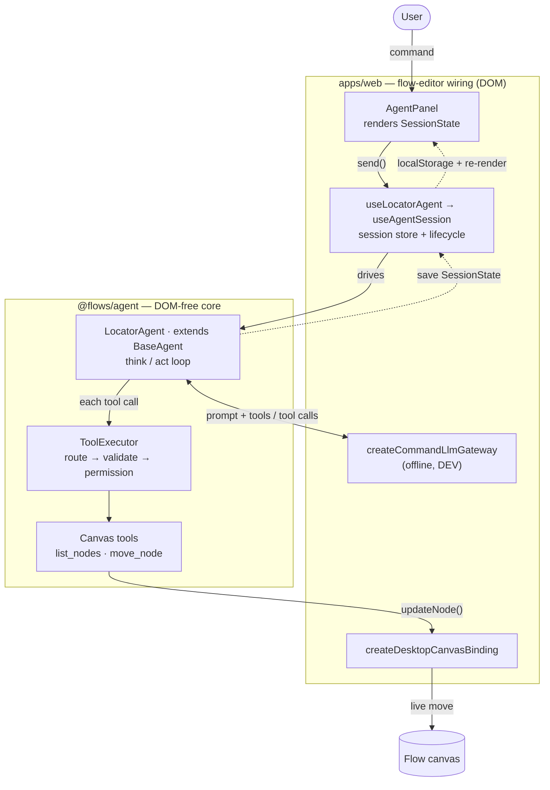

# Locator Agent — Implementation Record

What was actually built for [SPEC.md](SPEC.md), in the order it happened. Companion to the
spec (the "what/why"); this is the "what shipped / how to run it".

Last updated: 2026-07-15 · Branch: `feat/locator-agent`

---

## 1. Summary

Shipped the first concrete in-browser flow agent — the **locator agent**, which moves an
existing canvas node from a natural-language request ("move Fetch 10px right", "put Email at
x=100,y=100"). It is applied **live** through the `CanvasBinding` (no draft, no approval gate),
and the agent is the **sole editor** of the canvas.

Two pieces:

1. **`libs/agent` (`@flows/agent`)** — a DOM-free, node-testable agent core.
2. **Flow-editor wiring (`apps/web`)** — an always-present, right-docked chat panel that
   shrinks the canvas, backed by the agent.

---

## 2. Code map — hierarchy, reading order, purpose

The feature spans a DOM-free library (`libs/agent`) and its flow-editor wiring (`apps/web`).
The tree below is the file hierarchy with each file's purpose; the reading path after it makes
each file make sense by the time you reach it (contracts → pure logic → orchestration → wiring →
UI → tests). The lib also hosts two shared subsystems from adjacent work — the **HTTP port** and
the **Agent Environment** (storage / trace / self-check) — shown collapsed here and documented in
[llm-gateway.md](../../foundations/llm-gateway.md) and [environment.md](../../foundations/environment.md).

### At a glance



The two boundary-crossing arrows are the core's only seams: the app implements the lib's
`LlmGateway` (the gateway) and `CanvasBinding` (the desktop binding); the turn loop itself never
touches the DOM. The loop repeats — model → tool calls → results → model — until the model replies
with no further tool calls.

### Hierarchy & purpose

```text
libs/agent/src/                          @flows/agent — DOM-free agent core (vitest env: node)
├─ agent.ts                              Agent (the turn surface) + AgentConfig (what varies per agent)
├─ permissions.ts                        Capability / AgentGrant — capability vocabulary the executor enforces
├─ canvas/
│  ├─ canvasBinding.ts                   CanvasBinding / Graph / XY — the ONE seam to the live canvas (sole write path)
│  ├─ inMemoryCanvasBinding.ts           Headless reference binding for tests / Node runs
│  ├─ moveSemantics.ts                   Pure move math: direction→delta, relative/absolute, 20px default
│  └─ canvasTools.ts                     Shared canvas tool provider: createCanvasToolProvider (list_nodes + move_node)
├─ llm/
│  ├─ llmGateway.ts                      LlmGateway + ChatMessage / ToolDef / Chunk / JsonSchema — the ONE outbound LLM dep
│  ├─ fakeGateway.ts                     Scripted, deterministic gateway for tests
│  ├─ GeminiLlmGateway.ts                Gemini 2.5 Flash provider (text-only) — W04; see foundations/llm-gateway.md
│  └─ index.ts                           llm barrel
├─ tools/
│  ├─ toolTypes.ts                       ToolProvider / ToolExecutor / ToolCall / ToolResult contracts
│  ├─ validateArgs.ts                    Minimal JSON-Schema structural validator
│  └─ toolExecutor.ts                    The ONE shared executor: route by name → validate → permission → dispatch
├─ agents/
│  ├─ baseAgent.ts                       BaseAgent — the generic think/act turn loop, shared by every agent (interface → class)
│  └─ locatorAgent.ts                    LocatorAgent extends BaseAgent — adds the canvas tools + persona + node-list seeding
│                                        (the home for concrete agents; more join here)
├─ session/session.ts                    SessionState (the Panel renders from it) + in-memory Storage
├─ http/                                 HttpRequest port (fetch + scripted) — W04; see foundations/llm-gateway.md
├─ environment/                          Agent Environment: storage / trace / self-check — see foundations/environment.md
├─ index.ts                              Public barrel
└─ __tests__/                            All specs, mirroring the source tree (vitest env: node)

apps/web/src/app/features/flows/         Flow-editor wiring (vitest env: jsdom)
├─ utils/createDesktopCanvasBinding.ts   Real CanvasBinding over the editor's node state
├─ utils/createCommandLlmGateway.ts      Offline command gateway (DEV — no network, no key): parses a command, resolves the node by exact match, emits real move_node/list_nodes tool calls
├─ hooks/useAgentSession.ts              Generic React glue for ANY agent: per-flow localStorage-backed session store (survives reload) + lifecycle (arm/dispose; StrictMode-safe; abort on flow switch / unmount)
├─ hooks/useLocatorAgent.ts              Thin wrapper: supplies the locator factory to useAgentSession
├─ components/AgentPanel.tsx             The docked chat panel — renders purely from SessionState
└─ pages/FlowEditorPage.tsx             Mounts the panel; flex layout that shrinks the canvas
```

### Reading order

1. **Intent** — [SPEC.md](SPEC.md) (the what/why), then this file (the what-shipped).
2. **Contracts** (`libs/agent`, read as interfaces first): `permissions.ts` → `canvas/canvasBinding.ts`
   → `llm/llmGateway.ts` → `tools/toolTypes.ts` → `session/session.ts` → `agent.ts`.
3. **Pure logic** (verifiable in isolation): `canvas/moveSemantics.ts` → `tools/validateArgs.ts`.
4. **Orchestration**: `tools/toolExecutor.ts` → `canvas/canvasTools.ts` → `agents/baseAgent.ts`
   (the generic turn loop) → `agents/locatorAgent.ts` (the concrete agent — read last; it pulls in
   everything above) → `index.ts`.
5. **App wiring** (binding → gateway → hook → UI → mount): `createDesktopCanvasBinding.ts` →
   `createCommandLlmGateway.ts` → `useAgentSession.ts` (generic session store + lifecycle) →
   `useLocatorAgent.ts` (supplies the locator factory) → `AgentPanel.tsx` → `FlowEditorPage.tsx`.
6. **Tests**: lib specs live in `src/__tests__/`, mirroring the source tree; the app's specs are
   co-located. `__tests__/agents/locatorAgent.spec.ts` and `useLocatorAgent.spec.tsx` carry the most
   behavior.

**Shortest high-signal path** (most risk / design weight): `canvasBinding.ts` (the sole-editor seam)
→ `baseAgent.ts` (the generic turn loop) → `locatorAgent.ts` (what the concrete agent adds) →
`useAgentSession.ts` (the lifecycle + persistence) → `useLocatorAgent.ts` (thin locator factory) →
`createCommandLlmGateway.ts` (command parse → exact-match node resolution).

---

## 3. Testing

Everything runs under vitest.

| Suite                                                               | Command                                             | Env             | Result     |
| ------------------------------------------------------------------- | --------------------------------------------------- | --------------- | ---------- |
| Full agent lib (canvas · tools · agents · llm · http · environment) | `npx nx test @flows/agent`                          | **node**        | 133 passed |
| Panel end-to-end wiring                                             | `npx nx test @flows/web -- AgentPanel`              | jsdom (on node) | 2 passed   |
| Hook lifecycle / persistence                                        | `npx nx test @flows/web -- useLocatorAgent`         | jsdom (on node) | 5 passed   |
| Offline command gateway (full pipeline)                             | `npx nx test @flows/web -- createCommandLlmGateway` | jsdom (on node) | 9 passed   |

- The locator core of the suite covers move semantics, arg validation, the executor
  (routing/permission/errors), the tools, and the full turn (both spec user stories + edge cases:
  absolute/vague/ambiguous moves, multi-node turns, abort, iteration cap, gateway error, permission
  denial, re-entrancy). The rest of the merged lib covers the shared HTTP port, the LLM gateway
  contract + Gemini provider, and the Agent Environment (storage contract, trace redaction, self-check).
- The panel tests drive the **real wiring**: test 1 injects `FakeGateway`, types "move Fetch right 10",
  and asserts the in-memory node moved to (210, 80) with the confirmation rendered; test 2 drives the
  real offline command gateway end-to-end — "move(Fetch, up, 10)" moves the node to (200, 70).
- The command-gateway suite runs the full agent→executor→canvas pipeline offline: relative/absolute
  moves, default step, match-by-type, unknown/ambiguous targets, the `list` command (+ empty canvas),
  and the exact-match regression ("Beta" must not move "Betamax").
- The hook suite asserts a mid-request flow switch **aborts + silences** the outgoing agent and resets
  the transcript; unmount aborts too; the transcript keeps rendering under **StrictMode** (re-arm after
  the simulated remount); it **persists to localStorage and rehydrates on reload**; and a stale
  `thinking` phase is sanitized to `idle` on rehydrate.

Other gates: `npx nx typecheck @flows/agent` ✓, `npx nx lint @flows/agent` ✓, `npx nx lint @flows/web` ✓
(0 errors). The app's overall `typecheck @flows/web` remains blocked only by the pre-existing web-core
`nodenext` issue — no new errors from this work.
