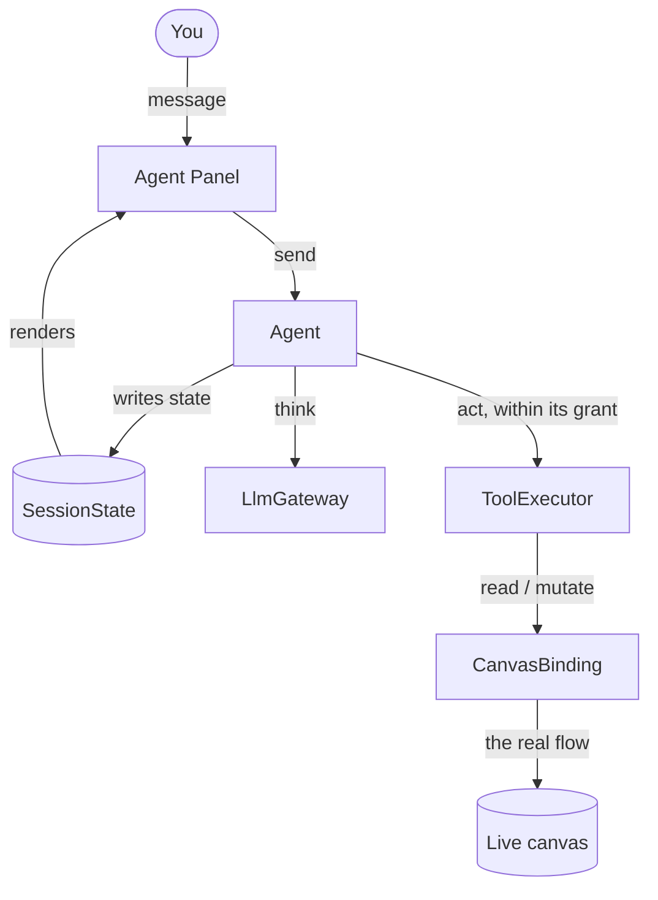
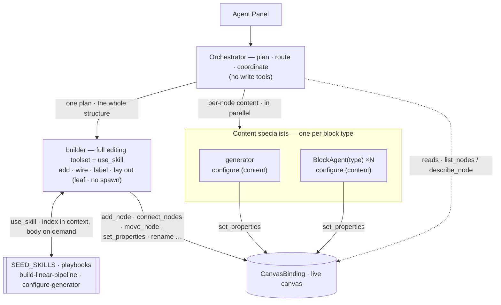
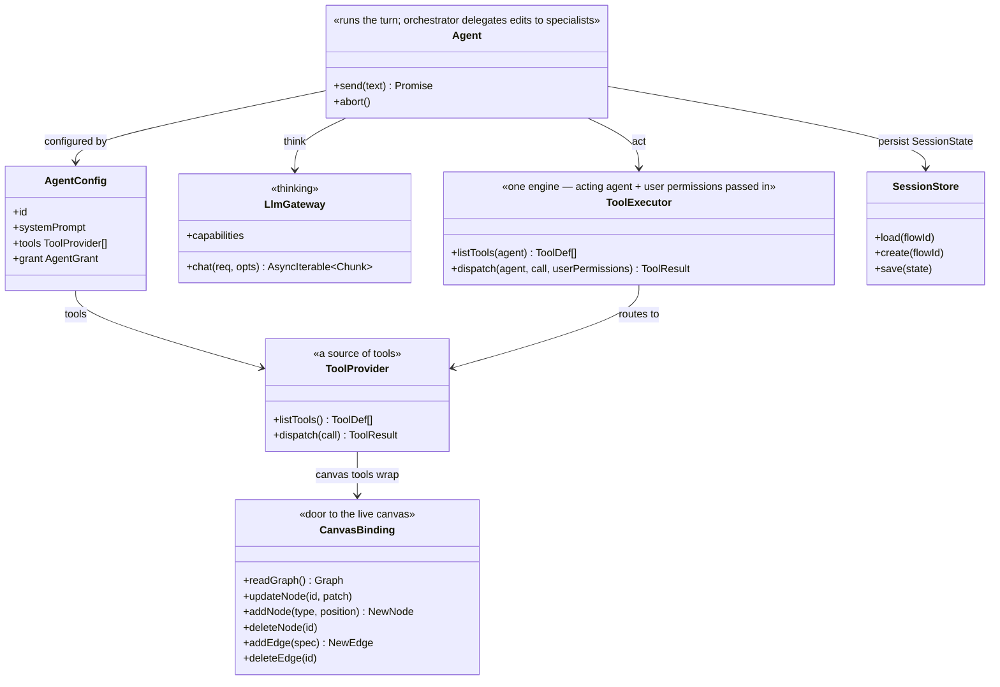
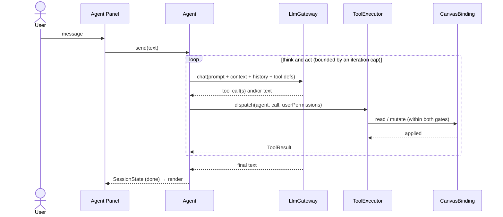

# Agent architecture — the shared model

The parts every in-browser flow agent is built from, described once. The concrete agent specs (e.g.
[builder.md](../agents/builder.md)) reference this page instead of restating it; each covers only what it
_adds_.

The DOM-free core is `@flows/agent` (`libs/agent`); the editor wiring lives in
`apps/web/src/app/features/flows/`. Last updated 2026-08-06.

## At a glance

You talk to the **Panel**; the **orchestrator Agent** owns the turn. It coordinates rather than edits —
it carries no write tools of its own, and delegates every edit to **specialist agents** it spawns, which
are the actual writers. Every agent — orchestrator and specialist alike — runs the same think/act loop:
ask the **LlmGateway**, run tool calls through the one **ToolExecutor** (which checks permissions), repeat
until the model is done. All of them reach the live canvas through a single shared seam, the
**CanvasBinding**, editing it directly. The persisted **SessionState** is what the Panel renders from.

**One foundation, one hybrid writer layer.** The orchestrator and every primitive on this page are the same
however the editing gets done; what the orchestrator does is **split each request by the KIND of work** and
delegate each part to the specialist built for it:

- **Structure → the builder.** Which nodes exist, how they wire together, how they are labelled, and how they
  lay out is coordination-heavy, so the orchestrator plans it and hands the **whole structural plan to one
  `builder`**, which realizes it on the canvas (add · wire · label · lay out) with on-demand `use_skill`
  playbooks and spawns nothing.
- **Content → per-node specialists.** A node's own configuration values are independent per node, so the
  orchestrator **fans those out in parallel** to the specialist for that block type (one **block agent** per
  block type; the AI **generator** is the richest of them).

This page describes the shared primitives the writers are built from; the spawn / roster / runner topology is
in [harness-spec.md](harness-spec.md) and [harness-interfaces.md](harness-interfaces.md) §4.

```
Panel → Agent → LlmGateway (think)
              → ToolExecutor → tools → CanvasBinding → live canvas (act)
              → SessionState → Panel (render)
```



The little loop on the left — **Panel → Agent → store → Panel** — is one-way. The Panel only sends
commands and renders what's in the store; it never touches the flow itself.

## The hybrid writer layer

Everything else on this page is **identical however the editing is delegated** — the same orchestrator
persona and tools, the same `BaseAgent` loop, the same `ToolExecutor` and two-gate permissions, the same
`CanvasBinding`. What the orchestrator holds is a **roster of specialists** it can `spawn` into, and it
routes each part of a request to the right one: the whole **structure** to the `builder`, each node's
**content** to that block's specialist.



|                         | role                                                                                                                                           |
| ----------------------- | ---------------------------------------------------------------------------------------------------------------------------------------------- |
| **Orchestrator**        | plan · route · coordinate — no write tools                                                                                                     |
| **Builder**             | realizes the whole **structure** from one plan (add · wire · label · lay out); carries `use_skill` over `SEED_SKILLS`; a leaf (spawns nothing) |
| **Content specialists** | one per block type (block agent ×N · the AI generator) — the orchestrator routes each node's **content** (config) to them, in parallel         |

Both write the **same live `CanvasBinding`** through the **same tools** under the **same two-gate
permission model**, so the foundation below is unchanged.

## Principles

- **One agent owns the turn; the writers are its specialists.** "Agent" means a single capability (a
  persona + its tools + its permissions). The Panel talks straight to the orchestrator, which owns the
  turn but coordinates rather than edits — it holds no write tools and delegates each edit to a
  specialist agent it spawns. The specialists are the writers; each is still a single capability.
- **Permissions are two gates, both fail-closed.** Every mutate tool declares the capability it needs;
  the executor runs it only if BOTH allow it — the agent's own fixed grant (what it was built to do) and
  the user's flow-role permissions (`userPermissions`, the runtime ceiling). An agent can never do more
  than its grant allows, and no agent can exceed the current user's role.
- **One seam to the canvas.** All reads and writes of the live flow go through the `CanvasBinding`; the
  turn loop itself never touches the DOM.

## Components

| Component         | Role                                                                                                                                                             |
| ----------------- | ---------------------------------------------------------------------------------------------------------------------------------------------------------------- |
| **Agent Panel**   | Chat UI. Emits `send`; renders purely from the session store. No logic.                                                                                          |
| **Agent**         | Runs the think/act loop, configured with a persona + tools + a grant. The orchestrator owns the turn and delegates edits to specialists (the writers) it spawns. |
| **LlmGateway**    | The one outbound LLM dependency, behind one interface so it can be swapped (Generate API, fake, Gemini).                                                         |
| **ToolExecutor**  | One engine for the session: route a call by name → validate args → gate on BOTH the agent's grant and the user's flow-role → dispatch → result.                  |
| **CanvasBinding** | The single seam to the real graph, over the `FlowEngine` that owns it: read it, patch a node, add/delete nodes and edges.                                        |
| **SessionStore**  | Loads/creates/saves the `SessionState` the Panel renders from, keyed by `flowId`.                                                                                |

### The pieces (UML)

These primitives are the **reused foundation** — identical however the editing is delegated, and (relative to
`develop`, where `@flows/agent` does not exist) the layer everything else is built on. The hybrid writer layer's
pieces (`spawn` / roster / the specialists / the builder / skills) sit _above_ this and are detailed in
[harness-interfaces.md §4](harness-interfaces.md#4--spawn--sub-agents-over-the-live-binding).



## The turn (think/act loop)

The generic loop is written once, in `BaseAgent` (`libs/agent/src/agents/baseAgent.ts`); a concrete
agent supplies only its `AgentConfig` and, optionally, per-turn context messages recomputed each
iteration.

Those per-turn hooks are where each agent delivers the **live canvas**, and the choice is
**lifetime-matched**: a short specialist (a block agent) re-sends the canvas in its head every turn
(`buildContextMessages`); the long-lived builder and orchestrator seed it **once** into the first user message
(`initialUserPreamble`) and pull fresh state on demand via a `get_graph` tool, so their growing transcript
stays a cacheable prefix. The rationale and measurements are in
[context-strategy-and-composition.md](context-strategy-and-composition.md).



Not shown in the diagram: the turn moves through phases `idle → thinking → done`, ending in `error` on a
gateway failure or on exceeding the iteration cap. `abort()` cancels the in-flight gateway stream, but
work already applied stays applied; and a `send` arriving while a turn is in flight is ignored — a single
active turn.

## Interfaces

The provider-neutral contracts as they ship in `@flows/agent`.

```ts
// ── Agent — runs the turn (orchestrator delegates edits to specialists) ──────
interface Agent {
    send(text: string): Promise<void>; // append user msg → run the whole turn
    abort(): void; // cancel the in-flight stream; applied work stays applied
}
// What varies between capabilities.
interface AgentConfig {
    id: string;
    description: string; // what it handles
    systemPrompt: string; // persona / instructions
    tools: ToolProvider[]; // its tool sources; the executor unions + routes across them
    grant: AgentGrant; // the capabilities it is allowed to use
}

// ── Permissions ──────────────────────────────────────────────────────────────
type Capability = 'canModifyCanvas' | 'canEditConfig' | 'canEditStructure' | 'canRun'; // compile-guarded subset of keyof FlowPermissions
type AgentGrant = Partial<Record<Capability, boolean>>; // absent/false = denied. Both gates are an AgentGrant: an agent's fixed grant, and the user's flow-role permissions (derived from FlowPermissions via toAgentGrant())

// ── LlmGateway — the one outbound LLM dependency ─────────────────────────────
interface LlmGateway {
    readonly capabilities?: LlmGatewayCapabilities; // absent = unspecified (don't assume tool support)
    chat(req: ChatRequest, opts?: { signal?: AbortSignal }): AsyncIterable<Chunk>;
}
interface LlmGatewayCapabilities {
    readonly toolCalls: boolean;
}
interface ChatRequest {
    messages: ChatMessage[];
    tools: ToolDef[];
    stream?: boolean;
}
interface ChatMessage {
    role: 'system' | 'user' | 'assistant' | 'tool';
    content: string | null;
    toolCalls?: { id: string; name: string; args: string }[]; // args = the raw JSON string
    toolCallId?: string;
}
interface ToolDef {
    name: string;
    description: string;
    parameters: JsonSchema;
    requires?: Capability; // the capability this tool needs; reads omit it
}
interface Chunk {
    text?: string;
    toolCall?: { id: string; name: string; argsDelta: string };
    done?: boolean;
    usage?: { inputTokens?: number; outputTokens?: number; totalTokens?: number; cachedTokens?: number }; // emitted with the final chunk when reported
}

// ── ToolExecutor & tools ─────────────────────────────────────────────────────
interface ToolCall {
    id: string;
    name: string;
    args: unknown; // already parsed from the model's raw JSON
}
type ToolResult = { toolCallId: string; ok: true; data?: unknown } | { toolCallId: string; ok: false; error: string };

// A ToolProvider is one source of tools — it lists them and runs them. Maps 1:1
// to an MCP server (listTools ↔ tools/list, dispatch ↔ tools/call).
interface ToolProvider {
    listTools(): ToolDef[] | Promise<ToolDef[]>;
    dispatch(call: ToolCall): ToolResult | Promise<ToolResult>;
}
// ONE executor for the session — a single engine, not reimplemented per agent.
// The acting agent (its tools + grant) is passed in each call.
interface ToolExecutor {
    listTools(agent: AgentConfig): Promise<ToolDef[]>; // the agent's providers' tools, unioned
    // route by name → validate → gate on BOTH the agent's grant and userPermissions (the flow-role ceiling) → run
    dispatch(agent: AgentConfig, call: ToolCall, userPermissions: AgentGrant): Promise<ToolResult>;
}

// ── CanvasBinding — the one door to the live canvas ──────────────────────────
type Graph = WorkflowState; // the live canvas shape ({ nodes, edges }), aliased from @lemoncloud/eureka-flows-api
interface CanvasBinding {
    readGraph(): Graph; // live structural read
    // patch one node, applied immediately (frontend-only): move → position · rename → label · set_properties → config
    updateNode(id: string, patch: { label?: string; position?: XY; config?: Record<string, string> }): void;
    // structural edits, each applied immediately, checkpointed, gated on canModifyCanvas:
    addNode(type: string, position: XY): { id: string }; // create with the block's defaultConfig; returns the new id
    deleteNode(id: string): void; // remove the node + cascade its edges
    addEdge(spec: { sourceNodeId: string; sourcePortId: string; targetNodeId: string; targetPortId: string }): {
        id: string;
    };
    deleteEdge(id: string): void;
}

// ── Session — what the Panel renders from ────────────────────────────────────
type AgentPhase = 'idle' | 'thinking' | 'done' | 'error';
interface SessionState {
    flowId: string;
    messages: Message[];
    phase: AgentPhase;
    error?: string; // set when phase === 'error'
}
interface SessionStore {
    load(flowId: string): SessionState | null;
    create(flowId: string): SessionState;
    save(state: SessionState): void;
}
```

## ToolExecutor & permissions

There is **one `ToolExecutor` for the session** — a single engine, not subclassed per agent. The acting
agent and the user's permissions are passed in (`dispatch(agent, call, userPermissions)`), and the
executor reads that agent's `tools` (to route) and `grant` (to gate). Per-agent behavior is therefore
_data the same code reads_, not new code.

`dispatch(agent, call, userPermissions)` is the single choke-point per tool call: **route by name** →
**validate** `args` against the tool's JSON Schema → **check permission** → return a `ToolResult`. It
never throws; a denied or invalid call returns `{ ok: false, error }` and changes nothing.

Tools come from **providers**, and an agent can compose several — its `tools` is a list. Each provider
lists and runs its own tools; the executor unions their `listTools()` for the model and builds a
`name → provider` index so `dispatch` routes each call. A provider holds no agent-specific state, so one
provider can back several agents; each agent's `grant` decides what it may actually call.

Each canvas tool is a **self-named value** — a `CanvasTool` carrying its `def` (the single source of its name)
and a `build(deps)` that binds it to the live canvas — the model every mature agent SDK uses (LangChain's
`tools: [a, b]`, the Vercel AI SDK's tool objects). An agent assembles its toolset by **listing the tool
values** it carries (`toolset(deps, [SET_PROPERTIES, …])`), so composition is a **list of values selected by
identity**, not strings and not a bespoke provider per operation. That makes rename/delete a **compile error at
every use** — an unresolved import the compiler, linter, and editor all flag — and a real MCP server drops in
later as just another list of named tools. The orchestration seams (`list_agents`, `spawn`) stay bespoke providers:
they close over the roster/runner, not a canvas.

**Permission is two gates, per-tool.** Each tool declares the capability it needs via `ToolDef.requires`
(reads omit it). A required-capability call runs only if that capability is enabled in **both** the
agent's fixed `grant` (what the developer built the agent to do) **and** `userPermissions` (the current
user's flow-role ceiling, projected from `FlowPermissions` via `toAgentGrant`). Both are fail-closed:
`userPermissions` is always supplied, so a viewer (`{}`) is denied even where a specialist grants itself
the capability. The same tool can thus be callable for one agent/user and denied for another.

## CanvasBinding — the seam

The single door between the agent core and the graph on screen, injected at mount. It wraps the
**`FlowEngine`** that owns the graph, so one binding serves every runtime — the desktop editor, the
mobile editor, the tutorial and a headless Node run — and nothing in it is React-aware.

- `readGraph()` — the live `{ nodes, edges }`, straight from `engine.getGraph()`. Not from
  `useCanvasStore`: that projection pauses mid-drag, leaving it behind on committed edits and ahead
  on uncommitted preview coordinates at once.
- `updateNode(id, patch)` — one node's label / position / config, frontend-only, applied through
  `engine.transact`, so the edit is undoable like a user drag and is part of what the next save
  sends. No server call at the moment of the edit. `config` is merged; `position` replaces whole.
- `addNode` / `deleteNode` / `addEdge` / `deleteEdge` — the structural edits, each one `engine.transact`
  call (one undo step, part of the next save). `addNode`/`addEdge` return the new id; `deleteNode`
  cascades the node's edges (`ops.removeNodes`). Semantic validation (block type exists; ports exist,
  are type-compatible, won't cycle; the target input is free) lives in the tools, so the binding just
  applies — `ops.connect` never has an existing edge to displace.

It does **not** check permissions — the `ToolExecutor` above it already gates each tool on the
capability that tool requires, and a second coarser gate here could only fail silently.

The implementation and the primitives it wraps are in [canvas-binding.md](canvas-binding.md).

## Session & storage

`SessionState` is the whole persisted turn state; the Panel is a pure function of it. `SessionStore`
loads/creates a session keyed by `flowId` and `save`s at each turn step — after the user message, after
the fully-collected assistant reply, after each tool result, and on phase transitions. The gateway
stream is drained in full before the reply is persisted; text is not saved token-by-token. The render
loop is one-way: Panel emits commands → the Agent writes `SessionState` → store → Panel re-renders.

`@flows/agent` ships an in-memory `SessionStore` via `createInMemorySessionStore` (the default for tests
and Node runs); in the browser, `useAgentSession` builds a `SessionStore` whose writes and hydration
persist through an injected storage port (localStorage), so a transcript survives a reload.

## Grounding (what already exists)

Every seam wraps a primitive already in the repo, which is what makes an agent implementable without new
backend work.

| Seam                     | Wraps                                                                                                                                                                                                                                                      | Where                                          |
| ------------------------ | ---------------------------------------------------------------------------------------------------------------------------------------------------------------------------------------------------------------------------------------------------------- | ---------------------------------------------- |
| `readGraph` (live)       | `engine.getGraph()` → `{ nodes, edges }` (the engine, not the store — the store's projection pauses mid-drag)                                                                                                                                              | `libs/agent/src/canvas/engineCanvasBinding.ts` |
| `updateNode`             | `engine.transact(label, ops => ops.updateNode(id, patch))` — one call, one undo step; history is the transaction                                                                                                                                           | `libs/agent/src/canvas/engineCanvasBinding.ts` |
| `addNode` / `deleteNode` | `engine.transact(label, ops => ops.addNode(...))` (engine seeds defaults, returns the id) / `ops.removeNodes([id])` (drops the node **and** cascades its edges)                                                                                            | `libs/agent/src/canvas/engineCanvasBinding.ts` |
| `addEdge` / `deleteEdge` | `engine.transact(label, ops => ops.connect(spec))` (returns the new edge id; refuses cycle / incompatible ports) / `ops.disconnect([id])`                                                                                                                  | `libs/agent/src/canvas/engineCanvasBinding.ts` |
| permissions              | `FlowPermissions` (7 flags; structural edits use `canModifyCanvas` = "add/delete nodes, connect edges"); the agent's `Capability` is a compile-guarded subset, and the user's `userPermissions` are derived from the flow's permissions via `toAgentGrant` | `libs/flows/.../types/permissions.ts`          |
| node shape               | `NodeData` (`id`, `type`, `position`, `customLabel`)                                                                                                                                                                                                       | `@lemoncloud/eureka-flows-api`                 |

New agent code lives in `libs/agent/src`, mirroring how `flows`/`socket` are structured.

## Shared foundations

Two subsystems under `@flows/agent` back any agent and are documented separately:

- **Storage + Trace ports** — session persistence and observability, standalone modules
  (`libs/agent/src/{storage,trace}`); the trace design is [design/trace-spec.md](./trace-spec.md).
- **LlmGateway providers** — the contract plus the Gemini provider and HTTP port:
  [llm-gateway.md](./llm-gateway.md).
