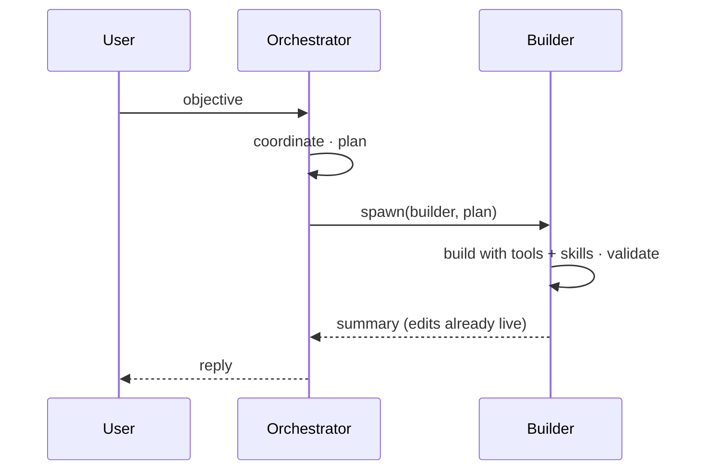
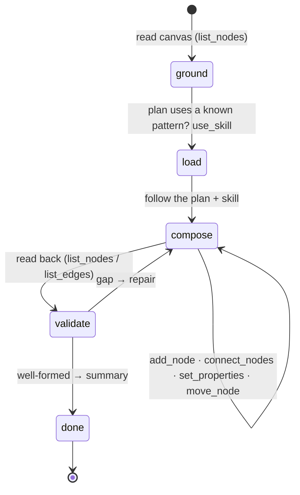

# Builder agent — builds the flow from the orchestrator's plan, with tools and skills

> **Status: LANDED** — the first consumer of the shipped skills foundation ([skills.md](./skills.md)). The
> Builder is a spawnable **composition specialist**: the **orchestrator plans and spawns it**; the **Builder
> builds** the flow with its tools (the doing) and on-demand skills (the how-to). The code shipped
> ([builderAgent.ts](../../../libs/agent/src/agents/builderAgent.ts), registered `type: 'builder'`); its spec is
> co-located at [builder.md](../../../libs/agent/src/agents/builder.md) and §5 is the change note.
>
> **Grounding.** `@flows/agent` on `feat/structural-agents`: the `BaseAgent` loop, the tool surface
> ([harness-spec.md §8](./harness-spec.md)), and the shipped skills foundation (`Skill`, `use_skill`,
> `SEED_SKILLS`). 2026-07-31.

---

## 1 · Division of labor

The Builder is the sole worker of **Strategy 2**
([architecture.md · Two strategies](./architecture.md#two-strategies-over-the-shared-foundation)) — the
orchestrator plans, the Builder builds. It does **not** plan or coordinate — the orchestrator does. Each
stays in its lane:

- **Orchestrator** (unchanged; write-free, Principle 1 intact) — coordinates, **makes the plan**, and **spawns
  the Builder** with it. It resolves what only the coordinator can see (the target, shared values, the shape to
  build) and hands the Builder one complete objective.
- **Builder** (new) — **just builds.** It takes the plan and realizes it on the live canvas with its **tools**,
  reaching for **skills** for the how-to, then validates and returns a summary. It coordinates nothing and spawns
  nothing — a leaf sub-agent.

## 2 · The Builder

A `BaseAgent` subclass registered as `type: 'builder'`, spawned with a plan. It holds a write grant like every
specialist (`canModifyCanvas` + `canEditConfig`), gated at the executor against the user's role.

**Tools — the doing** (all shipped, wired directly): reads `list_nodes` · `describe_node` · `list_edges` ·
`catalog_search` · `describe_block`; writes `add_node` · `set_properties` · `rename` · `delete_node` ·
`connect_nodes` · `disconnect_edge` · `move_node`; and **`use_skill`** (the shipped
`createUseSkillToolProvider(SEED_SKILLS)`).

**Skills — the how-to.** `use_skill` loads the playbook whose description matches the work, and the Builder
follows it (progressive disclosure; the index rides the tool description — [skills.md](./skills.md)). Seed
playbooks, already shipped:

| Skill                   | Body                                                                                           |
| ----------------------- | ---------------------------------------------------------------------------------------------- |
| `build-linear-pipeline` | add stages in dependency order, wire adjacent, lay out left-to-right, read back                |
| `configure-generator`   | model↔provider-key map, sampling params, system-vs-user prompt                                |
| `validate-and-repair`   | the well-formedness checklist (no dangling required input · valid configs · acyclic) + repairs |

Richer playbooks (`build-retrieval-flow`, `layout-flow`) are just new `.md` files — the Builder needs no change.

**The build loop** — a lean persona; the domain knowledge lives in the skills:

## 3 · What's new

Near-pure assembly. The only new **code** is the `BuilderAgent` subclass + one `builder` roster registration
(+ its `AgentCard`). Reused unchanged: the `BaseAgent` loop, every tool, the whole skills foundation, the
orchestrator, and the surgical specialist fleet. No new tools, no skill-layer or loop changes.

## 4 · Verify

- **Build-a-flow oracle** — plan → the post-turn graph **shape** (right blocks, wired in order, required inputs
  satisfied, key configs set); exact where the intent fixes a value, relational where it doesn't
  ([harness-scenarios.md](./harness-scenarios.md)).
- **Validate-and-repair** — seed a dangling required input; the Builder wires it.
- **Skill selection (live)** — the matching playbook is `use_skill`-loaded, unrelated ones are not
  ([skills.md §5](./skills.md) parks this here).
- **Routing (live)** — the orchestrator delegates a multi-block build as **one** `builder` spawn, not a per-block
  fan-out.
- **Cost** — Builder-direct vs. the old per-block fan-out on the same objective ([eval-benchmark](./eval-benchmark.md)).

## 5 · Change note — what landed

**Docs (clean end-state, present tense).** The Builder is now specced as the **third specialist kind**:

- [harness-spec.md](./harness-spec.md) — §6 (three shapes: block · operation · **composition**), §8 (per-agent
  tool-surface row + the Strategy-2 build-handoff note + the skills-consumer note),
  §9 (what's new).
- [harness-interfaces.md](./harness-interfaces.md) §4 — the `builder` registration entry + the `BuilderAgent`
  surface (`BuilderAgentDeps = BaseAgentDeps`, `createBuilderAgent`, `BUILDER_SYSTEM_PROMPT`).
- [agents/README.md](../agents/README.md) — the composition kind + a `builder` roster row.
- **The Builder's own SPEC is co-located with its code** at
  [`libs/agent/src/agents/builder.md`](../../../libs/agent/src/agents/builder.md) (not under `docs/agents/`).

**Code.** `libs/agent/src/agents/builderAgent.ts` (`BuilderAgent` + `BUILDER_SYSTEM_PROMPT` +
`createBuilderAgent`), a `type: 'builder'` entry in `registrations.ts`, exported from `agents/index.ts`. **No new
tools, no skill-layer or loop changes** — pure assembly (the full editing toolset +
`createUseSkillToolProvider(SEED_SKILLS)`), grant `canModifyCanvas` + `canEditConfig`, a leaf sub-turn (no
`spawn`).

**Tests.** `__tests__/harness/scenarios/builder.spec.ts` (deterministic: build-a-pipeline · add+configure ·
validate-and-repair · tool surface · skill load), `builder.live.spec.ts` (`RUN_LIVE`-gated build), and
`integration.spec.ts` **A7** (orchestrator plans → one `builder` spawn → build). Live skill-selection and routing
stay live observations, not hard-asserted (they depend on the model's judgement).
