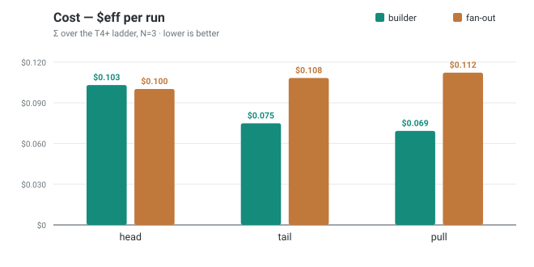
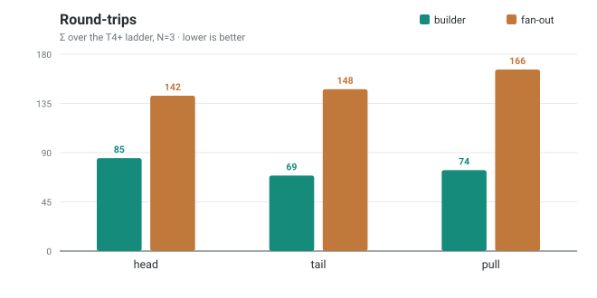
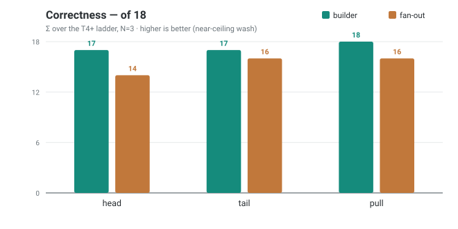
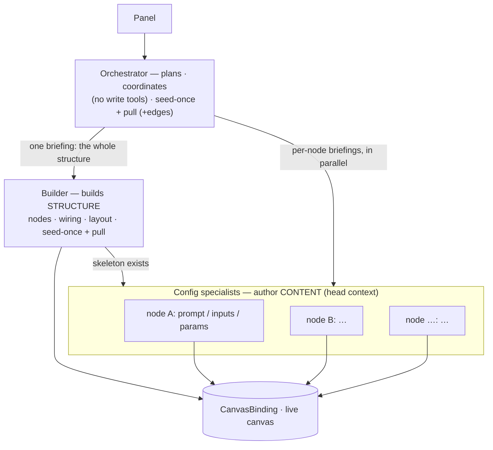

# Report — context delivery & agent composition

**What this is.** The consolidated findings from the context-delivery + builder-vs-fan-out investigation,
and the **design decision** they lead to — the single source of truth for both. The intermediate change-notes
and per-run comparison reports it grew out of have been folded in here.

**Method.** `gemini-2.5-flash` (Developer API), `temperature 0`. Two benchmark passes:
the **three-way** context comparison (Σ over the T4+ ladder, **N=3**) and the **orchestrator-tail** A/B
(scenarios T6 + T8, **N=5**, baseline and variant run back-to-back in one session). temp=0 is
non-deterministic on 2.5 Flash, so single-cell flips are noise; the direction of a Σ or a control is the signal.
Last updated 2026-08-05.

---

## TL;DR — the decision

1. **Context delivery is lifetime-matched, not one global setting.** Where the live graph goes in the prompt
   depends on how long the agent's context lives:
    - **Builder** (one long context) → **seed once + pull** (`get_graph`). Lowest cost, best caching.
    - **Orchestrator** (medium) → **seed once + pull**, and it now carries **edges** (occupancy it was blind to).
      **Not tail** — tail triggers a runaway (below).
    - **Short specialists** (block / edge / locator, 2–3 turns) → **head** (canvas re-sent each turn). A 2-turn
      agent can't amortize a pull round-trip, so pull _taxes_ it.
2. **The two "strategies" are complementary, not either/or.** The builder wins at **structure** (nodes +
   wiring — coordination-heavy). Fan-out's only failure mode is **coordination**, so it is a natural fit for
   **independent, per-node work**. So: **the builder builds the structure; per-node config specialists author
   the content in parallel; the orchestrator plans.**
3. **What's proven vs. hypothesis.** Structural composition is measured (builder wins). **Open-ended content
   authoring (writing generator prompts, meaningful inputs) is untested** — the "config specialists author
   content" half is a well-reasoned hypothesis awaiting a content-authoring benchmark (see [Next](#next)).

---

## 1. The question

A flow-building agent must see the **live canvas** every turn. Two independent questions:

- **Where does the graph go in the prompt?** — three shapes: **head**, **tail**, **pull**.
- **Who does the building?** — one **builder** holding the whole plan, or an orchestrator **fanning out** to
  narrow specialists.

## 2. Three ways to deliver the graph

| strategy      | where the canvas lands                                                             | when                   |
| ------------- | ---------------------------------------------------------------------------------- | ---------------------- |
| **Head** (A1) | in the **system prompt**                                                           | re-sent **every turn** |
| **Tail** (A2) | as the **last user turn**                                                          | re-sent **every turn** |
| **Pull** (A3) | **seeded once** in the first user message, then fetched via a **`get_graph`** tool | **on demand**          |

**Per-agent, per-strategy — where the canvas actually lands.** The strategies were never applied uniformly;
this is what each agent did in each pass (🔴 = volatile canvas sits in the cacheable prefix → breaks it;
🟢 = prefix stays cacheable):

| agent            | head · A1                  | tail · A2                 | pull · A3                                 |
| ---------------- | -------------------------- | ------------------------- | ----------------------------------------- |
| **Orchestrator** | 🔴 head · nodes + roster   | 🔴 head (= A1)            | 🟢 seed¹ nodes+edges · roster head · pull |
| **Builder**      | 🔴 head · nodes+edges      | 🟢 **tail** · nodes+edges | 🟢 seed¹ nodes+edges · pull               |
| **Block**        | 🔴 head · its nodes+schema | 🔴 head (= A1)            | 🟢 head schema · pull                     |
| **Edge**         | 🔴 head · nodes            | 🔴 head (= A1)            | 🟢 pull only                              |
| **Locator**      | 🔴 head · nodes            | 🔴 head (= A1)            | 🟢 pull only                              |

¹ seeded **once** into the first user message (the A3 seed-once + pull strategy), not re-sent each turn.

> **Read A2 carefully:** "tail" moved **only the builder**. Every fan-out row is byte-identical to A1 — which
> is why fan-out's A1↔A2 numbers are run-noise, not an effect.

## 3. The caching mechanism

Prefix caching matches the **longest common prefix** of consecutive requests, so the prompt must be ordered
**[most stable … most volatile]**. A single long-lived agent re-sends its whole transcript every round-trip —
that re-send is ~90% of the tokens (the **re-send tax**). If the volatile canvas sits in the **head**, it
changes every turn and **truncates the cached prefix down to the persona** — the growing transcript never
caches. Moving the canvas to the **tail** (or out of the loop entirely, **pull**) keeps persona + transcript a
stable, cacheable prefix.

This is exactly why **lifetime matters**: the tax only bites an agent whose context lives long enough to
re-send a big transcript. A 2–3-turn specialist has almost no transcript, so caching barely helps it — but a
`get_graph` round-trip is a fixed ~1-turn cost it _can't_ amortize. Hence: **long context → pull; short
context → head.**

## 4. Results — builder vs fan-out × head/tail/pull

Σ over the T4+ ladder, N=3. `$eff` is cache-aware cost per run; correctness is out of 18; turns are total
round-trips across all agents in the run.

**Cost — `$eff` per run** (lower is better; same scale across both designs):

**Turns — total round-trips** (lower is better; same scale):

**Correctness — of 18** (higher is better):

Builder **cache-share** climbs as the volatile canvas leaves the head: head **29%** → tail **37%** → pull **52%**.

**Reading it.** Correctness is a near-ceiling wash (within N=3 noise), so **cost and turns decide**. For the
**builder**, tail and pull cut cost ~30% and trim turns — **pull is cheapest, caches best (52%), and hit
18/18**. For **fan-out**, pull _adds_ cost (+12%) and turns (+17%) with no correctness gain: its 2–3-turn
agents can't bank a `get_graph` round-trip. **Context lifetime decides the winner** — the same change that
helps the long builder hurts the short specialists.

## 5. The orchestrator-tail experiment — does the coordinator benefit from tail?

The orchestrator is fan-out's one longer-lived agent, so a natural idea: give **it** the builder's tail
treatment (canvas → last user turn, roster stays in the head). Tested as a **clean same-session A/B**, N=5,
T6 + T8 — the builder is byte-identical between the two runs, so it's a **noise control**.

|                       | scenario    | pass (base→var) | `$eff`                     | round-trips        | cache-share |
| --------------------- | ----------- | --------------- | -------------------------- | ------------------ | ----------- |
| **Fan-out**           | T6.branch   | 3/5 → **1/5**   | 0.0252 → 0.0288 (**+14%**) | 35.7 → 43.0 (+20%) | 15% → 7%    |
| **Fan-out**           | T8.two-pipe | 4/5 → **3/5**   | 0.0260 → 0.0294 (**+13%**) | 36.8 → 41.7 (+13%) | 16% → 9%    |
| **Builder** (control) | T6          | 5/5 → 4/5       | 0.0121 → 0.0107 (−12%)     | 10.6 → 8.5         | 34% → 28%   |
| **Builder** (control) | T8          | 5/5 → 4/5       | 0.0209 → 0.0202 (−3%)      | 18.0 → 18.3        | 54% → 36%   |

**It backfired — the opposite of the hypothesis.** Two things read through the noise:

- **The control quantifies the noise.** On _byte-identical_ builder code, cache-share fell (54%→36%, 34%→28%)
  and correctness fell 5/5→4/5 — implicit caching is best-effort and swings run-to-run. So the fan-out cost
  deltas are noise-confounded; don't read +13% as precise.
- **But two signals are not noise.** (1) **Cost asymmetry** — fan-out cost rose while the identical builder's
  fell (opposite directions); since the orchestrator is far more active in fan-out, the fan-out-only rise
  points at it. (2) **A tail-induced runaway** — baseline's worst run reached node-id `n_6` (normal — T8 needs
  6); the variant spiraled to **`n_302`**, a delegation loop that created ~300 nodes, committed them, then had
  the orchestrator echo the bloated tail-canvas verbatim as its answer (→ unparseable → refused). **Zero**
  baseline runs came near this.

**Why tail helps the builder but hurts the orchestrator.** The **builder is an executor** — it reads state and
acts, so state-last (most salient) is ideal. The **orchestrator is a coordinator** — it tracks _"what have I
already delegated?"_ from its **transcript**. Tail displaces its own action-history from the recency slot, so
it stops tracking its plan and reacts to raw state → redundant re-delegation → in the worst case, the `n_302`
runaway. **Tail is an executor optimization, not a coordinator one.** (Note: A3's _seed-once + pull_ is safe
for the orchestrator precisely because it does **not** re-inject the canvas every turn — the transcript stays
in the recency slot.)

## 6. Failure modes (from the transcripts)

- **Builder — finishes one edge short, then reports done.** It builds the nodes and most edges, misses the
  last one, yet its summary claims completion. A _discipline_ gap: verify the graph against the plan before
  declaring done.
- **Fan-out — botches the wiring, never verifies.** Every node gets built; the edges don't. Parallel edge
  agents guess wrong port names, race, duplicate; the orchestrator reports success from children's `ok`
  summaries without re-reading the graph. _Coordination_ gaps — and the reason fan-out loses on structure.
- **Tail-on-orchestrator — regurgitation / runaway** (§5): the coordinator loses its progress-tracking.

The through-line: both designs want the same safeguard — **re-read the graph against the plan before
reporting success** — which neither push nor pull provides on its own.

## 7. The design decision

**Play each design to its proven strength.** Structure is coordination-heavy → the builder. Content
(per-node prompts, inputs, params) is independent per node → fan-out's strength, and it dodges fan-out's only
proven weakness (cross-node wiring).

**Context strategy is lifetime-matched:**

| agent                                           | role              | context lifetime     | strategy                                                |
| ----------------------------------------------- | ----------------- | -------------------- | ------------------------------------------------------- |
| **Builder**                                     | build structure   | long, single context | **seed-once + pull** (`get_graph`)                      |
| **Orchestrator**                                | plan · coordinate | medium               | **seed-once + pull**, carries **edges**; **never tail** |
| **Config / block / edge / locator specialists** | one node / one op | short (2–3 turns)    | **head** (canvas re-sent each turn); no pull            |

**Proven vs. hypothesis.**

- **Proven:** builder wins at structural composition; context strategy is lifetime-matched (builder pull /
  short specialists head); tail helps the builder (executor) and hurts the orchestrator (coordinator).
- **Hypothesis (untested):** the content half. We benchmarked structure and _structured_ config
  (`temperature=0.2`, `model=…`, rename), never **open-ended content authoring** (a generator's prompt, a
  meaningful input). "Per-node config specialists author content" is a reasoned extrapolation from fan-out's
  strength profile, not a measured result.

## Next

Add a **content-authoring scenario set** — e.g. _"make the generator summarize the input in a formal tone,"_
_"set the input to a haiku about X"_ — with an oracle that checks the field is **populated and on-intent**, and
run **builder-loops-back vs. per-node config specialists**. That settles the one open half of the decision
instead of reasoning about it.

## Appendix — retrievable code & data

| pass          | what                                        | commit / path                                          |
| ------------- | ------------------------------------------- | ------------------------------------------------------ |
| A1 head       | canvas in the system prompt                 | `809169b`                                              |
| A2 tail       | canvas as the last user turn (builder only) | `ea980b9`                                              |
| A3 pull       | seeded once + `get_graph`                   | `1fe32bf`                                              |
| orch-tail A/B | N=5 baseline vs variant                     | `bench-runs/orchtail-{baseline,variant}/` (gitignored) |

Every number here was cross-checked against its source (`bench-runs/*.json`, the run transcripts) — 57 data
points, zero discrepancies.
