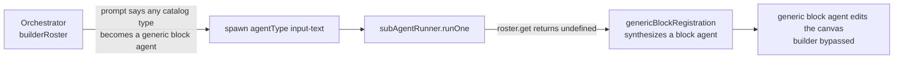
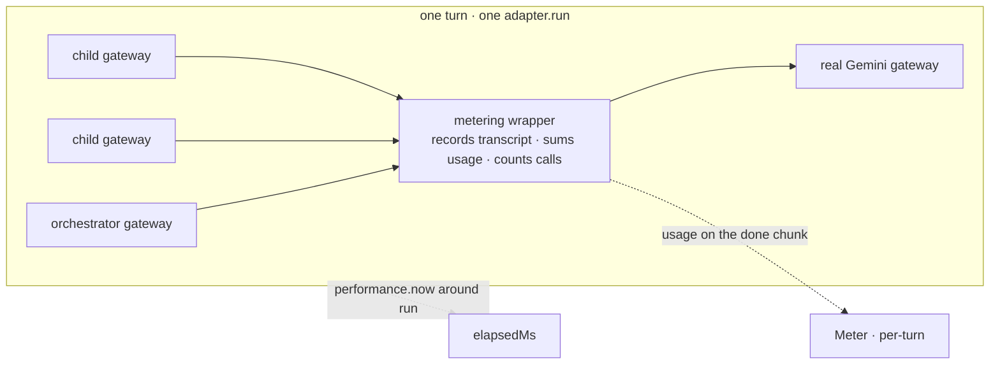
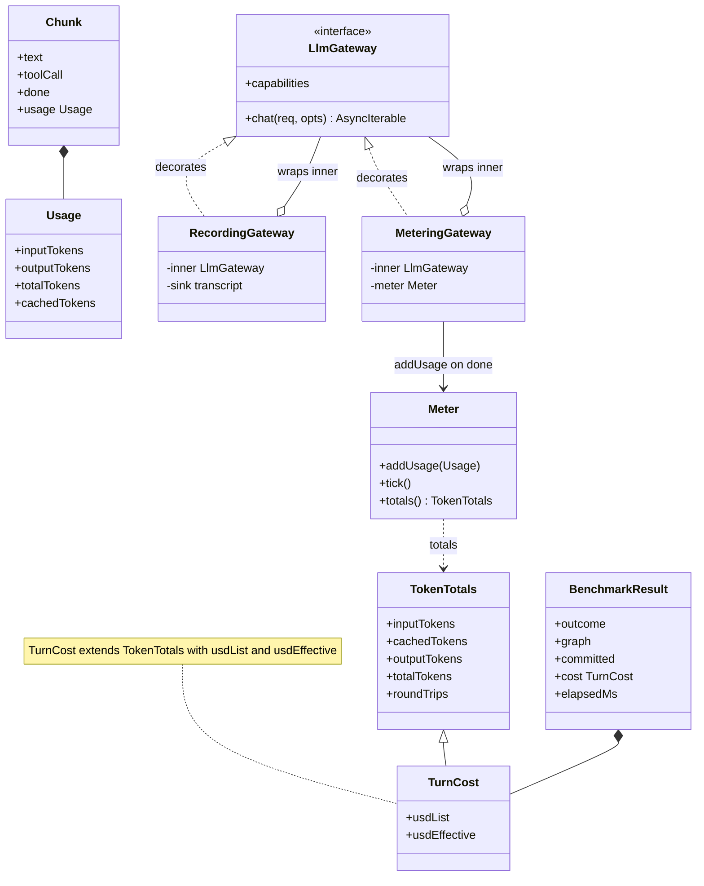

# Flow-agent eval — adding cost & time, and isolating the builder A/B

> **A plan / change note**, not the clean-end-state spec. It records the two gaps to close before the next
> benchmark run and how to close them; on approval, the agreed end-state folds back into
> [eval-benchmark.md](./eval-benchmark.md) (§8 lists the exact edits) and the code conforms.
>
> **Grounding.** Everything rides seams that already ship: the live benchmark
> (`libs/agent/src/__tests__/harness/scenarios/eval-benchmark.live.spec.ts`), its per-agent **recording
> gateway** (same file, the `makeGateway` seam `runScenario` forwards), the `LlmGateway` `Chunk.usage` field
> (`llm/llmGateway.ts:44` — carries input/output today; we add total + cached, §3.1) as populated by
> `GeminiLlmGateway` (`llm/GeminiLlmGateway.ts:229–259`), the `AgentRoster` (`agents/roster.ts`), the sub-agent
> runner (`agents/subAgentRunner.ts`), and the orchestrator context (`agents/orchestratorAgent.ts`). The
> correctness discipline is unchanged — see [eval-benchmark.md](./eval-benchmark.md). Written 2026-08-04.

---

## 0 · Two gaps to close before we run again

The correctness A/B is green (T0–T5 smoke, N=1, both designs). Two things block a _meaningful_ next run:

1. **The builder design is not isolated.** "Strategy 2 = builder" is meant to be _the orchestrator hands the
   whole plan to one `builder`_. It isn't: the orchestrator can still route single-block work to a **generic
   block agent**, so the builder roster is really "builder + block agents." Cost/time measured for such a
   confounded design would be misleading — so **the isolation fix is a prerequisite, not a side quest.**

2. **We only measure correctness.** Correctness is settled; the open question is now _which design is cheaper
   and faster for the same correct result_. Token/time metering was removed on 2026-08-03 ("compare correctness
   first"); this re-introduces it, adapted to the live benchmark and its recording gateway.

Order: **fix the confound (§1), add the efficiency axis (§2–§4), verify offline (§5), then re-run live.**

---

## 1 · Fix the confound — derive the routing rule from the roster

### The leak (two unconditional paths)



- **Path A — the prompt.** `renderContext` ([orchestratorAgent.ts:74-83](../../../libs/agent/src/agents/orchestratorAgent.ts#L74-L83))
  _always_ appends the block-rule: "any other catalog block type is served by a generic block agent
  automatically." Under the builder roster that instruction misdescribes the roster, and it invites the
  orchestrator to spawn per-block agents instead of the builder. **This is the cause the review flagged.**
- **Path B — the runner.** Even with the prompt silent, `runOne` ([subAgentRunner.ts:93](../../../libs/agent/src/agents/subAgentRunner.ts#L93))
  resolves `roster.get(type) ?? genericBlockRegistration(type, catalog)` — so _any_ `agentType` that is a real
  catalog block still materializes a block agent, whatever the roster says. A latent leak a prompt fix leaves open.

### The decision — minimal, prompt-only

> The structural ideal is **the roster as the single source of truth**, with the generic-block fallback a
> roster property that both the runner and the prompt derive from — closing both paths. It is the right
> end-state, but it touches `roster.ts` + `subAgentRunner.ts` + the prompt.

**We ship the minimal, prompt-only fix now and defer that refactor.** The review pinned the prompt, and the
prompt is where the orchestrator is actively _invited_ to spawn generic block agents (Path A). We fix exactly
that, in one file, and knowingly accept Path B as a dormant path guarded by a transcript check.

**The fix — `renderContext` chooses the routing rule from the roster it already holds:**

```ts
const cards = roster.list();
const builderExclusive = cards.length > 0 && cards.every(c => c.type === 'builder');
const routingRule = builderExclusive ? BUILDER_RULE : BLOCK_RULE;
```

- `BLOCK_RULE` = today's paragraph, verbatim → **fan-out _and_ the shipped default roster are unchanged**
  (both carry non-builder specialists, so `builderExclusive` is false). The gate is _builder-exclusive_, never
  merely "a builder is present" — so this is a benchmark-isolation fix, not a production routing change.
- `BUILDER_RULE` (new) = one line for the builder-only roster: _"All node and wiring work — add, configure,
  rename, delete, connect, rewire, insert, or build — goes to the builder; there are no per-block agents. Route
  the whole request to it in a single delegation."_ It removes the misleading generic-block invitation **and**
  states where node work goes. The "work it into one complete plan, don't fragment" _strategy_ moved to the base
  prompt (next bullet), so it is stated once.
- **The base prompt, too (extended later).** The routing rule was the first cut; the orchestrator's _base_
  system prompt is now chosen by the same gate — `orchestratorPromptFor(roster)`. Fan-out (and the shipped
  default) keeps the decompose-into-small-tasks prompt; the builder-exclusive roster gets a plan-and-hand-off
  prompt telling the orchestrator to work the request into ONE complete plan and delegate it in a single Builder
  briefing. Same isolation principle, carried from the routing line to the whole persona — so Strategy 2 is
  briefed to play to the Builder's strength (one pass, no re-discovery) instead of fragmenting a job it can do
  whole. Shared framing (intro + the target/amount/shared-values planning tail) is composed once and reused by
  both prompts.

**Accepted residual (Path B).** The runner fallback stays on: an off-book `spawn('input-text')` under the
builder roster would still synthesize a block agent. With the prompt no longer advertising it and only the
builder card visible, that should not happen at temp 0, but it is not _structurally_ impossible — §5.2's
transcript guard surfaces it in the logs if it ever fires. The roster-owned design is the follow-up that makes
it impossible.

---

## 2 · What to measure — and what each axis is worth

Four numbers per turn, **not** equal in trustworthiness:

| axis              | what                                                                                     | trust         | why                                                                                                                                       |
| ----------------- | ---------------------------------------------------------------------------------------- | ------------- | ----------------------------------------------------------------------------------------------------------------------------------------- |
| **total tokens**  | Σ per-call `totalTokenCount` over every agent (re-sent prompt + thinking included, §3.1) | **primary**   | network-independent, deterministic-ish at temp 0, cache-independent, and the actual cost driver                                           |
| **round-trips**   | count of `chat()` calls in the turn                                                      | primary       | a clean latency proxy that doesn't move with the network                                                                                  |
| **dollars**       | _list_ (tokens × rate) and _effective_ (cache-aware, §3.1)                               | derived       | human-readable; the _effective_ figure is real spend but **non-deterministic** (implicit cache hits vary run-to-run and leak across runs) |
| **wall-clock ms** | end-to-end `run()` latency                                                               | **secondary** | user-facing but **noisy** — network variance, and fan-out parallelizes children while the builder is one long serial agent                |

Design consequence: **raw tokens and round-trips decide the efficiency verdict; wall-clock and cost are reported
but not trusted to rank.** Dollars are twice-derived — a price constant we own times a cache state we don't
control — so the stable, cache-independent `totalTokenCount` is the axis the comparison rests on, and the cost
columns are a readout of real (effective) and list-price spend.

```ts
// Rates WE own — confirm against current Google AI pricing. Raw tokens are the ground-truth axis; these only
// scale the derived $ columns. cachedPerM applies to cachedContentTokenCount (implicit-cache hits, §3.1).
// Keyed by model so a bigger model reprices without touching the Meter.
const PRICES: Record<string, { inPerM: number; outPerM: number; cachedPerM: number }> = {
    'gemini-2.5-flash': { inPerM: 0.3, outPerM: 2.5, cachedPerM: 0.03 }, // cached = 10% of input (90% off), Dev API + Vertex
};
```

---

## 3 · Where to measure — extend the recorder into a metering gateway

Every LLM round-trip of every agent (orchestrator + each spawned specialist/builder) already flows through the
recording gateway the benchmark wraps around `makeGateway`. That is the exact choke point for metering — no new
seam. The only product touch is surfacing a few more usage fields on the gateway (§3.1); the Meter itself is
test-only.



- **Meter.** A tiny per-turn accumulator — `{ addUsage(u), tick(), totals(): TokenTotals }`, pure counting,
  no pricing (that is `price()`, §3.2). Each metering gateway reads `chunk.usage` on the `done` chunk — the one
  usage-bearing chunk per call (§3.1) — and adds it once; `tick()` counts the call. A fresh Meter per `run()`
  (per scenario × design × run i), threaded into `makeGateway` so **all** agents of the turn write into the
  same Meter → the totals are the whole-turn sum.
- **Wall-clock.** `performance.now()` immediately around the `d.run(...)` call in the it-loop (Node test
  context — available here). Includes every round-trip and the outcome re-ask, i.e. the latency a user feels.
- **Result surface.** `BenchmarkResult` grows an efficiency block; correctness fields are untouched:

```ts
interface TokenTotals {
    // what Meter.totals() returns — pure counting, provider-neutral (§3.2)
    inputTokens: number; // Σ promptTokenCount — re-sent history included (that IS the bill, §3.1)
    cachedTokens: number; // Σ cachedContentTokenCount — input served from the implicit cache (§3.1)
    outputTokens: number; // Σ (totalTokenCount − promptTokenCount) — visible output + thinking
    totalTokens: number; // Σ totalTokenCount — the stable, cache-independent ground-truth axis
    roundTrips: number; // count of chat() calls in the turn
}
// the single pricing seam — a pure fn over TokenTotals + PRICES (§2); nothing else applies a rate (§3.2)
declare function price(t: TokenTotals, model: string): { usdList: number; usdEffective: number };
interface TurnCost extends TokenTotals {
    usdList: number; // cache-blind: all input at standard rate — stable, apples-to-apples
    usdEffective: number; // cache-aware: cached input at cachedPerM — real spend, but noisy + order-dependent
}
interface BenchmarkResult {
    outcome: TurnOutcome;
    graph: Graph;
    committed: boolean; // ── unchanged above ──
    cost: TurnCost; // NEW
    elapsedMs: number; // NEW
}
```

A provider that reports no usage yields `undefined` → counted as 0 and flagged once in the scorecard, so a
silent 0 never masquerades as "free."

### 3.1 · Token accounting under a re-sending loop

The think/act loop re-sends the whole conversation every iteration, so call N's `promptTokenCount` already
includes the re-sent prefix. That is the bill, not an artefact to correct for: the provider charges the full
prompt on every call. **So a turn's cost is exactly Σ over every call `(input + output)`, across the
orchestrator and every child — re-sends counted each time, because they are paid each time. Summing is correct;
it is not double-counting.**

A concrete turn makes it click — the generator agent handling _"set the generator's temperature to 0.2 on
gen_1"_ over three rounds (tokens illustrative; the real ones come from `usageMetadata`):

```
══ round 1 ══                                                        billed as →
◀ system   generator-specialist persona ............ ~350 ┐
◀ tools    6 fn-declarations: describe_node,          ~520 ├ base prefix
           set_properties, catalog_search, …               │  ~1050 → INPUT (call 1)
◀ context  nodes: gen_1 (single-output-generator) .. ~160 │
◀ user     "set gen_1 temperature to 0.2" ............ ~20 ┘
▶ (thinking) ........................................ ~120 → OUTPUT
▶ calls    describe_node({ id:"gen_1" }) .............. ~15 → OUTPUT
     ⟨tool runs locally — 0 tokens⟩
◀ result   { model:"gemini-2.5-flash", temperature:"0.7" }  ~60 → INPUT (re-sent from call 2)

══ round 2 ══  (re-sends base + round-1 call + result)
◀ …base 1050 + call 15 + result 60 ................ = 1125 → INPUT (call 2)
▶ (thinking) ......................................... ~80 → OUTPUT
▶ calls    set_properties({ id:"gen_1",               ~25 → OUTPUT
             props:{ temperature:"0.2" } })
     ⟨tool edits the config — 0 tokens⟩
◀ result   { ok:true } ................................ ~8 → INPUT (re-sent from call 3)

══ round 3 ══  (re-sends everything so far)
◀ …prev 1125 + call 25 + result 8 ................. = 1158 → INPUT (call 3)
▶ (thinking) ......................................... ~40 → OUTPUT
▶ says     "Set the temperature to 0.2." ............. ~15 → OUTPUT  (no tool call → done)
```

Thinking is billed as output when generated but is **not** re-sent as input — only the visible assistant parts
(tool calls / text) and tool results re-enter the prompt. Per call, this is what `usageMetadata` reports and the
Meter sums:

|  call | input `prompt` |   cached | new (prompt − cached) | output (visible + thinking) |  `total` |
| ----: | -------------: | -------: | --------------------: | --------------------------: | -------: |
|     1 |           1050 |        0 |                  1050 |              135 (15 + 120) |     1185 |
|     2 |           1125 |    ~1050 |                    75 |               105 (25 + 80) |     1230 |
|     3 |           1158 |    ~1125 |                    33 |                55 (15 + 40) |     1213 |
| **Σ** |       **3333** | **2175** |              **1158** |                     **295** | **3628** |

Priced at the `PRICES` rates (in \$0.30/M, out \$2.50/M, cached \$0.03/M):

```
list $ (cache-blind):  3333×0.30/M + 295×2.50/M                = $0.00174
effective $ (cached):  1158×0.30/M + 2175×0.03/M + 295×2.50/M  = $0.00115   (~34% less)
                       └ new input ┘└ cached −90% ┘└ output (never cached) ┘
```

The base prefix (system + tools + context ≈ 1050, half of it the tool schemas) is billed on every call — the
re-send tax — but from call 2 it is a stable prefix, so implicit caching discounts it (the `cached` column).
Nominally this tax is where the designs diverge: the builder re-sends _one long history_ across up to 20
iterations, fan-out spreads _short, isolated_ child histories (≤8 iters, a fresh store each) plus the
orchestrator's — but caching refunds most of it, so the real gap is empirical. The Meter settles it by summing
per-call totals.

Three properties of the accounting, verified against `GeminiLlmGateway`:

1. **One usage per call.** The gateway is non-streaming (one `chat()` = one `generateContent` = one bill) and
   yields `usage` exactly once, on the `done` chunk
   ([GeminiLlmGateway.ts:259](../../../libs/agent/src/llm/GeminiLlmGateway.ts#L259)). The Meter adds it once
   per call — no within-call double count.
2. **Bill on `totalTokenCount`, not `candidatesTokenCount`.** `candidatesTokenCount` is only the _visible_
   output — 55 tokens across the three calls above — so a candidates-only meter would report 55 where the true
   output is **295**, silently dropping the 240 thinking tokens (`thinkingBudget: 1024`), the bulk and priciest
   part of the output side. `Chunk.usage` reads only prompt + candidates today
   ([GeminiLlmGateway.ts:229-237](../../../libs/agent/src/llm/GeminiLlmGateway.ts#L229-L237)); surface
   `usageMetadata.totalTokenCount` and derive `output = total − prompt`, immune to whether candidates includes
   thoughts.
3. **Implicit caching is on — capture `cachedContentTokenCount`.** Gemini 2.5+ caches automatically (default
   on; only _explicit_ `CachedContent` is off). A prefix shared with a recent call is billed **90% off** — a
   cached input token is \$0.03/M vs \$0.30/M, confirmed on both the Developer API and Vertex pricing pages —
   reported as `cachedContentTokenCount` — the `cached` column, which turned this turn's bill from \$0.00174 to \$0.00115.
   Our loop is the ideal shape (stable prefix front, new turn appended end — Google's own guidance), and the
   refund lands on precisely the re-sent prefix, favouring the builder's one long thread. Two consequences:
   **(a)** price cached input at `cachedPerM` or cost over-states input; **(b)** implicit hits are best-effort
   and _order-dependent_ — a design that runs second can hit the first's warm prefix — so the _effective_ figure
   is non-deterministic, and the fair cross-design axis stays raw `totalTokenCount`. Report both a _list_ figure
   (cache-blind, stable) and an _effective_ one (real spend); their gap = how cache-friendly each design is.

The example already shows the **four ways a tool call costs**, all captured by metering `usageMetadata` per call
(never reconstructed from text): the **tool schemas** in the ~520-token base (input, every call, then cached),
the **tool call** as output, the **tool result** as re-sent input (fat reads like `catalog_search`/`list_nodes`
accumulate), and each exchange forcing another **round-trip**. Local tool _execution_ is free in tokens
(`⟨0 tokens⟩` above) — the one tool cost outside the bill; it lands only in wall-clock (negligible in-memory, but
the dominant time cost once tools hit real services at n8n scale).

### 3.2 · Structure & reuse — decorators, one Meter, provider-neutral

The metering code is test-only, but held to the same discipline — no parallel wrapping infrastructure, one home
per responsibility:



The commitments this encodes:

- **Decorators over one seam, composed — not two wrappers.** Metering is an `LlmGateway` **decorator**, exactly
  like the shipped recorder; `makeGateway` composes them —
  `recordingGateway(meteringGateway(gateway, meter), label)` — so the recorder's transcript logic is **not
  duplicated**. The metering decorator is a thin usage tap (`if (chunk.usage) meter.addUsage(chunk.usage)`,
  then re-yield the chunk unchanged); both are pure pass-through observers, so composition order is free.
- **The Meter is provider-neutral (SRP).** It accumulates `Chunk.usage` and counts calls — nothing else: no
  provider field names, no gateway, no scenario. Every Gemini-specific mapping
  (`promptTokenCount`/`totalTokenCount`/`cachedContentTokenCount` → `Chunk.usage`) stays in its one home,
  `GeminiLlmGateway`, so a second provider needs no benchmark change.
- **Counting and pricing are separate.** `Meter.totals()` returns raw `TokenTotals` (no dollars);
  `price(totals, model)` is the one pure function that derives `usdList`/`usdEffective` from `PRICES`. The Meter
  test needs no rates, the pricing test needs no gateway, and a rate is applied in exactly one place.
- **One rate table, one aggregation.** `PRICES` (§2) is the sole source of rates; the per-cell mean over
  passing runs and the % deltas (§4) are one helper, not re-inlined per column.
- **The isolation fix is DRY too.** `BLOCK_RULE`/`BUILDER_RULE` are each a single constant that `renderContext`
  selects between — no duplicated prompt text.

---

## 4 · How to report — efficiency rides beside correctness, never replaces it

Correctness still gates. **Efficiency is compared only among the runs that _pass_** — the cost of a wrong answer
is meaningless, so averaging it in would be a lie. Per cell (scenario × design):

- `passRate` `k/N` — the gate, unchanged. Then, **over passing runs only**: `tok` mean `totalTokenCount` ·
  `rt` mean round-trips · `ms` mean wall-clock · list and effective cost (cache-blind / cache-aware).

```
━━━━━━━ EVAL BENCHMARK · model=gemini-2.5-flash · N=5 ━━━━━━━
scenario            design         pass   tok     rt   ms      $list    $eff     notes
T4.build-pipeline   strategy-1     5/5    18.4k   9    22.1s   0.0031   0.0022   —
T4.build-pipeline   strategy-2     5/5    12.1k   5    17.8s   0.0021   0.0013   —
                    ▶ correctness: tie · efficiency: strategy-2 (−34% tok, −44% round-trips)

━━━ EFFICIENCY (scenarios BOTH designs pass) ━━━
strategy-1     Σ 71.2k tok · 38 rt · 96s   ·  $list 0.012 / $eff 0.008
strategy-2     Σ 49.8k tok · 24 rt · 74s   ·  $list 0.009 / $eff 0.005   →  −30% tok, −37% round-trips
```

- **Verdict is two-part:** the correctness winner (pass-rate, as today) **then** an efficiency winner among the
  co-correct, ranked on `tok`/`rt` (the stable axes) — never fold cost into the correctness ranking.
- **Persist:** the JSON cells and the `.txt`/`.transcript.log` scorecard gain the cost/time fields; the
  `bench-runs/` mechanism (timestamped + `latest.*`) is otherwise unchanged.

---

## 5 · Verification (offline first — nothing live until this is green)

**5.1 · Meter accounting + pricing (unit, one test per responsibility, §3.2).** A fake gateway emits known
`usage` on the done chunk across K calls — including a call whose `totalTokenCount > prompt + candidates`
(thinking) and one reporting `cachedContentTokenCount`. Assert `Meter.totals()` sums input/cached/output/**total**
and counts K round-trips (pure counts, no rates); then assert `price(totals, model)` yields the expected
`usdList` (cache-blind) and `usdEffective` (cached input at `cachedPerM`). Together they guard every number the
benchmark quotes, without either test needing the other's collaborator.

**5.2 · Isolation (unit, the prompt fix).** Assert `renderContext(builderRoster)` shows the builder-routing
line and **not** the generic-block paragraph, while `renderContext(fanoutRoster)` **and**
`renderContext(defaultRoster)` still show the generic-block paragraph (fan-out + production unchanged). Plus a
**transcript guard** on the live run: under `strategy-2-builder`, no agent label other than `…:builder`
appears — surfaces the accepted residual leak (§1) if it ever fires, instead of letting it pass silently.

**5.3 · Live re-run.** Only after 5.1 + 5.2 are green: small N first (per the "don't run too much" rule), one
failing cell at a time via `-t`, before any full N≥3 matrix.

---

## 6 · Reused vs. new

|                        |                                                                                                                                                                                                                                                                                                                                                                   |
| ---------------------- | ----------------------------------------------------------------------------------------------------------------------------------------------------------------------------------------------------------------------------------------------------------------------------------------------------------------------------------------------------------------- |
| **Reused as-is**       | `runScenario` + the `makeGateway` seam, the recording gateway, `bench-runs/` persistence, the oracle discipline + the whole scenario ladder, the `RUN_LIVE` gate.                                                                                                                                                                                                 |
| **New — product code** | (1) `renderContext` renders the routing rule from the roster — `BLOCK_RULE` unless builder-exclusive, then `BUILDER_RULE` (`orchestratorAgent.ts`). (2) surface `totalTokenCount` + `cachedContentTokenCount` (+ thinking) on `Chunk.usage` + `GeminiLlmGateway` — a ~3-field read — so cost captures thinking tokens **and** the implicit-cache discount (§3.1). |
| **New — test-only**    | the `Meter` + metering wrapper (extends the existing recorder), `TurnCost` / `elapsedMs` on `BenchmarkResult`, the cost/time scorecard columns + efficiency summary, the two offline tests (§5.1, §5.2).                                                                                                                                                          |

Product changes are two and small — the one-file routing-rule gate (`orchestratorAgent.ts`) and the ~3-field
usage read on the gateway + `Chunk.usage`. Both leave the default (production) roster and Strategy 1 byte-for-
byte the same; `roster.ts` + `subAgentRunner.ts` are untouched and the runner fallback stays (§1 residual).
Everything else is test-only — and carries no duplication either: metering is a decorator **composed** with the
existing recorder, the `Meter` is a provider-neutral accumulator, and pricing is a single pure `price()` (§3.2).

---

## 7 · Sequence

1. **Isolation fix** (§1, one file — the prompt-only `renderContext` change) + its test (§5.2). Land first — it
   changes what Strategy 2 _is_.
2. **Metering** (§2–§4): gateway usage fields → Meter → metering wrapper → `BenchmarkResult` cost/time →
   scorecard columns + efficiency summary → persistence, guarded by the Meter test (§5.1).
3. **Fold the end-state into [eval-benchmark.md](./eval-benchmark.md)** (§8) so the spec again describes cost &
   time and the roster isolation.
4. **(gate) Live re-run** (§5.3), small N.

---

## 8 · eval-benchmark.md edits (applied on approval)

- **§0/§1 — strategy isolation.** Add: the builder roster is builder-exclusive, so the orchestrator is shown
  the builder-routing rule and sends _all_ node & wiring work to the one builder; the generic-block rule is
  shown only to rosters that carry block specialists (fan-out, default). The runner's catalog fallback is
  unchanged but is not invited under the builder roster (a transcript guard watches it).
- **Re-add a "Cost & time" section** (restores what fa5963f removed, re-shaped for the live harness): the four
  axes and their trust weighting (§2), the metering-gateway seam (§3), and token accounting under a re-sending
  loop — summing-is-the-bill, thinking via `totalTokenCount`, implicit caching, and the list/effective cost split
  (§3.1).
- **§1 adapter contract / §3 protocol.** `BenchmarkResult` gains `cost` + `elapsedMs`; the protocol notes
  efficiency is compared **only among co-passing runs**, ranked on tokens/round-trips, verdict two-part.
- **§5 scorecard.** Show the cost/time columns (`tok`/`rt`/`ms` + list/effective cost) + the efficiency summary block
  (§4); persistence fields updated.
- **§6 reused/new.** Mirror §6 here: metering mostly test-only, the two product changes = the routing-rule gate
    - the gateway usage fields.
