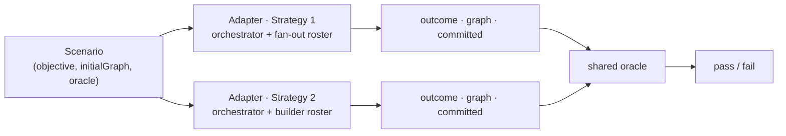

# Flow-agent eval — comparing two designs by correctness

> A **design-agnostic** benchmark: one fixed ladder of scenarios (simple → complex), each verified by code,
> run identically against **two agent designs** so we can compare their **correctness** on the same footing.
> This page is the spec for that benchmark — the scenario catalog, the oracle discipline, and the comparison
> protocol.
>
> **Grounding.** Built on what ships in `@flows/agent` today: `runScenario` / `TurnResult`
> (`libs/agent/src/__tests__/harness/runScenario.ts`), the `CanvasBinding` graph model
> (`Graph = WorkflowState = { nodes: NodeData[]; edges: EdgeData[] }`), the `LlmGateway` seam
> (`libs/agent/src/llm/llmGateway.ts`), and the fixture graph + catalog
> (`libs/agent/src/__tests__/harness/fixtures.ts`). Behavior & the loop: **[harness-spec.md](./harness-spec.md)**;
> how we verify a single design: **[harness-scenarios.md](./harness-scenarios.md)**; types:
> **[harness-interfaces.md](./harness-interfaces.md)**. Last updated 2026-08-03.

---

## 0 · The one idea that makes the comparison fair

**A scenario is a pure triple `(objective, initialGraph, oracle)` and knows nothing about the design under
test.** The oracle reads only the three public observables of a turn — `outcome`, the post-turn `graph`, and
`committed` — never any agent internals. So the _same_ scenario runs unchanged against either design; the only
per-design code is a thin **adapter** that turns an objective + a graph into those three observables.

```
scenario  ─────────────►  RunAdapter (design A | design B)  ─────────────►  { outcome, graph, committed }
(objective, graph)                                                           └── oracle reads these ──► pass / fail
```

Concretely, the two adapters are the two strategies — the same scenario and the same oracle, one roster apart:



This is the whole discipline: **correctness lives in the oracle (shared), and only the adapter differs.** If a
verdict could only be produced by peeking inside one design, it is not a fair verdict and does not belong here.

> **The two designs.** The concrete A/B here is the pair of strategies the harness can run
> ([architecture.md · Two strategies](./architecture.md#two-strategies-over-the-shared-foundation)): **Design
> A = Strategy 1** (the orchestrator fans out to narrow block + operation specialists; no skills) and **Design
> B = Strategy 2** (the orchestrator hands the whole plan to one `builder` that carries tools + `use_skill`
> and spawns nothing). Both run through the **same** `runScenario` orchestrator harness — they differ only in
> the **roster** exposed — so the comparison is unusually clean. The spec still does not care _what_ the two
> designs are, so a genuinely different Design B (e.g. a single code-writing agent in the n8n "BUILD" shape)
> drops in the same way — it is just another `RunAdapter`.

---

## 1 · The adapter contract

```ts
// The ONLY per-design code. Both designs implement this. It must be a black box: given an objective over a
// graph, produce the three observables the oracle reads.
interface RunAdapter {
    readonly designId: string; // 'strategy-1-fanout' | 'strategy-2-builder' (or any A/B) — labels the scorecard
    run(input: BenchmarkInput): Promise<BenchmarkResult>;
}

interface BenchmarkInput {
    objective: string;
    initialGraph: Graph; // cloned per run by the adapter — a scenario is reused across N runs & 2 designs
    userPermissions?: AgentGrant; // default { canModifyCanvas, canEditConfig }; {} = viewer (permission cases)
    catalog?: CatalogLookup; // default = createFixtureCatalog()
}

interface BenchmarkResult {
    outcome: TurnOutcome; // applied | partial | answered | refused  (shared parse: parseOutcome)
    graph: Graph; // post-turn live graph — the direct-edit oracle target
    committed: boolean; // did the live graph change this turn
}
```

**Both strategies' adapters are one-liners over the shipped harness** — `runScenario` already returns
`{ outcome, graph, committed }`; each adapter only registers the strategy's **roster** and forwards the rest:

```ts
const strategy1Adapter: RunAdapter = {
    designId: 'strategy-1-fanout',
    async run({ objective, initialGraph, userPermissions, catalog }) {
        const { outcome, graph, committed } = await runScenario({
            objective,
            initialGraph,
            userPermissions,
            catalog,
            roster: fanoutRoster, // Strategy 1: block + operation agents (no builder)
            makeGateway: () => liveGateway, // the seam runScenario already exposes
        });
        return { outcome, graph, committed };
    },
};
// Strategy 2's adapter is identical but registers ONLY the builder: `roster: builderRoster`. Selecting the
// roster is the one extra seam runScenario needs for the benchmark (test-only) — `createOrchestratorAgent`
// already accepts a `roster`, so it is a passthrough.
```

A design that is **not** the orchestrator harness at all (e.g. a single code-writing agent in the n8n
"BUILD" shape) implements the same interface over its own entry point. If it does not expose an
`{ outcome, graph, committed }` surface, the adapter derives them the same way `runScenario` does — read the
final graph from its binding, diff it against a clone of `initialGraph` for `committed`, and re-ask the model
once for the `TurnOutcome` JSON (`parseOutcome`). **Every design must derive `outcome` the identical way** so
the correctness comparison is not contaminated by two different outcome-extraction methods.

---

## 2 · Correctness — the oracle discipline (reused verbatim)

The rule is the one already locked in [harness-scenarios.md](./harness-scenarios.md): **well-formedness ≠
correctness**, and each oracle is _only as strict as the intent fixes it_.

- **exact** where the intent pins a value — `"set the model to Gemini 2.5 Pro"` ⇒ `config.model === 'gemini-2.5-pro'`.
- **relational** where it does not — `"nudge right a bit"` ⇒ `x↑ ∧ y=`, never a magnitude.
- **structural** for build/rewire — assert _paths and node/edge presence_, never a specific id or position the
  request never named (`"insert a buffer between gen and preview"` ⇒ the path `gen → ? → prev` exists, its one
  hop is a `buffer`, and no direct `gen → prev` edge remains — not "the new node's id is `n_5`").
- **no-edit** for every `refused` / `answered` — `committed === false` **and** the post-turn graph deep-equals
  the scenario's own initial graph (`expectUnchanged`).

An oracle is a pure function `(BenchmarkResult, initialGraph) → { pass: boolean; note?: string }`. It is the
_same function object_ fed both designs' results — there is exactly one oracle per scenario, shared.

```ts
interface Scenario {
    id: string; // 'T4.build-pipeline'
    tier: 0 | 1 | 2 | 3 | 4 | 5;
    objective: string; // the verbatim prompt handed to the agent
    initial: () => Graph; // a fresh graph per run (fixture, a minimal graph, or empty)
    userPermissions?: AgentGrant;
    expect: TurnOutcome['status']; // the intended outcome — the coarse first check
    oracle: (r: BenchmarkResult, initial: Graph) => { pass: boolean; note?: string };
    // OPEN-ENDED scenarios (T4/T5) also carry a requirement rubric for partial credit (§2.1); `oracle`
    // is then `requirements.every(pass)`. Simple scenarios omit it.
    requirements?: Requirement[];
}
interface Requirement {
    id: string; // 'input-reaches-generator'
    check: (g: Graph, initial: Graph) => boolean;
}
```

Helpers the oracles use (all pure over `Graph`, reusing the shipped `nodeById` / `IDS` from `fixtures.ts`):

```ts
const edgeExists = (g: Graph, s: string, t: string) => g.edges.some(e => e.sourceNodeId === s && e.targetNodeId === t);
const hasNodeOfType = (g: Graph, type: string) => g.nodes.some(n => n.type === type);
const outDegree = (g: Graph, id: string) => g.edges.filter(e => e.sourceNodeId === id).length;
// a directed path a ⇒ … ⇒ b exists (BFS over edges) — the backbone of every build/rewire oracle
const reaches = (g: Graph, a: string, b: string) => {
    /* BFS from a over sourceNodeId→targetNodeId, true if b is hit */
};
const unchanged = (r: BenchmarkResult, initial: Graph) => r.committed === false && deepEqual(r.graph, initial);
```

---

## 2.1 · Verifying open-ended scenarios (build & refactor)

A build or refactor has **many correct answers**: two designs may return structurally different graphs that
are both right. So the oracle must **not** compare against a golden graph. The reframe:

> **Verify the _spec_ (what the graph must do), never the _plan_ (how the agent built it).** Correctness is a
> conjunction of invariants; the set of accepted graphs is defined _implicitly_ by those invariants — possibly
> infinite. Every correct realization satisfies them; no wrong one does. You never enumerate the good graphs.

Choose invariants that are **necessary** (every correct graph has them) and **sufficient** (no wrong graph
does), from this ladder — weakest to strongest — and `AND` the clauses the intent justifies:

1. **Existence / count** — "a generator exists." One clause only; brittle alone.
2. **Typed-path (motif) embedding** — the workhorse. Not `edgeExists(gen, prev)` but _"a directed dataflow path
   runs through a node of type input-text, then a generator, then a preview."_ Accepts any topology that
   realizes the dataflow (extra hops, any ids, any build order); rejects a missing/reversed/disconnected one.
3. **Global validity** — reuse the engine's **own** rules as an oracle: every edge's ports type-check
   (`arePortTypesCompatible`), acyclic (`wouldCreateCycle`), ≤1 driver per input port, no dangling required
   input. A correct build is always valid; this catches "wired but nonsensical."
4. **Pinned invariants** — exact **only** where the intent named a value (`generator.config.model`). Never pin
   an id or position the request never specified.
5. **Behavioral / execution oracle** — the strongest and most design-agnostic: **run the flow on a fixed input
   and assert the output.** It ignores shape entirely and judges _what the graph computes_. Make such a
   scenario out of **deterministic blocks** (`input-text`, `buffer`, `echo`, `image-resize`, `preview`) so the
   output is exact and needs no API key; for a `generator`, leave its _output_ unasserted but assert its
   presence + config + wiring via 2–4 (or swap in an identity stand-in block to keep behavior deterministic).
6. **Relational oracle (refactor)** — a refactor is a _behavior-preserving structural change_, so the oracle
   compares pre vs post: **the intended structural delta happened AND the dataflow that must survive still
   survives.** "Insert a buffer between gen and preview" ⇒ `gen` still `reaches` `prev` (preserved), a
   `buffer` now sits on that path (the delta), the direct `gen→prev` edge is gone, the graph is still valid —
   no golden graph, no execution.

```ts
// (2) typed path: ∃ a→…→b→…→c with those node types, in order — one chain threaded through by reachability
const embedsTypedPath = (g: Graph, types: string[]): boolean => {
    const idsOf = (t: string) => g.nodes.filter(n => n.type === t).map(n => n.id);
    let frontier = idsOf(types[0]);
    for (const t of types.slice(1)) {
        frontier = idsOf(t).filter(dst => frontier.some(src => reaches(g, src, dst)));
        if (!frontier.length) return false;
    }
    return true;
};
// (3) validity — the engine's OWN semantics reused as the oracle (canvas/edgeSemantics.ts + a driver check)
const isValid = (g: Graph, cat: CatalogLookup): boolean =>
    g.edges.every(e => portsCompatible(e, g, cat)) && !hasCycle(g) && atMostOneDriverPerInput(g);
// (6) refactor — preserved dataflow + intended delta, no golden graph
const insertBufferOracle = (r: BenchmarkResult) =>
    reaches(r.graph, IDS.gen, IDS.prev) && // behavior preserved
    !edgeExists(r.graph, IDS.gen, IDS.prev) && // no longer direct
    onPath(r.graph, IDS.gen, IDS.prev, n => n.type === 'buffer') && // a buffer between
    isValid(r.graph, catalog);
```

### The linchpin — test the oracle itself

An open-ended oracle is code, so it has bugs, and a buggy oracle silently scores a wrong design as correct.
Calibrate every T4/T5 oracle with a **no-false-accept / no-false-reject** meta-test: hand-author graphs and
assert the oracle's verdict, so the oracle is trusted before it judges a live model.

```ts
describe('oracle: T4.build-pipeline', () => {
    // MUST accept — same spec, different shapes
    it.each([minimal3Node, withExtraBuffer, differentIdsAndPositions, redundantButHarmlessPreview])(
        'accepts correct variant %#',
        v => expect(oracle(asResult(v)).pass).toBe(true)
    );
    // MUST reject — plausible wrongs
    it.each([noGenerator, edgeReversed, previewDisconnected, containsCycle, generatorOffThePath])(
        'rejects wrong variant %#',
        v => expect(oracle(asResult(v)).pass).toBe(false)
    );
});
```

### Grade, don't just pass/fail — for comparing designs

Binary loses the interesting signal. Decompose the objective into a **requirement rubric** and score `k/total`;
`oracle.pass` is then `every requirement holds`, while the rubric gives partial credit so "Design B got 3/4
(forgot to wire the preview)" is visible instead of a flat fail. The rubric doubles as the meta-test's target.

```ts
const requirements: Requirement[] = [
    { id: 'has-generator', check: g => hasNodeOfType(g, 'single-output-generator') },
    { id: 'input→generator', check: g => embedsTypedPath(g, ['input-text', 'single-output-generator']) },
    { id: 'generator→preview', check: g => embedsTypedPath(g, ['single-output-generator', 'output-preview']) },
    { id: 'valid', check: g => isValid(g, catalog) },
];
const grade = (g: Graph) => requirements.filter(r => r.check(g)).length / requirements.length; // 0..1
```

The scorecard (§4) reports the **requirement pass-rate per clause** for T4/T5, so a design's failure is
localized to _which_ invariant it broke — far more actionable than a single number.

---

## 3 · The comparison protocol (fighting non-determinism)

A live model is stochastic — one run is an anecdote. The protocol turns anecdotes into a verdict.

> **The comparison is only meaningful live.** Under the fake gateway both designs replay identical scripted
> tool calls, so they produce identical graphs and the comparison is vacuous. The whole point — how well each
> design's routing and prompting actually produce correct graphs — only shows up when a **real model** decides
> the tool calls. So the benchmark runs against a live Gemini gateway; the fake gateway is for the
> deterministic single-design specs, not for this A/B.

1. **Same everything but the adapter.** Same model + `temperature: 0`, same `initialGraph` (deep-cloned per
   run), same catalog, same `userPermissions`, same timeout. Only `RunAdapter` differs. (`temperature: 0` is
   already the live-spec default; it does not remove non-determinism but shrinks it.)
2. **N runs per (scenario × design).** Default `N = 5`; a first look can use `N = 1` (anecdotal).
3. **Correctness = pass-rate**, the fraction of the N runs whose oracle passes. This is the only axis —
   report it as `k/N`, not a boolean.
4. **Verdict per scenario:** the design with the higher pass-rate wins the scenario; a tie is a tie. For the
   graded T4/T5 scenarios, break a tie by the mean requirement pass-rate (`k/total` averaged over the runs) so
   "3/4 vs 2/4" is visible even when both flat-fail the conjunction.
5. **Aggregate** across the ladder with tier weighting if desired (complex tiers are where designs diverge),
   but always report the per-tier and per-scenario breakdown — an aggregate that hides "Design B passes every
   T0 but fails every T4 build" is a lie.

```ts
interface ScorecardCell {
    scenarioId: string;
    designId: string;
    passRate: string; // 'k/N'
    requirementRate?: string; // 'k/total' mean over runs — T4/T5 only, the partial-credit tie-breaker
    notes: string[]; // per-run oracle notes for the misses (why a run failed)
}
// The benchmark runner: for each scenario, for each design, run N times, apply the shared oracle, aggregate.
declare function runBenchmark(scenarios: Scenario[], designs: RunAdapter[], n: number): Promise<ScorecardCell[]>;
```

**Repeatability & cost of the benchmark itself.** The whole ladder × 2 designs × N is a few hundred live
Gemini calls — gate it behind `RUN_LIVE` exactly like `integration.live.spec.ts`, and let a single scenario be
selectable (`-t T4.build`) so a design change can be spot-checked without the full matrix. Persist each
`ScorecardCell` to a JSON file so runs are comparable over time (the "regression scorecard" of
[harness-spec.md §10](./harness-spec.md)).

---

## 4 · The scenario ladder (simple → complex)

Every row is design-agnostic. The graphs: **`fixture`** = the shipped 4-node chain
`input-text → buffer → single-output-generator → output-preview` (`makeInitialGraph()`), **`minimal`** = the
smallest graph the case needs, **`empty`** = `{ nodes: [], edges: [] }`. Objectives keep an **explicit target**
except where ambiguity _is_ the test (per the discipline). Tiers T0–T2 largely formalize what
`integration.live.spec.ts` already probes; **T3–T5 are the new, harder cases where two designs actually
diverge** and are where this benchmark earns its keep.

### Tier 0 — single primitive edit (`applied`)

| id          | objective                                  | graph   | oracle (post-turn)                                                              |
| ----------- | ------------------------------------------ | ------- | ------------------------------------------------------------------------------- |
| `T0.move`   | "move the input-text node to x=200, y=100" | fixture | exact: `txt.position == {200,100}`; other 3 unchanged; `committed`              |
| `T0.rename` | "rename the preview to 'Result'"           | fixture | exact: `prev.customLabel === 'Result'`                                          |
| `T0.config` | "set the generator's temperature to 0.2"   | fixture | exact: `gen.config.temperature === '0.2'`; `gen.config.model` preserved (merge) |

### Tier 1 — single edit needing judgement (relational / merge / spatial)

| id               | objective                                                     | graph   | oracle                                                                     |
| ---------------- | ------------------------------------------------------------- | ------- | -------------------------------------------------------------------------- |
| `T1.nudge`       | "nudge the input right a bit"                                 | fixture | relational: `txt.x↑ ∧ txt.y=`; no magnitude asserted (= A1)                |
| `T1.model-merge` | "set the generator's model to Gemini 2.5 Pro"                 | fixture | exact `model==='gemini-2.5-pro'` **and** `temperature==='0.7'` kept (= A2) |
| `T1.align`       | "line the four nodes up in one column, keeping each node's y" | fixture | relational: all four `x` equal (any value); every `y` preserved (= A4)     |

### Tier 2 — compound, two dependent edits (`applied`), and single-fault refusals

| id                  | objective                                                           | graph                            | expect   | oracle                                                                                         |
| ------------------- | ------------------------------------------------------------------- | -------------------------------- | -------- | ---------------------------------------------------------------------------------------------- |
| `T2.delete-rewire`  | "delete the buffer and connect the input directly to the generator" | fixture                          | applied  | `buf` gone; no edge touches `buf`; `edgeExists(txt, gen)` (= A5)                               |
| `T2.add-config`     | "add a generator and set its model to Gemini 2.5 Pro"               | fixture                          | applied  | a 2nd `single-output-generator` exists whose `config.model==='gemini-2.5-pro'`; node count +1  |
| `T2.ambiguous`      | "move the node right"                                               | `minimal` (two same-typed nodes) | refused  | `unchanged` — asks which (= Q1, sharpened with a real ambiguity)                               |
| `T2.bad-value`      | "set the generator's model to gpt-4o"                               | fixture                          | refused  | `unchanged`; reason names a real model from `GENERATOR_MODELS` (= Q2)                          |
| `T2.unknown-field`  | "set the generator's max tokens to 500"                             | fixture                          | refused  | `unchanged` — didn't invent/remap a field (= Q4)                                               |
| `T2.occupied-input` | "connect the input directly into the generator"                     | fixture                          | refused  | `unchanged` — `gen.in` already fed by the buffer; edge agent rejects, names the occupying edge |
| `T2.cycle`          | "connect the generator's output to the buffer's input"              | fixture                          | refused  | `unchanged` — would form `buf→gen→buf`; rejected as a cycle                                    |
| `T2.permission`     | "rename the preview to 'Result'" · `userPermissions: {}`            | fixture                          | refused  | `unchanged` — viewer, denied at the executor (= R2)                                            |
| `T2.capability-gap` | "run the generator node"                                            | fixture                          | refused  | `unchanged` — no specialist executes nodes (= R1)                                              |
| `T2.answered`       | "which model is the generator using?"                               | fixture                          | answered | `unchanged`; the answer contains `gemini-2.5-flash`                                            |

### Tier 3 — coordination across ≥3 edits (the multi-agent path's home turf)

| id                   | objective                                                                      | graph   | expect  | oracle                                                                                                         |
| -------------------- | ------------------------------------------------------------------------------ | ------- | ------- | -------------------------------------------------------------------------------------------------------------- |
| `T3.add-wire-config` | "add a second generator set to Gemini 2.5 Pro and feed the input-text into it" | fixture | applied | new gen node exists, `config.model==='gemini-2.5-pro'`, and `edgeExists(txt, <newGen>)`; original chain intact |
| `T3.fan-out`         | "connect the input-text to both the buffer and a new preview"                  | fixture | applied | a 2nd `output-preview` exists; `txt` out-degree ≥2; both targets reachable from `txt`                          |
| `T3.reroute`         | "make the preview show the buffer's output instead of the generator's"         | fixture | applied | `edgeExists(buf, prev)`; **not** `edgeExists(gen, prev)`; node count unchanged                                 |
| `T3.space-evenly`    | "spread the four nodes out evenly along the x-axis, same order"                | fixture | applied | relational: `x` strictly increasing in chain order; adjacent gaps ≈ equal (within tolerance); `y` preserved    |

### Tier 4 — build from little/nothing (the n8n "BUILD" test)

> These are the scenarios where two designs legitimately return different-but-correct graphs. Their oracles
> follow **§2.1**: typed-path embedding + validity + pinned config, graded by a requirement rubric, and each
> oracle is calibrated by its own no-false-accept/no-false-reject meta-test. Add a **deterministic behavioral
> variant** (`T4.build-passthrough`: "build text → buffer → preview") whose oracle _runs_ the flow on input
> `'hello'` and asserts the preview reads `'hello'` — the shape-blind gold-standard check, no key needed.

| id                    | objective                                                                                    | graph | expect  | oracle                                                                                                                                                                                           |
| --------------------- | -------------------------------------------------------------------------------------------- | ----- | ------- | ------------------------------------------------------------------------------------------------------------------------------------------------------------------------------------------------ |
| `T4.build-pipeline`   | "build a flow that takes a text input, runs it through a generator, and previews the result" | empty | applied | one `input-text`, one `single-output-generator`, one `output-preview` exist; `reaches(txt → gen)` and `reaches(gen → preview)` (a directed path, direct or via added nodes); ≥3 nodes, connected |
| `T4.build-configured` | "build a text → Gemini 2.5 Pro generator → preview pipeline"                                 | empty | applied | as `T4.build-pipeline` **plus** the generator's `config.model==='gemini-2.5-pro'`                                                                                                                |
| `T4.build-branch`     | "from a single text input, run it through two generators and preview each"                   | empty | applied | one input, two generators, two previews; `reaches(input → each preview)`; input out-degree ≥1 feeding both branches                                                                              |

### Tier 5 — refactor an existing flow (splice / extract / partial)

| id                   | objective                                                               | graph                                                        | expect       | oracle                                                                                                                                                                                                                                   |
| -------------------- | ----------------------------------------------------------------------- | ------------------------------------------------------------ | ------------ | ---------------------------------------------------------------------------------------------------------------------------------------------------------------------------------------------------------------------------------------- |
| `T5.insert-between`  | "insert a buffer between the generator and the preview"                 | fixture (start from the _no-buffer_ variant: `txt→gen→prev`) | applied      | a `buffer` node exists on the path; `reaches(gen → buffer)` ∧ `reaches(buffer → prev)`; **no** direct `edgeExists(gen, prev)`; net node count +1                                                                                         |
| `T5.extract-preview` | "delete the preview and everything that only fed it"                    | fixture                                                      | applied      | `prev` gone; any node whose _only_ consumer was `prev` also gone; the rest of the chain intact                                                                                                                                           |
| `T5.mixed-validity`  | "set the generator's model to Gemini 2.5 Pro and its max tokens to 500" | fixture                                                      | **unpinned** | _no oracle asserts a status_ — `partial` (model set, bad field reported) **or** `refused` (whole ask rejected) both pass; the oracle only checks: if `committed`, then `model==='gemini-2.5-pro'` and no invented `maxTokens` key exists |

> **`T5.mixed-validity` is deliberately not scored on outcome status** — per the discipline, a mixed-validity
> ask is exactly the case where `partial` vs `refused` is the agent's judgement, so the benchmark leaves it
> unpinned and only forbids a _wrong_ edit. It is included because how each design _handles_ a partial-fault
> request (does it salvage the good part? does it hallucinate the bad field?) is one of the most revealing
> differences between designs — but it is measured by the no-bad-edit invariant, never by a status the spec
> refuses to pin.

**Coverage the ladder guarantees:** `applied` (T0–T1 primitives, T2 compounds, T3 coordination, T4 builds,
T5 refactors) · `refused` (ambiguity, bad value, unknown field, occupied input, cycle, permission,
capability-gap) · `answered` (pure question) · and the unpinned mixed-fault case. Every `refused`/`answered`
row uses the `unchanged` no-edit oracle.

---

## 5 · Reporting — the scorecard

Print one table per tier and one aggregate, both designs side by side, mirroring the `afterAll` scorecard in
`integration.live.spec.ts`:

```
━━━━━ BENCHMARK · model=gemini-2.5-flash · N=5 ━━━━━
scenario            design         pass   req(mean)   notes
T4.build-pipeline   strategy-1     5/5    4/4         —
T4.build-pipeline   strategy-2     4/5    3.6/4       1 run: forgot to wire the preview
                    ▶ winner: strategy-1 (5/5 vs 4/5)
...
━━━━━ AGGREGATE ━━━━━
strategy-1     correctness 46/55
strategy-2     correctness 41/55
```

The winner line is computed by §3's ranking (pass-rate first, requirement-rate tie-break). Persist the raw
`ScorecardCell[]` to JSON so two benchmark runs — before/after a prompt or design change — are diffable.

---

## 6 · Reused vs. new

|                                            |                                                                                                                                                                                                                                                                                                              |
| ------------------------------------------ | ------------------------------------------------------------------------------------------------------------------------------------------------------------------------------------------------------------------------------------------------------------------------------------------------------------ |
| **Reused as-is**                           | `runScenario` / `TurnResult`, `parseOutcome` / `TurnOutcome`, `makeInitialGraph` / `createFixtureCatalog` / `IDS` / `nodeById`, the `makeGateway(agentType)` seam, the oracle discipline, the live Gemini gateway, the `RUN_LIVE` gate + per-case selectability.                                             |
| **New (all test-only, no product change)** | `RunAdapter` + the two adapters, the `fanoutRoster` / `builderRoster` pair, the `Scenario` catalog + shared oracles (§4), `runBenchmark` + the pass-rate aggregation, the scorecard writer, and one tiny `runScenario` hook (pass a `roster` through to `createOrchestratorAgent`, which already takes one). |

Nothing here touches `BaseAgent`, the specialists, or the tools — the benchmark observes the shipped agent
through seams it already has, which is the whole reason the two designs can be compared honestly.

---

Behavior & the loop: **[harness-spec.md](./harness-spec.md)**. Single-design verification & oracle rules:
**[harness-scenarios.md](./harness-scenarios.md)**. Types: **[harness-interfaces.md](./harness-interfaces.md)**.
