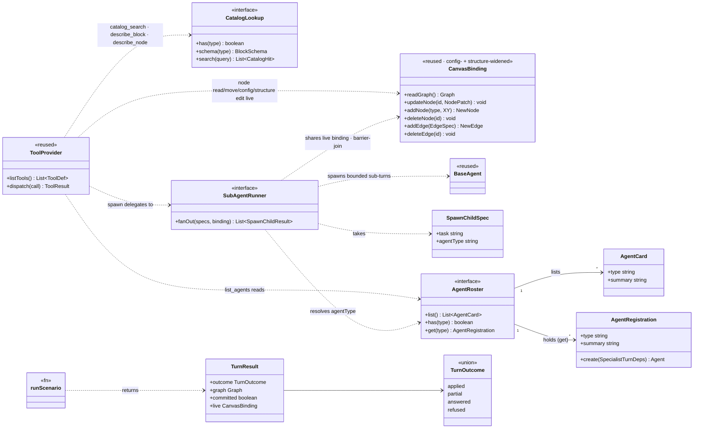

# Flow-agent harness — interfaces

> The **new** TypeScript surface for the harness (move / config / rename / add-delete node / connect-disconnect
> edge). Specialists edit the **live `CanvasBinding` directly** — a node edit via `updateNode`, a structural
> edit via `addNode` / `deleteNode` / `addEdge` / `deleteEdge`. Types in `code font` with no declaration here
> (`Graph`, `XY`, `NodeData`, `EdgeData`, `ToolProvider`, `AgentGrant`, `BaseAgent`, `FakeScriptStep`, …) are
> **reused as-is** from `@flows/agent` / `@flows/flows` / `@lemoncloud/eureka-flows-api`.
>
> Behavior & the loop: **[harness-spec.md](./harness-spec.md)**. How we verify: **[harness-scenarios.md](./harness-scenarios.md)**. Last updated 2026-07-28.

---

## UML — the new surface at a glance



## 1 · The edit space

The harness emits two families of edit, each applied **directly to the live canvas** through the
`CanvasBinding` (§6). **Node edits** patch one existing node via `updateNode`; **structural edits** change the
set of nodes or edges via the id-returning `addNode` / `addEdge` and the void `deleteNode` / `deleteEdge`.

- **move** `{ nodeId, position: XY }` — absolute result position (`updateNode({ position })`).
- **set_properties** `{ nodeId, config }` — merged over the node's existing config (`updateNode({ config })`).
- **rename** `{ nodeId, label }` — `''` clears the override (`updateNode({ label })`).
- **add_node** `{ type, position }` — create with the block's default config (`addNode` → `{ id }`).
- **delete_node** `{ nodeId }` — remove the node; its edges cascade (`deleteNode`).
- **connect_nodes** `{ sourceNodeId, sourcePortId, targetNodeId, targetPortId }` — add a validated edge
  (`addEdge` → `{ id }`).
- **disconnect_edge** `{ edgeId }` — remove one edge (`deleteEdge`).

Capability per edit: `set_properties` / `rename` → `canEditConfig`; `move` and the structural
`add_node` / `delete_node` / `connect_nodes` / `disconnect_edge` → `canModifyCanvas` (flows defines it as
"add/delete nodes, connect edges" — _not_ flows' `canEditStructure`, which is rename/publish metadata) —
enforced by each tool's `requires` gate in the executor.

## 2 · Reads reflect the live canvas

Specialists and the orchestrator edit the **live `CanvasBinding` directly** (`updateNode` for a node patch;
`addNode` / `deleteNode` / `addEdge` / `deleteEdge` for structure), and reads (`list_nodes` / `describe_node`
/ `list_edges`) reflect the live canvas including edits made this turn — so a node created by the node agent
is visible to the edge agent that wires it, and an id returned by `addNode` / `addEdge` names a node/edge the
next read will show.

## 3 · Tools

```ts
// Tool convention: a `list_*` / `*_search` tool returns a COMPACT shape (ids + labels, no config/schema);
// a paired `describe_*` returns the FULL detail for ONE item. Lists stay cheap; detail is pulled on demand.

// NODE READ — over the live CanvasBinding: list_nodes (compact) + describe_node (its detail companion).
// ONE provider, carried by every node-reading agent (locator, property, orchestrator).
declare function createNodeReadToolProvider(binding: CanvasBinding, catalog: CatalogLookup): ToolProvider;
//   list_nodes()              → { nodes: NodeLocation[] }        // COMPACT: id, type, label, position — reuses listNodeLocations
//   describe_node({ nodeId }) → { type, currentConfig, schema }  // DETAIL: current config + block schema + a select's options

// CATALOG — search (compact) + describe_block (detail). Never dumps the catalog.
declare function createCatalogToolProvider(catalog: CatalogLookup): ToolProvider;
interface CatalogSearchInput {
    query: string;
}
interface DescribeBlockInput {
    type: string;
}
interface CatalogHit {
    type: string;
    label: string;
    summary: string;
}
//   catalog_search({ query }) → { hits: CatalogHit[] }  // COMPACT: lexical shortlist (type, label, summary)
//   describe_block({ type })  → { schema: BlockSchema } // DETAIL: one block's full schema (fields + a select's enum)

// NODE MOVE (write: position) — LOCATOR carries this over the live binding:
declare function createNodeMoveToolProvider(binding: CanvasBinding): ToolProvider;
//   move_node({ nodeId, by | to })  // sync dispatch validates, then binding.updateNode({ position })
//                                    // applies the move straight to the live canvas.

// NODE CONFIG (write: config/label) — PROPERTY carries this over the live binding (reads via node read above).
declare function createNodeConfigToolProvider(binding: CanvasBinding, catalog: CatalogLookup): ToolProvider;
//   set_properties({ nodeId, config }) → binding.updateNode({ config }) // MERGED; rejects bad value/type/unknown key/missing node
//   rename({ nodeId, label })          → binding.updateNode({ label })  // '' clears the label; rejects missing node

// NODE STRUCTURE (write: add/delete node) — NODE agent carries this over the live binding (reads via node read + catalog).
declare function createNodeStructureToolProvider(binding: CanvasBinding, catalog: CatalogLookup): ToolProvider;
interface AddNodeInput {
    type: string;
    position: XY;
}
interface DeleteNodeInput {
    nodeId: string;
}
//   add_node({ type, position }) → binding.addNode(type, position) → { nodeId } // DEFAULTS-ONLY; rejects unknown type; no config, no wiring
//   delete_node({ nodeId })      → binding.deleteNode(nodeId)                    // edges CASCADE; rejects missing node

// EDGE (read + write: connect/disconnect) — EDGE agent carries this; validation (ports · type-compat · cycle) lives HERE.
declare function createEdgeToolProvider(binding: CanvasBinding, catalog: CatalogLookup): ToolProvider;
interface ConnectNodesInput {
    sourceNodeId: string;
    sourcePortId: string; // an OUTPUT port on the source
    targetNodeId: string;
    targetPortId: string; // an INPUT port on the target
}
interface DisconnectEdgeInput {
    edgeId: string;
}
interface EdgeSummary {
    edgeId: string;
    sourceNodeId: string;
    sourcePortId: string;
    targetNodeId: string;
    targetPortId: string;
}
//   list_edges()                → { edges: EdgeSummary[] } // COMPACT edge list — the palette for disconnect
//   connect_nodes({ … })        → validates ports exist · arePortTypesCompatible · !wouldCreateCycle, then
//                                  binding.addEdge(spec) → { edgeId } // replaces an existing edge on an occupied input
//   disconnect_edge({ edgeId }) → binding.deleteEdge(edgeId)         // rejects unknown edge

// DISCOVER — orchestrator only. The roster is a registry (data), never enumerated in the persona.
declare function createAgentDirectoryToolProvider(roster: AgentRoster): ToolProvider; // §4
//   list_agents() → { agents: AgentCard[] } // COMPACT: each specialist's type + one-line capability

// DELEGATE — orchestrator only.
declare function createSpawnToolProvider(runner: SubAgentRunner, binding: CanvasBinding): ToolProvider; // §4
// NO grant arg — each child runs under its OWN fixed grant; the user's permissions gate it at the executor.
```

## 4 · `spawn` — sub-agents over the live binding

```ts
interface SpawnChildSpec {
    task: string; // COMPLETE briefing by value (no transcript inheritance; can't ask the user)
    agentType: string; // roster key → persona + tool provider. Required.
    // NO grant — a child's capabilities are DEVELOPER-defined (its OWN fixed grant, set in its constructor);
    // the user's permissions bound it at the executor. The main agent (an LLM) cannot request or widen a grant.
}
interface SpawnChildResult {
    ok: boolean;
    summary: string;
}

interface SubAgentRunner {
    // BARRIER fan-out: spawn every spec concurrently as a bounded sub-turn sharing the live `binding`,
    // AWAIT ALL, and return the gathered results together (they re-enter the orchestrator transcript in
    // one batch). A child that throws → { ok:false } (never rejects). Each edit is a synchronous atomic
    // `updateNode`, so concurrent children never corrupt the canvas. No grant argument: each child runs
    // under its OWN fixed grant, and the user's `userPermissions` (a runner-level input) gate each tool.
    // resolves each spec.agentType via the roster (below) to build the child's tool provider.
    fanOut(specs: SpawnChildSpec[], binding: CanvasBinding): Promise<SpawnChildResult[]>;
}
interface SpawnInput {
    children: SpawnChildSpec[];
} // non-empty (at least one child)
type SpawnResult = { children: SpawnChildResult[] };

// Grants are TWO layers and neither is set at spawn: (1) each agent's OWN fixed grant, declared by the
// developer in its constructor (locator {canModifyCanvas}, property {canEditConfig}); (2) `userPermissions`,
// the flow-role ceiling the FRONTEND derives (@flows/flows `getPermissions(role)` → `toAgentGrant`) and
// threads in. The executor gates each required-capability tool on BOTH. No `clampGrant`, no `roleGrant`.
```

The **roster is a registry** — the data behind `list_agents` and the lookup `spawn` validates against. The
orchestrator discovers it at runtime and names no agent in its persona; a new specialist is one added entry
(+ card), no prompt change.

```ts
interface AgentCard {
    type: string;
    summary: string;
} // COMPACT directory entry: spawn key + one-line capability

// One specialist registration — everything both list_agents and spawn need, so registering an agent
// is a one-liner with NO prompt edit. There is NO per-registration grant: a specialist is bounded by the
// tools it carries + its OWN fixed grant (set in its constructor), with the user ceiling enforced at the
// executor. `create` builds the specialist's OWN BaseAgent subclass (LocatorAgent / PropertyAgent) — no
// generic shell; each is a concrete agent, so `create` just forwards the base deps below.
type SpecialistTurnDeps = BaseAgentDeps; // exactly the shared per-turn deps — no extra fields
// = { gateway, storage, flowId, maxIterations?, binding, catalog, userPermissions } where:
//   binding        — the LIVE canvas the child reads and edits directly
//   catalog        — block schemas behind read/config validation
//   userPermissions — the user's flow-role ceiling (viewer ⇒ no edits — R2); the child's OWN grant is
//                     fixed in its constructor, NOT supplied here
interface AgentRegistration {
    type: string; // spawn key, e.g. 'locator' — also the AgentCard.type
    summary: string; // the one-line capability the card shows
    create(deps: SpecialistTurnDeps): Agent; // build the concrete specialist agent, bound to the live canvas
}
interface AgentRoster {
    list(): AgentCard[]; // backs list_agents (compact)
    has(type: string): boolean; // spawn validates agentType against this
    get(type: string): AgentRegistration | undefined; // the full registration — the runner builds the child from it
}
declare function createAgentRoster(registrations: AgentRegistration[]): AgentRoster;

// the roster's entries (type · the concrete agent `create` builds):
{
    type: 'locator';
} // create → createLocatorAgent({ binding, catalog, … })  — carries move_node
{
    type: 'property';
} // create → createPropertyAgent({ binding, catalog, … }) — carries set_properties + rename
{
    type: 'node';
} // create → createNodeAgent({ binding, catalog, … })     — carries add_node + delete_node
{
    type: 'edge';
} // create → createEdgeAgent({ binding, catalog, … })     — carries connect_nodes + disconnect_edge
```

## 5 · Catalog types

Read by `catalog_search` / `describe_block`, `describe_node`, and `set_properties` validation.

```ts
interface CatalogLookup {
    has(type: string): boolean;
    schema(type: string): BlockSchema | undefined;
    search(query: string): CatalogHit[];
}
interface BlockSchema {
    type: string;
    label: string;
    stereo?: 'input' | 'process' | 'output';
    config: JsonSchema; // required fields + a select's `enum`
    inputs: { portId: string; type?: string }[];
    outputs: { portId: string; type?: string }[];
}
```

## 6 · The `CanvasBinding` seam

```ts
// The whole seam between (non-React) agent code and the React-owned live canvas. `updateNode` patches ONE
// existing node (move → position · rename → label · set_properties → config); the structural primitives
// change the SET of nodes/edges. Each is SYNCHRONOUS, applied immediately (frontend-only), checkpointed for
// undo, and gated on its capability. `addNode`/`addEdge` RETURN the new id so a compound turn can reference
// what it just created; `deleteNode` cascades the node's edges.
interface CanvasBinding {
    readGraph(): Graph; // live structural read of the current canvas graph
    updateNode(id: string, patch: NodePatch): void; // node patch — canModifyCanvas / canEditConfig per field
    addNode(type: string, position: XY): { id: string }; // create with the block's defaultConfig — canModifyCanvas
    deleteNode(id: string): void; // remove node + cascade its edges — canModifyCanvas
    addEdge(spec: EdgeSpec): { id: string }; // link two ports; replaces an existing edge on an occupied input — canModifyCanvas
    deleteEdge(id: string): void; // remove one edge by id — canModifyCanvas
}
interface NodePatch {
    label?: string; // '' / falsy clears a custom label
    position?: XY; // replaces the node's position whole
    config?: Record<string, string>; // MERGED over the node's existing config
}
interface EdgeSpec {
    sourceNodeId: string;
    sourcePortId: string;
    targetNodeId: string;
    targetPortId: string;
}
```

The binding is a **thin mechanical seam**: it applies the edit, checkpoints, and gates on the capability — it
does **not** judge whether an edit is sensible. Semantic validation lives in the tools: config against the
catalog in `createNodeConfigToolProvider`, and port-existence + type-compat + no-cycle in
`createEdgeToolProvider` (§3). So `addEdge` trusts a spec the tool already validated, exactly as `updateNode`
trusts a config the tool already merged and checked.

## 7 · `TurnOutcome` — the eval's parsed outcome shape

```ts
type TurnOutcome =
    | { status: 'applied'; summary: string } // ALL intended changes landed
    | {
          status: 'partial';
          summary: string; // SOME landed, SOME could not (partial-commit)
          applied: string[];
          failed: { task: string; reason: string }[];
      }
    | { status: 'answered'; answer: string } // pure Q&A, no edits
    | { status: 'refused'; reason: string }; // nothing landed — couldn't act, OR needs a decision from the user (reason carries any question)

// `TurnOutcome` is the EVAL's parse target (§8): the shape `runScenario` parses the orchestrator's
// re-asked outcome into for the oracle — it is NOT produced in production. The production loop just
// stops when the model emits a message with no tool calls (a plain-text turn; see harness-spec.md); the
// app renders the transcript. There is no finish tool and no sink to read.
```

## 8 · Eval entry

```ts
interface TurnResult {
    outcome: TurnOutcome; // parsed from the eval's test-only re-ask via `parseOutcome()` (lenient extract + validate; `refused` fallback if unparseable). Production neither produces nor parses this
    graph: Graph; // live graph AFTER the turn — the direct-edit oracle (specialists edit the live canvas)
    committed: boolean; // did the live graph change this turn (⇔ something landed)
    live: CanvasBinding; // test affordance: read the live binding directly
}
interface ScenarioInput {
    objective: string;
    initialGraph: Graph;
    userPermissions?: AgentGrant; // TEST-CONVENIENCE override: fail-closed (required) lives at `BaseAgentDeps` + production; the harness defaults to full edit { canModifyCanvas, canEditConfig } for happy-path, and R2 passes {} (viewer)
    script?: FakeScript; // per-agent fake-gateway scripts; OMIT for a real-model run
    mode?: 'parallel' | 'serial'; // sub-agent dispatch order (parallel fan-out vs serial)
    catalog?: CatalogLookup; // catalog override; defaults to the fixture catalog
}
declare function runScenario(input: ScenarioInput): Promise<TurnResult>;

// One fake gateway per agent (keyed by agentType) — see impl-notes for why.
type FakeScript = Record<string, FakeScriptStep[]>; // 'orchestrator' | 'locator' | 'property' | 'node' | 'edge' → scripted turns
```

**Test-only re-ask + honest errors.** The orchestrator ends its turn with a plain-text reply (production is
fine with that — the app renders the transcript), but the oracle needs a structured `TurnOutcome`. So after
the turn, `runScenario` sends **one** follow-up asking the orchestrator to return the turn's outcome as a JSON
object matching `TurnOutcome`, then `parseOutcome()` parses it (lenient extract + validate; a `refused`
fallback if unparseable). This re-ask + parse lives **only in the eval** — the production loop never re-asks
and never parses an outcome. `runScenario` also **surfaces a turn error** (a thrown gateway/loop failure,
which `BaseAgent.send` records as `phase: 'error'` without rethrowing) by inspecting the session state and
throwing when `phase === 'error'`, so a real failure shows up as an eval `ERROR` (with the reason) instead of
masquerading as a `refused`.

---

Behavior & the loop: **[harness-spec.md](./harness-spec.md)**. How we verify: **[harness-scenarios.md](./harness-scenarios.md)**.
