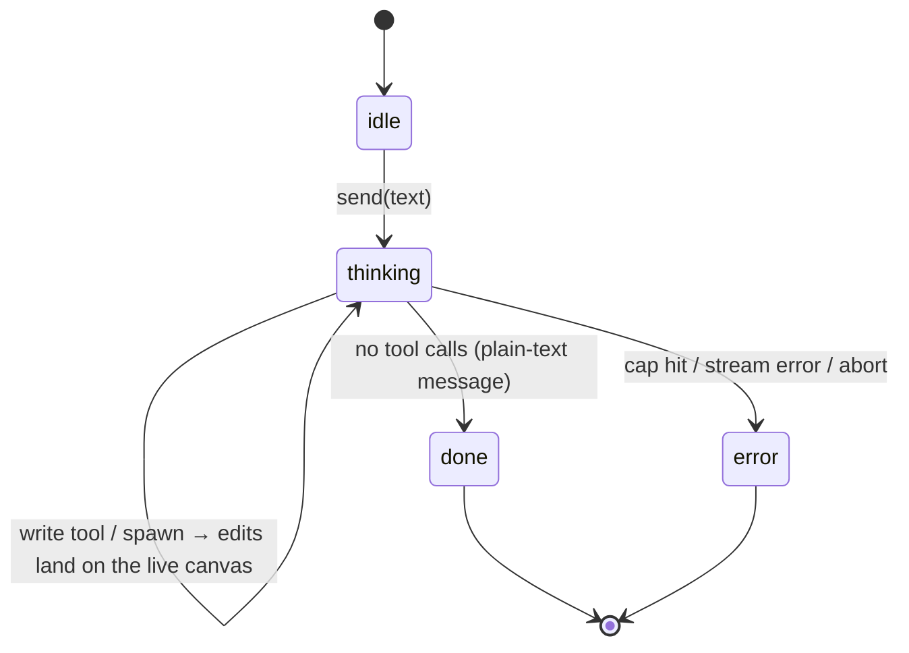
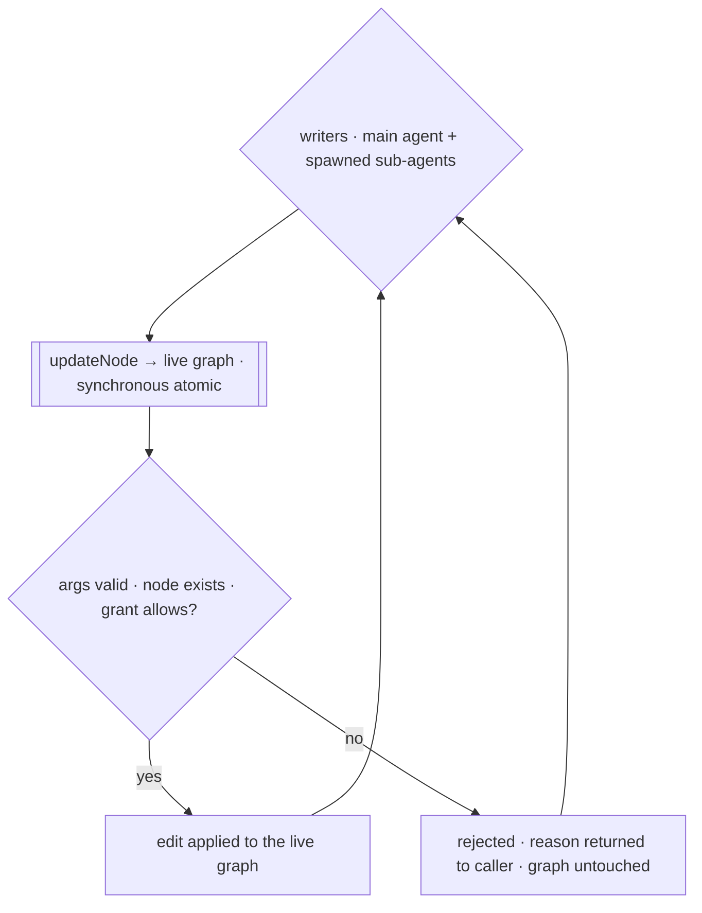
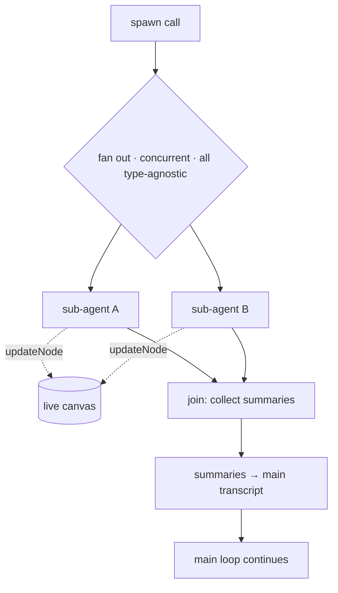
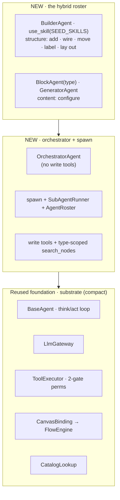

# Flow-agent harness — specification

> **Model: Claude Code.** One main agent, one flat think/act loop, the transcript is the state. The agent
> spawns sub-agents **only when it wants to**. Every writer edits the **live canvas directly** through the
> shared `CanvasBinding` (`updateNode`); edits land immediately, and reads reflect them the same turn. No
> plan stage, no user approval gate.
>
> **Grounding.** Built only on what ships on **this branch**: the agent core in `@flows/agent`
> (`libs/agent/src`) and the frontend toolkit in `@flows/flows` (`libs/flows/src`). No other branch is
> referenced. Last updated 2026-08-02.

---

## 1 · What it is

A side-panel agent in the flow editor. You give it an objective in plain language; it reads your flow and
the block catalog, and edits the flow **directly on the live canvas** through the shared `CanvasBinding`.

It follows the **Claude Code** shape:

- **one main agent** owns the turn in a single flat loop — think, call tools, feed results back, repeat
  until it stops;
- it may **spawn sub-agents on demand** (its own choice) for parallel or focused work;
- **all of them — main agent and sub-agents — write the same live `CanvasBinding`**; edits land immediately;
- when the loop ends, the turn is the orchestrator's plain-text final message — there is no `finish` tool and
  production produces no structured outcome; the app renders the transcript.

There is no separate planner agent and no Accept/Reject gate — the single main agent (the orchestrator)
plans and delegates inline. It carries **no write tools of its own**: every edit goes through a
sub-agent (§8), which keeps it a pure coordinator and forces the full multi-agent path.

## 2 · Principles (locked)

1. **One agent, flat loop.** The main agent (the orchestrator) owns the turn end-to-end (the shipped
   `BaseAgent` loop). Planning and gathering are things it _may_ do — not phases the harness imposes. It
   holds **no write tools**: it reads, plans, and **delegates every edit** to a sub-agent (§8).
2. **Sub-agents on demand, type-agnostic.** The agent spawns a sub-agent through a tool when it decides to
   (parallelism, or an isolated context for a focused job). There is **no fixed reader/writer
   classification** — the harness doesn't split sub-agents into "readers" and "writers"; each is bounded by
   its own tools + grant (the builder wires and lays out, a block agent adds/configures its block), not by a role the harness assigns.
   Sub-agents are bounded sub-turns.
3. **One live canvas, shared by every writer.** The main agent and every sub-agent edit the **same live
   `CanvasBinding`**. An edit is applied immediately via `updateNode`, and any later canvas read (e.g.
   `list_nodes` or `describe_node`) reflects it.
4. **Writes are synchronous and atomic; the live graph is authoritative.** Each write tool does a single
   synchronous `updateNode` on the live binding, so concurrent writers in one batch never lose or reorder an
   update (no async mutex). The in-memory graph read via `readGraph()` is the one source of truth. A rejected
   write (bad args, missing node, denied grant) never touches the graph and its reason is returned to the
   caller.
5. **Edits apply immediately.** Every edit that validates is written straight to the live canvas; a rejected
   edit is returned to its caller and never applied.
6. **Partial is a per-outcome notion.** If one delegated task lands and another can't (e.g. the node is added
   but the requested connection would cycle and is rejected), the successful edits stay and the turn reports
   `partial` — good work is never undone because a sibling failed.
7. **No user approval gate.** Writes are validated **per-op by the tools** (an invalid config value or bad
   move is rejected before it applies). There is no click-to-accept.

## 3 · Components — reused vs. new

The harness is mostly **assembly**: a thin `BaseAgent` subclass over the reused loop / tools / permissions /
catalog, plus a little genuinely-new code — the `spawn` sub-agent runner + roster/runner.

`Graph` in the agent code is exactly `WorkflowState` = `{ nodes: NodeData[]; edges: EdgeData[] }`.

## 4 · The loop

The shipped **`BaseAgent`** flat loop, unchanged: assemble context → call the LLM → run its tool calls →
feed results back → **stop when it emits no tool calls**. Stopping _is_ the turn's final message. Edits have
already landed on the live canvas as they were made.

- **`AgentPhase` is the shipped `idle｜thinking｜done｜error`** — the agent plans and gathers inline, and edits
  apply live, so the harness adds no phase of its own.
- **The agent decides everything** — whether to read first, whether to spawn help, how many nodes to
  touch. The harness only provides the live binding, the tools, and the executor.
- **The turn ends with the agent's plain-text final message** — the loop stops when the model emits no tool
  calls. There is **no `finish` tool**, production produces no structured outcome, and the persona says
  nothing about reporting or output format; the app renders the turn from the transcript. The **`TurnOutcome`**
  type (`applied｜partial｜answered｜refused`) remains only as the shape the **eval** parses into: the eval —
  and only the eval — re-asks once for the turn's outcome as JSON matching `TurnOutcome` and parses it
  (`parseOutcome`, with a `refused` fallback if unparseable) for a **code-checkable** oracle result (§8, §10).

**Serial or parallel tool calls — the agent's choice.** `BaseAgent` runs the tool calls in one assistant
message **concurrently** (a `Promise.all` over the batch), while the agent still gets **serial** execution by
emitting calls across separate iterations. So the agent chooses: batch independent calls to parallelize them;
sequence dependent ones. Either way is safe — reads run truly parallel, and **each write is a synchronous
atomic `updateNode`** on the live canvas, so concurrent edits never corrupt it. The `Promise.all` is a
**barrier**: every call in the batch finishes and its result is **gathered, then fed back to the agent
together** (tool results in original call order). The same holds for `spawn`: sub-agents run concurrently and
**barrier-join** — all finish, summaries gathered, fed back together.

## 5 · Direct writes to the live canvas

One live `CanvasBinding`, shared by everyone who writes.

- **Edits land live.** Every writer points its tools at the same live binding. A write is a single
  `updateNode`; the graph read via `readGraph()` reflects every edit applied so far — so a sub-agent sees
  what the main agent already did.
- **Synchronous atomic writes.** Every write — `move_node`, `set_properties`, `rename`, `add_node`,
  `delete_node`, `connect_nodes`, `disconnect_edge` — does one synchronous primitive on the live binding
  (`updateNode` for a node patch; `addNode` / `deleteNode` / `addEdge` / `deleteEdge` for structure), so two
  concurrent edits can't cause a lost update or an out-of-order result (no mutex). A rejected write never
  touches the graph — there is nothing to undo.
- **Two distinct sources of failure** — worth keeping straight because they arrive by different paths:
    1. **Write rejection** — a write tool ran, but the edit didn't apply and the reason went back to that
       sub-agent (graph untouched): missing node · invalid config value (not in the block's select / wrong
       type) · unknown config key · bad move args (non-finite / not exactly one of `by`/`to`) · unknown block
       `type` on create · unknown/incompatible port, or a would-be **cycle**, on connect · **permission** (the
       executor's grant gate denies before the primitive runs).
    2. **No capable agent** — the request needs a tool **no roster agent carries**. Nothing is attempted; the
       **orchestrator recognizes the capability gap** from its own system prompt (§8) and states it in its
       plain-text reply; the eval parses this as a `refused` outcome whose `reason` names the gap. Not a write
       rejection — no edit reaches the canvas. (The shipped roster **covers** the whole edit space — the
       **builder** for structure (add / delete / wire / move / label / lay out) and the **block agents** for
       content (configure) — so this path is for genuinely unsupported asks, not structural edits.)
- **How a failure resolves the turn follows what LANDS** — the eval reads the outcome out (§4): everything
  intended lands → `applied`; nothing lands (ambiguous target, an impossible whole request, or permission
  denied) → `refused` (the `reason` carries any question for the user); some lands, some doesn't → `partial`.
  Full matrix: [harness-scenarios.md](./harness-scenarios.md).

## 6 · Sub-agents — on demand, type-agnostic

The main agent spawns sub-agents through a `spawn` tool when it wants parallelism or an isolated context.
Every sub-agent is a bounded `BaseAgent` sub-turn — its own concrete subclass (a block agent is a
`BlockAgent`, the builder is a `BuilderAgent`; the roster's `create` factory builds it) — that gets a
briefing **by value** and a handle to the **live `CanvasBinding`** (the same one every writer shares). It
reads and edits the live canvas directly through its own tools (whatever its grant allows); on finish it
returns a **summary** into the main agent's transcript — Claude Code's "delegation is a tool that returns a
summary." Its _edits_ are already on the live canvas; only its summary comes back.

**One roster, the hybrid** ([architecture.md · the hybrid writer layer](./architecture.md#the-hybrid-writer-layer)).
The `spawn` mechanism is one; the shipped roster carries the **builder** (structure) + the **block agents**
(content). The orchestrator hands the whole structure to the builder as one plan and fans each node's content
out to the block agents. The `spawn` / roster mechanism is design-agnostic — the roster is a passthrough — which
is how the earlier fan-out-vs-builder A/B was measured ([eval-benchmark](./eval-benchmark.md), now settled). The
two sub-agent shapes below are the shipped roster.

> **Removed in the shipped hybrid (2026-08-05).** The cross-block **operation agents** `locator` (move) and
> `edge` (connect/disconnect) — and the older operation-split `node` / `property` agents — have been **removed**;
> the **builder** owns wiring, layout, and labeling (rename), and block agents own config
> ([architecture.md · the hybrid writer layer](./architecture.md#the-hybrid-writer-layer)). Their edit primitives
> live on as the tool providers the builder + block agents carry.

**Sub-agents come in two shapes — block agents (per block type) and the composition builder.** A **block agent**
owns one block type's content end-to-end (add · configure · delete a node of that type — NOT rename, the
builder's), with **type-scoped** reads (`search_nodes` lists only its own type); the orchestrator addresses it by putting the
**block's type** in `spawn`'s `agentType`. The **builder** is the composition specialist: the orchestrator plans
a multi-block build and spawns it (`agentType: 'builder'`) with the plan, and it builds the whole (sub-)flow
itself — it carries the FULL editing toolset (read · catalog · add/delete · config · rename · connect/disconnect · move)
plus `use_skill`, and pulls a progressively-disclosed playbook ([skills.md](./skills.md)) for the how-to. Like
every sub-agent it is a leaf (no `spawn`). Addressing resolves in the sub-agent runner, which holds the catalog:

1. an **explicit registration** wins (`roster.get(agentType)`) — the **named block specialists** (e.g.
   `single-output-generator` → `GeneratorAgent`, a `BlockAgent` with a richer AI persona) and the composition
   **`builder`**;
2. else, if `agentType` is a **valid catalog block type**, a **generic `BlockAgent(agentType)`** is synthesized
   on the fly (create + configure + delete that block, driven purely by its schema) — so any
   server-served block is covered with no new code;
3. else, the spawn fails with `no specialist of type "<agentType>"` (unchanged).

The orchestrator knows a node's type from `list_nodes` and the available block types from `catalog_search`, so
block addressing needs no new discovery tool — `list_agents` lists the named specialists + the builder, and the
generic-block rule lives in the orchestrator's context (§8).

- **Barrier-join.** `spawn` fans out concurrently and **waits for all** children before continuing; their
  summaries are **gathered and fed back to the main agent together** in the next iteration. A child's
  writes are already on the live canvas; only its summary returns.
- **No reader/writer split.** There is no "read-only" sub-agent class the harness imposes; each agent is
  bounded by its OWN fixed `AgentGrant` plus the user's permissions (both checked at the executor), not by a
  read/write role. Agents ARE scoped by responsibility — a block agent to its block type's content, the builder
  to composition — but that scope is the agent's own tools + persona, enforced at the executor, not a privilege
  the orchestrator hands out per spawn.
- **Briefing is complete up front** — a sub-agent can't ask the user and its transcript isn't inherited,
  so the `spawn` briefing must carry everything it needs.
- Cost levers (Claude Code): bounded sub-turns, focus-only context, a cheap model for sub-agents.

## 7 · When the loop ends

When the loop ends, the turn is already done: every edit landed on the live canvas as it was made. Node edits
go through `updateNode` (widened to carry config); structural edits go through the add/delete primitives:

- `move` → `updateNode({ position })`;
- `rename` → `updateNode({ label })`;
- `set_properties` → `updateNode({ config })`;
- `add_node` → `addNode(type, position)` → `{ id }`;
- `delete_node` → `deleteNode(id)` (edges cascade);
- `connect_nodes` → `addEdge(spec)` → `{ id }`;
- `disconnect_edge` → `deleteEdge(id)`.

A pure question (no edits) simply answers. The turn ends with the orchestrator's plain-text message (the loop
stops on no tool calls); the structured `TurnOutcome` is produced only by the eval's re-ask + parse (§8, §10).

## 8 · Tools

All routed through the shipped `ToolExecutor` (validate args → check the agent's `grant` + the user's permissions → run). Reads follow
a **compact-list + detail** convention for the canvas: a `list_*` / `*_search` tool returns a cheap shortlist
(ids + labels, no config/schema), paired with `describe_node`, which returns one node's full detail on demand
(`list_nodes` → `describe_node`). The **block catalog** is a single tool instead — `catalog_search` returns each
matching block type's FULL schema (ports + config fields) directly, because a type's schema is static, so there
is nothing per-instance to defer (unlike a live node → `describe_node`). Node **read** comes in two forms over
ONE `describe_node`: the full `list_nodes` (all nodes), carried by the orchestrator and the builder; and
**`search_nodes`**, a general search over the current nodes (`query` matched against a
node's id, label, and type), which a block agent carries **scoped to its own block type** so it never sees
the whole canvas — the scope is an optional structural bound, not a limit of the tool. **Write** is split by capability — `set_properties` / `rename`
(`canEditConfig`), and the canvas-modifying writes `move_node` plus the structural `add_node` / `delete_node` /
`connect_nodes` / `disconnect_edge` (all `canModifyCanvas`, the flow-role flag that literally covers "add/delete
nodes, connect edges") — so an agent mixes in only the writes its grant allows: a **block agent** adds /
configures / deletes its block (both grants); the **builder** additionally renames, moves, and wires
(connect/disconnect) with its full toolset.

| Tool                                      | Kind     | Target                | Notes                                                                                                                                                                   |
| ----------------------------------------- | -------- | --------------------- | ----------------------------------------------------------------------------------------------------------------------------------------------------------------------- |
| `list_nodes`                              | read     | live canvas           | **compact** node list, ALL nodes (reflects edits so far); reuses `listNodeLocations`. Carried by orchestrator + builder.                                                |
| `search_nodes`                            | read     | live canvas           | **compact** search over the current nodes — `query` matches id/label/type; a block agent carries it **scoped to its own type** (optional structural bound).             |
| `describe_node`                           | read     | live canvas + catalog | **detail** for one node: block schema, current config, a select's allowed options.                                                                                      |
| `list_edges`                              | read     | live canvas           | **compact** edge list (`edgeId`, `source:port → target:port`); the palette for disconnecting an edge.                                                                   |
| `catalog_search`                          | read     | block catalog         | **lexical search** over `blockRegistry`; each hit is that type's FULL schema (ports + config fields) — no separate describe step. Never dumps the whole catalog.        |
| `move_node` / `set_properties` / `rename` | write    | live canvas           | patch one node via `updateNode`; a bad edit is rejected and the graph is left untouched.                                                                                |
| `add_node` / `delete_node`                | write    | live canvas           | `addNode` (defaults, or defaults + optional `config` in one call, returns the new id) / `deleteNode` (edges cascade); rejects unknown type / bad config / missing node. |
| `connect_nodes` / `disconnect_edge`       | write    | live canvas           | `addEdge` (validated: ports · type-compat · no-cycle; returns the new id) / `deleteEdge`; a bad connection is rejected, graph untouched.                                |
| `list_agents`                             | discover | agent registry        | **compact** directory of available specialists (type + one-line capability); the orchestrator discovers its roster here — none is hardcoded in the prompt.              |
| `spawn`                                   | delegate | sub-agents            | fan out bounded sub-turns that share the live canvas; barrier-join their summaries (§6).                                                                                |

Permissions map op → capability: `set_properties`/`rename` need `canEditConfig`; `move` and the structural
`add_node`/`delete_node`/`connect_nodes`/`disconnect_edge` all need `canModifyCanvas` (flows defines it as
"add/delete/resize nodes, connect edges, undo/redo, layout" — Owner + Editor). Note the name trap: flows'
`canEditStructure` is **flow metadata** (rename/publish, Owner only), **not** graph structure, so structural
graph edits use `canModifyCanvas`, not `canEditStructure`. Two layers gate a write: each specialist's OWN
fixed grant (declared in its constructor — the builder and block agents grant themselves `canModifyCanvas` +
`canEditConfig`) and the user's flow-role permissions (derived in the
**frontend** via `getPermissions` → `toAgentGrant`, `@flows/flows`, and threaded in as `userPermissions`). The
executor gates each write on **both**, so a viewer (`userPermissions {}`) is denied even though the specialist
grants itself the capability, while an editor — who has `canModifyCanvas` — is allowed (interfaces §4).

### Per-agent tool surface

The main agent coordinates; each specialist carries only what its job needs and points its providers at the
**live `CanvasBinding`**. All go through the same executor gate (the agent's fixed grant **and** the user's
permissions).

| Agent                                               | Read                                                                 | Write                                                                                                  | Delegate                                  | Grant                                                                                |
| --------------------------------------------------- | -------------------------------------------------------------------- | ------------------------------------------------------------------------------------------------------ | ----------------------------------------- | ------------------------------------------------------------------------------------ |
| **orchestrator** (main)                             | `list_nodes`, `describe_node`, `catalog_search`                      | **— none**                                                                                             | `list_agents`, `spawn`                    | `{}` (empty) — writes gated by each child's own fixed grant + the user's permissions |
| **BlockAgent(type)** (sub, generic)                 | `search_nodes` (type-scoped), `describe_node`                        | `add_node`, `set_properties`, `delete_node` (no `rename` — builder's)                                  | —                                         | `canModifyCanvas` + `canEditConfig`                                                  |
| **GeneratorAgent** (sub, `single-output-generator`) | same as BlockAgent                                                   | same as BlockAgent                                                                                     | —                                         | `canModifyCanvas` + `canEditConfig`                                                  |
| **builder** (sub, composition)                      | `list_nodes` (full), `describe_node`, `list_edges`, `catalog_search` | `add_node`, `set_properties`, `rename`, `delete_node`, `connect_nodes`, `disconnect_edge`, `move_node` | `use_skill` (load a playbook); no `spawn` | `canModifyCanvas` + `canEditConfig`                                                  |

- The **orchestrator has no write tools** — every edit goes through a sub-agent. This forces
  the full multi-agent path (best for evaluating the orchestrator) and keeps it a pure coordinator. It
  **discovers its named specialists + the builder via `list_agents`** — a registry, not hardcoded in the
  persona — and addresses a **block agent by the block's type** in `spawn`'s `agentType` (`buffer`,
  `single-output-generator`, `output-preview`, …): a listed type gets its specialist, any other catalog block
  type gets a generic `BlockAgent` (§6). It knows a node's type from `list_nodes` and the catalog's types from
  `catalog_search`, so no prompt enumerates the block set.
- **The orchestrator decomposes + routes + coordinates; the specialist validates.** It breaks the request into
  tasks each ONE specialist can carry out, routes each to the right specialist, and coordinates them (independent
  tasks together, dependent ones in sequence). It resolves only what the coordinator must settle and a specialist
  cannot see from its own briefing — the **target** id, a vague **amount** ("a bit" → ~20px), and **shared
  values** several specialists must agree on (the one column to align to, a just-added node's id threaded into
  the later connect/configure tasks) — and delegates each task at the level of the user's intent. It does **not**
  pre-validate the block schema: whether a config field exists, how it is named (`temp` vs `temperature`), or
  whether a value is allowed. That is the **specialist's** job — it reads the schema (`describe_node`), applies
  or rejects the edit, and reports the rejection (a block agent surfaces a bad value/type/unknown key; the
  builder a cycle/occupied input on a connect). The orchestrator keeps its read tools (`describe_node`, `catalog_search`)
  and **may** consult them to _plan_ — to understand the flow or settle a shared value — but
  reading never substitutes for delegating, and it does not gate delegation on a field-level check. So a
  single-task ask with a bad value (invalid model, unknown field) is a **specialist rejection that bubbles up**,
  not an orchestrator pre-check: nothing lands and the turn is `refused`.
- **Per-agent detail lives with each agent, not here.** The table above is the orchestrator's view of the
  surface; each agent's persona, exact tool behavior, and definition of done are its own SPEC — the generic
  block agent [agents/blockAgent.md](../agents/blockAgent.md), the generator specialist
  [agents/single-output-generator.md](../agents/single-output-generator.md), and the composition [agents/builder.md](../agents/builder.md).
  The roster + coverage map is [agents/README.md](../agents/README.md).
- **Composition is split by KIND — the hybrid**
  ([architecture.md · the hybrid writer layer](./architecture.md#the-hybrid-writer-layer)). The orchestrator
  hands the whole **structure** to the **`builder`** and fans each node's **content** out to the **block agents**:
    - **Structure → the builder.** For anything that shapes the flow — a whole build ("build a summarization
      pipeline"), or any add / wire / move / lay-out — the orchestrator plans it and hands the plan to the
      `builder`, which adds + wires + configures + lays the flow out in one sub-turn (pulling a playbook).
    - **Content → a block agent.** A standalone change to an existing node's config or name is ONE block-agent
      sub-turn, addressed by the block's type; independent ones fan out in parallel.
      Scenarios: **[harness-scenarios.md](./harness-scenarios.md)**.
- Sub-agents do **not** carry `spawn` (no nesting; fan-out stays one level).

### Skills — a separate, progressively-disclosed capability (used by the `builder`, not the other agents)

The orchestrator and the block specialists **wire their tool providers directly** in their
constructors — they do not compose "skills." **Skills** are a distinct capability: named, described **playbooks**
whose instructions a capable agent loads **on demand** through a `use_skill` tool (the in-process Claude Code
Agent Skills model). The one consumer is the **composition `builder`** (§6): it carries `use_skill` over the seed
playbooks and pulls one for the how-to, while the fixed specialists carry none. Design + the `Skill` / `use_skill`
surface: **[design/skills.md](./skills.md)**; the consumer: **[the builder](../agents/builder.md)**.

### System prompts — the behavioral contract

Tools grant _ability_; the **system prompt** is what makes the agent choose the _right_ action — most of
all the orchestrator, whose outcome status (the `TurnOutcome` the eval parses) depends entirely on judgement
the tools don't encode (`partial` vs. `refused`, when to ask rather than guess, recognizing "no agent can do
this"). Each persona is an
`AgentConfig.systemPrompt` string; per-turn state (the current node list, catalog hints) is injected via
`BaseAgent.buildContextMessages()` — the seam the shipped block agents already use. Each shipped persona is the
`systemPrompt` string (or, for a block agent, the prompt builder) in its agent module — one per registered
agent, discovered through the roster rather than enumerated here.

## 9 · What's new

The little that is genuinely new over the reused surface: the `spawn` runner + roster (with its generic
block-agent fallback), the type-scoped `search_nodes` read tool, the write toolset (move / config / rename plus
the structural `add_node` / `delete_node` / `connect_nodes` / `disconnect_edge`), config-carrying `updateNode`
and the `addNode` / `deleteNode` / `addEdge` / `deleteEdge` binding primitives, the orchestrator / `BlockAgent`
(+ the `GeneratorAgent` specialist) / **`BuilderAgent`** (the composition specialist: the full toolset +
`use_skill` over `SEED_SKILLS`) subclasses, and the eval harness.

The map below places what is new on top of the reused foundation, and splits the new agents by the strategy
whose roster carries them. (Relative to `develop` the whole `@flows/agent` package is new; the **reused
foundation** row is the primitive substrate the structural-agents work builds _on_, drawn compact, while the
strategy-specific pieces are drawn in full.)

## 10 · Verifying the design

Every seam is swappable, so the whole harness runs **headless** (fake `LlmGateway`, in-memory / mock
`CanvasBinding`, in-process `ToolExecutor`), and the post-turn live `graph` is inspectable. Correctness is
judged by a **precise oracle** — exact where the intent fixes a value, relational where it doesn't ("nudge
right" ⇒ `x↑`, `y=`) — not mere well-formedness. The eval entry `runScenario` returns
`TurnResult { outcome, graph, committed, live }`, and the oracle reads the post-turn `graph`, the
`committed` flag (did the live graph change), and the `outcome`. Scenario coverage matrix + oracles:
**[harness-scenarios.md](./harness-scenarios.md)**; the eval entry (`runScenario` / `TurnResult`, one fake
gateway per agent): **[interfaces §8](./harness-interfaces.md#8--eval-entry)**. Each golden case is also
scored on **cost** (LLM steps, tokens, #sub-agents, #retries — the light/fast/cheap goal), run repeatably as
a regression scorecard.

Beyond the end-to-end scenarios, the unit/component targets:

| Layer                  | What it pins down                                                                                                                                                                                                                                        | How                                               |
| ---------------------- | -------------------------------------------------------------------------------------------------------------------------------------------------------------------------------------------------------------------------------------------------------- | ------------------------------------------------- |
| **Write tools**        | each write tool applies one synchronous binding primitive (`updateNode` for a patch; `addNode`/`deleteNode`/`addEdge`/`deleteEdge` for structure); a rejected write (bad args / missing node / unknown type / bad connection) leaves the graph untouched | plain unit tests over an in-memory binding        |
| **Serial ≡ parallel**  | the same independent-edit batch under serial vs concurrent dispatch yields the **identical** final graph                                                                                                                                                 | property test over the two dispatch modes         |
| **Direct-edit oracle** | the post-turn live `graph` matches the expected patches; `committed` is true iff the graph changed                                                                                                                                                       | headless `runScenario`; the real thing in-browser |
| **Permissions**        | an agent missing a capability → the tool is denied, the edit not applied                                                                                                                                                                                 | unit test on the executor gate per grant          |

---

Interfaces & exact types: **[harness-interfaces.md](./harness-interfaces.md)**.
