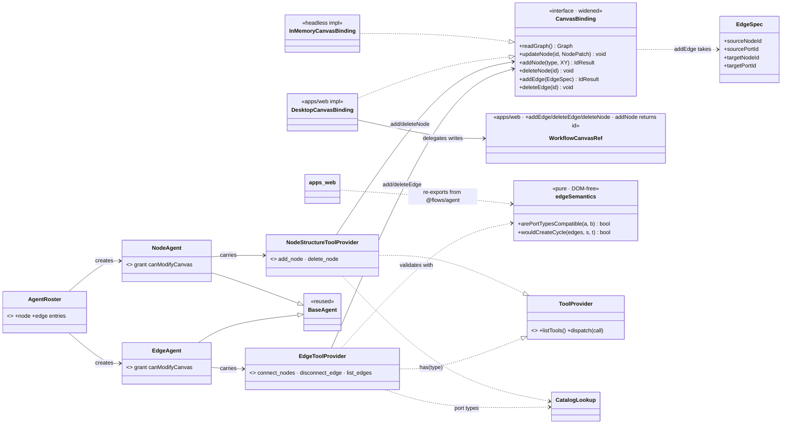

# Implementation — interface changes (node + edge structural agents)

> The exact **interface surface** the node + edge specialists add or extend, with a UML view and the
> SOLID/DRY rationale for each choice. This is the code-level companion to the a→b
> [change note](./change-note-structural-agents.md) and the end-state
> [harness-interfaces.md](./harness-interfaces.md). Scope: `@flows/agent` (`libs/agent`, DOM-free) plus the
> two seams the web app implements. Written 2026-07-28.

---

## 1 · What changes, at a glance

Five layers change; only **one existing interface is widened** (`CanvasBinding`). Everything else is **new**
surface added alongside the shipped locator/property pattern — no shipped signature is broken.

| Layer                | Interface                                                             | Change                                                                   | File                                                                                    |
| -------------------- | --------------------------------------------------------------------- | ------------------------------------------------------------------------ | --------------------------------------------------------------------------------------- |
| Seam                 | `CanvasBinding`                                                       | **widen**: +4 sync primitives; +`EdgeSpec` type                          | `libs/agent/src/canvas/canvasBinding.ts`                                                |
| Seam impl (headless) | `createInMemoryCanvasBinding`                                         | implement the 4 primitives                                               | `libs/agent/src/canvas/inMemoryCanvasBinding.ts`                                        |
| Seam impl (desktop)  | `createDesktopCanvasBinding` + `WorkflowCanvasRef`                    | implement the 4 primitives via new ref methods                           | `apps/web/.../utils/createDesktopCanvasBinding.ts`, `.../components/WorkflowCanvas.tsx` |
| Validation           | `edgeSemantics` (**new, pure, DOM-free**)                             | `arePortTypesCompatible`, `wouldCreateCycle`                             | `libs/agent/src/canvas/edgeSemantics.ts`                                                |
| Tools                | `createNodeStructureToolProvider`, `createEdgeToolProvider` (**new**) | `add_node`/`delete_node`, `connect_nodes`/`disconnect_edge`/`list_edges` | `libs/agent/src/tools/nodeTools.ts`, `.../tools/edgeTools.ts`                           |
| Agents               | `NodeAgent`, `EdgeAgent` (**new**) + 2 roster entries                 | mirror `LocatorAgent`/`PropertyAgent`                                    | `libs/agent/src/agents/{nodeAgent,edgeAgent}.ts`, `registrations.ts`                    |

The design rests on one invariant, applied top to bottom: **the binding is a thin mechanical seam; all
judgement lives in the tools.** A write that reaches the binding has already been validated.

## 2 · The widened seam — `CanvasBinding`

```ts
// libs/agent/src/canvas/canvasBinding.ts  — BEFORE
export interface CanvasBinding {
    readGraph(): Graph; // Graph = WorkflowState = { nodes: NodeData[]; edges: EdgeData[] }
    updateNode(id: string, patch: NodePatch): void;
}
```

```ts
// AFTER — +4 synchronous, frontend-only, mechanical primitives (no validation here)
export interface EdgeSpec {
    sourceNodeId: string;
    sourcePortId: string;
    targetNodeId: string;
    targetPortId: string;
}

export interface CanvasBinding {
    readGraph(): Graph;
    updateNode(id: string, patch: NodePatch): void;
    /** Create a node of `type` at `position` with the block's default config; returns the new id. */
    addNode(type: string, position: XY): { id: string };
    /** Remove a node and cascade every edge that touches it. */
    deleteNode(id: string): void;
    /** Append one (already-validated) edge and return its new id. */
    addEdge(spec: EdgeSpec): { id: string };
    /** Remove one edge by id. */
    deleteEdge(id: string): void;
}
```

**Why these signatures**

- **`addNode`/`addEdge` return `{ id }`.** Creation mints an id; a compound turn ("add a node, then wire it")
  cannot proceed without it. Returning the id is the whole reason the seam widens rather than reusing a
  fire-and-forget call. (ISP: callers that only delete/read never touch the returned id.)
- **`EdgeSpec` is `EdgeData` minus `id`.** The id is the binding's to assign, so the caller cannot supply
  one. We name a dedicated `EdgeSpec` rather than `Partial<EdgeData>` so "the 4 endpoint fields, all
  required" is enforced by the type. We use `EdgeData` (not the phantom `Connection` name, which the API
  package does not actually export) throughout libs/agent.
- **Sync, not async.** Every shipped edit (`updateNode`) is synchronous and frontend-only; structural edits
  join that model (the canvas store's `deleteNode`/`addConnection`/`deleteConnection` are synchronous). The
  async, server-backed variant stays deferred ([harness-deferred.md §5](./harness-deferred.md)).
- **`deleteNode` cascades in the binding, not the tool.** The store's `deleteNode` already drops incident
  edges atomically; the in-memory binding mirrors it. Keeping cascade in the seam means every writer gets a
  consistent graph and no tool can forget it (DRY: one cascade, not one-per-tool).
- **`addEdge` appends; the tool judges an occupied input.** Whether to displace an existing edge on an
  occupied input is a judgement, not a mechanical write, so `connect_nodes` **rejects** an occupied target
  input (naming the occupying edge for the orchestrator to `disconnect_edge`) and `addEdge` just appends the
  validated edge. The interactive canvas keeps its own drag-to-replace UX in `WorkflowCanvas`, unrelated to
  the agent seam.
- **`addNode(type, position)` takes no config.** Default config is a **binding** concern (desktop seeds from
  `blockRegistry[type].defaultConfig`; in-memory seeds `{}`), because the agent's `CatalogLookup`/`BlockSchema`
  does not carry `defaultConfig`. The tool passes only what it knows. Non-default config is a **separate**
  turn through the property agent (composition; see [node.md](../agents/node.md)).

## 3 · Validation module — `edgeSemantics` (new, pure, DOM-free)

```ts
// libs/agent/src/canvas/edgeSemantics.ts — mirrors moveSemantics.ts (pure, headless, no imports beyond a type)
import type { EdgeData } from '@lemoncloud/eureka-flows-api';

/** `any`/undefined on either side is a wildcard; else case-insensitive equality. */
export const arePortTypesCompatible = (sourceType: string | undefined, targetType: string | undefined): boolean;

/** True if adding source→target would close a cycle (self-loop included). DFS over existing edges. */
export const wouldCreateCycle = (edges: EdgeData[], sourceNodeId: string, targetNodeId: string): boolean;
```

**DRY decision (the one that needs a rationale).** These two pure functions already exist in **apps/web**
(`utils/index.ts`, `utils/graph.ts`) and drive the interactive canvas. The edge tool needs the identical
rules headlessly, but **libs/agent must not import apps/web** (a lib importing an app is a forbidden
dependency direction) — so a naive copy would be two implementations that can drift.

Resolution: the **canonical implementation moves to `libs/agent`** (pure, DOM-free — it only imports the
`EdgeData` _type_), and **apps/web re-exports it from `@flows/agent`** (`app → lib` is allowed). One
implementation, imported by both the headless edge tool and the React canvas. We deliberately do **not** put
it in `@flows/flows`: that lib carries zustand/React runtime, and importing it for values would pull
frontend deps into the DOM-free agent core (violating the core's "node-testable" property). The dependency
graph after the change:

```
apps/web  ──imports──▶  @flows/agent (edgeSemantics)   ◀──uses── edge tool (same package)
                         └─ DOM-free, only depends on @lemoncloud/eureka-flows-api (types)
```

## 4 · New tool providers

Both mirror `createNodeConfigToolProvider`'s **validate → reject-or-apply** shape exactly: compute every
rejection and `return toolErr(...)` **before** any binding mutation, so a rejected call leaves the graph
byte-for-byte unchanged. Mutating tools declare `requires: 'canModifyCanvas'`; reads omit `requires`.

```ts
// libs/agent/src/tools/nodeTools.ts  (co-located with the other node providers)
export const createNodeStructureToolProvider = (binding: CanvasBinding, catalog: CatalogLookup): ToolProvider;
//   add_node    { type: string; position: XY }              requires canModifyCanvas
//               → if !catalog.has(type) reject; else binding.addNode(type, position) → ok({ nodeId })
//   delete_node { nodeId: string }                          requires canModifyCanvas
//               → requireNode(nodeId) or reject; else binding.deleteNode(nodeId) → ok({ nodeId, droppedEdges })

// libs/agent/src/tools/edgeTools.ts  (new file)
export const createEdgeToolProvider = (binding: CanvasBinding, catalog: CatalogLookup): ToolProvider;
//   list_edges      {}                                      (read — no requires)
//                   → ok({ edges: EdgeSummary[] })   // compact: { edgeId, source/target node+port } mapped from readGraph().edges
//   connect_nodes   EdgeSpec                                requires canModifyCanvas
//                   → both nodes exist · sourcePortId ∈ schema(src).outputs · targetPortId ∈ schema(tgt).inputs
//                     · arePortTypesCompatible(outType, inType) · !wouldCreateCycle(edges, src, tgt)
//                     → else reject (reason names the ports the block exposes); else binding.addEdge(spec) → ok({ edgeId })
//   disconnect_edge { edgeId: string }                      requires canModifyCanvas
//                   → edge exists or reject; else binding.deleteEdge(edgeId) → ok({ edgeId })
```

**Why the edge tool owns validation** (SRP + testability): port-existence, type-compat, and cycle are
_domain rules_ that must be exercised headlessly (fake gateway + in-memory binding, no React). Putting them
in the tool keeps the binding a dumb seam and gives the model a precise rejection reason to report. This is
the same split as config validation living in `createNodeConfigToolProvider`, never in `updateNode`.

**Why `add_node` needs `catalog` but not for defaults**: it uses `catalog.has(type)` only to reject an unknown
block type before creating; defaults are the binding's job (§2).

## 5 · New agents + roster

Pure `BaseAgent` subclasses, identical in shape to `LocatorAgent`; the only variation is persona + tools +
(no) grant difference — all three canvas-mutating specialists share `grant: { canModifyCanvas: true }`.

```ts
// libs/agent/src/agents/nodeAgent.ts
export class NodeAgent extends BaseAgent {
    constructor(deps: BaseAgentDeps) {
        super(deps, {
            id: 'node',
            description: 'Adds a node to the canvas or deletes one.',
            systemPrompt: NODE_SYSTEM_PROMPT,
            grant: { canModifyCanvas: true },
            tools: [
                createNodeReadToolProvider(deps.binding, deps.catalog),
                createCatalogToolProvider(deps.catalog), // confirm the block type
                createNodeStructureToolProvider(deps.binding, deps.catalog),
            ],
        });
    }
    protected override buildContextMessages(): ChatMessage[] {
        return [{ role: 'system', content: renderNodeContext(this.binding) }];
    }
}
export const createNodeAgent = (deps: BaseAgentDeps): Agent => new NodeAgent(deps);

// libs/agent/src/agents/edgeAgent.ts
export class EdgeAgent extends BaseAgent {
    constructor(deps: BaseAgentDeps) {
        super(deps, {
            id: 'edge',
            description: 'Connects two nodes or disconnects an edge.',
            systemPrompt: EDGE_SYSTEM_PROMPT,
            grant: { canModifyCanvas: true },
            tools: [
                createNodeReadToolProvider(deps.binding, deps.catalog),
                createEdgeToolProvider(deps.binding, deps.catalog), // includes list_edges
            ],
        });
    }
    protected override buildContextMessages(): ChatMessage[] {
        return [{ role: 'system', content: renderNodeContext(this.binding) }];
    }
}
export const createEdgeAgent = (deps: BaseAgentDeps): Agent => new EdgeAgent(deps);
```

```ts
// libs/agent/src/agents/registrations.ts — two entries added (the only orchestrator-facing wiring)
{ type: 'node', summary: 'adds a node to the canvas or deletes one', create: deps => createNodeAgent(deps) },
{ type: 'edge', summary: 'connects two nodes or disconnects an edge', create: deps => createEdgeAgent(deps) },
```

The orchestrator discovers both via `list_agents` at runtime — **no orchestrator prompt or runner change**
(OCP: the roster is the extension point). New symbols surface on `@flows/agent` automatically via the
`export *` barrels; add named exports in `tools/index.ts`, `agents/index.ts`, and `canvas/index.ts`.

## 6 · The desktop seam (`apps/web`)

The store's guard (`canModifyCanvas`) + undo checkpoint live **inside** the `WorkflowCanvas` component, so
the desktop binding cannot drive the store directly and stay consistent with `updateNode`. Four
imperative-handle methods are added/extended (defined inline in the handle, like the existing `addNode`, so
they close over `saveCheckpoint`/`setNodes`/`setConnections`/`permissions`/`newEdgeId`):

```ts
// WorkflowCanvasRef — BEFORE → AFTER
addNode: (type: string, position?: XY) => void;            // →  (type, position?, options?: { autoConnect?: boolean }) => string   (returns the new id; autoConnect defaults true)
deleteNode: (id: string) => void;                          // NEW on the ref (guard + checkpoint + cascade)
addEdge: (spec: EdgeSpec) => string;                       // NEW (guard + checkpoint + append + newEdgeId)
deleteEdge: (id: string) => void;                          // NEW (guard + checkpoint)
```

`addNode` widening is **backward-compatible**: existing callers pass `(type, position)` and ignore the
return; the agent path passes `{ autoConnect: false }` and reads the id. The desktop binding then delegates:

```ts
addNode: (type, position) => ({ id: canvas().addNode(type, position, { autoConnect: false }) }),
deleteNode: id => canvas().deleteNode(id),
addEdge: spec => ({ id: canvas().addEdge(spec) }),
deleteEdge: id => canvas().deleteEdge(id),
```

## 7 · UML — the surface after the change



## 8 · SOLID / DRY self-check

- **SRP** — binding = mechanical apply; tool = validation + rejection reasons; agent = persona + tool
  selection. Cascade lives once in the binding; validation lives once in the edge tool.
- **OCP** — adding the specialists is two roster entries + barrel exports; no shipped file's behavior
  changes, no orchestrator prompt edit. The `addNode` ref signature is widened additively (optional arg,
  now-returned id) so existing callers are untouched.
- **LSP** — both `CanvasBinding` impls (in-memory, desktop) honor the same contract, including the
  cascade-on-delete and append-on-`addEdge` post-conditions, so tests over the in-memory binding
  predict desktop behavior. (The one honest gap: default-config _values_ differ — desktop seeds from the
  registry, in-memory seeds `{}` — documented in §2 as a binding concern, asserted structurally in tests.)
- **ISP** — no god interface: reads, node-structure, and edge are three providers an agent composes; a
  delete-only caller never sees edge tools.
- **DIP** — tools depend on the `CanvasBinding`/`CatalogLookup` abstractions, never on the desktop or store;
  that is what makes them headless-testable.
- **DRY** — one port-compat + cycle implementation (`edgeSemantics`), shared app↔lib; one cascade (binding);
  one occupied-input rejection (edge tool); agents/tools reuse `requireNode`, `toolOk/toolErr`,
  `renderNodeContext`, and the `BaseAgent` loop verbatim.

## 9 · Test surface (what proves the above)

- **Tool unit** (`__tests__/tools/nodeTools.spec.ts` extend, `edgeTools.spec.ts` new) over an in-memory
  binding + a small typed catalog: add/delete happy-path + cascade; connect happy-path; reject unknown type,
  missing node, unknown port, incompatible type (a real cross-type pair, e.g. `text`→`image`), cycle, and
  occupied-input (naming the occupying edge, sibling ports untouched); a rejected call leaves `readGraph()`
  unchanged; `def.requires === 'canModifyCanvas'`.
- **Agent scenario** (`scenarios/node.spec.ts`, `scenarios/edge.spec.ts` new) driving each agent directly
  over a fake gateway (bespoke graphs, `locator.spec` style) — the DoD lines in [node.md](../agents/node.md)
  / [edge.md](../agents/edge.md).
- **Integration** (`scenarios/integration.spec.ts`) — add the compound add→wire→configure (`applied`) and a
  partial (wire rejected, node+config land). **Rewrite** the now-stale `P1`/`R1` cases that assert structural
  edits are unsupported.
- **Permissions** — already proven once at the executor (`toolExecutor.spec.ts`); not re-tested per agent.
- **`edgeSemantics`** — a small pure unit test (compat wildcards + case-insensitivity; cycle incl. self-loop),
  since it is now the single source of that logic for both app and lib.

```

```
