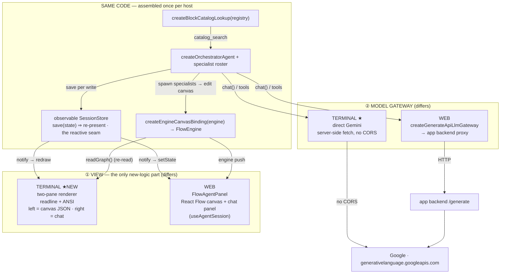
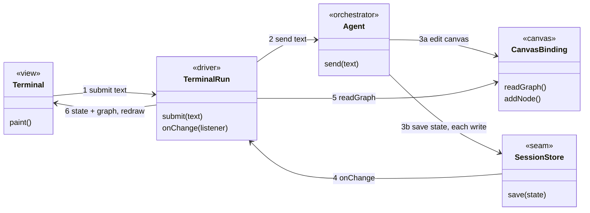
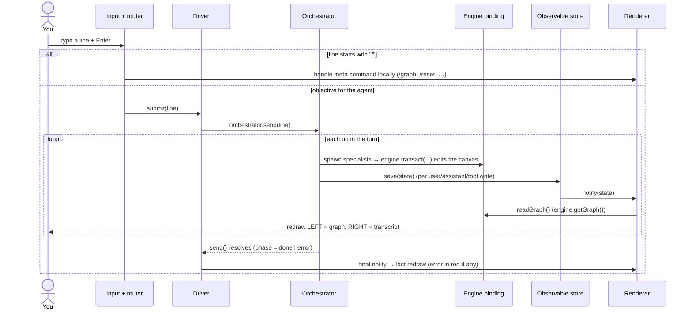

# Local terminal — a headless view over the flow-agent

> **What.** A Node terminal that drives the shipped orchestrator + specialist roster **outside the browser**,
> so we can _use_ the feature by hand. **Left pane** = the live `{ nodes, edges }` JSON of the canvas;
> **right pane** = a chat with the agent. You type an objective; the agent edits the canvas; both panes
> update as the turn unfolds.
>
> **Same stack as the browser.** The terminal runs the **real engine**: canvas edits go through
> `createEngineCanvasBinding` over a headless `FlowEngine`, and the block catalog is built from the same
> block registry — the exact pieces the browser's `FlowAgentPanel` wires. Only two things differ, both behind
> a port: the **model gateway** (the terminal talks **directly** to Gemini instead of the backend proxy the
> web uses — this is the whole point, since the browser can't call Gemini cross-origin) and the **renderer**
> (two panes instead of React). Nothing about the engine, the canvas rules, or the agent is re-implemented.
>
> **Grounding.** Assembly over public `@flows/engine` + `@flows/agent` on this branch
> (`feat/structural-agents`). The engine runs headless today (`libs/engine/src/cli` / `yarn engine:demo`:
> `load → add → undo → redo → save → run` in Node); the agent runs headless today
> (`__tests__/headless-gemini.smoke.spec.ts`); the reactive-store wiring mirrors the shipped web binding
> `apps/web/.../hooks/useAgentSession.ts`. Gemini Developer API only (Vertex dropped 2026-08-05). Last updated
> 2026-08-06.

---

## 1 · What it is

The terminal is a thin **renderer + input loop wrapped around the real flow stack**. It builds the same
`engine` → `binding` → `catalog` trio the browser's `FlowAgentPanel` uses — the browser calls `createFlowEngine`
with blocks from its store; the terminal wraps that in `createFlowWorkspace` to load the same blocks over HTTP —

```ts
const { engine, repository } = createFlowWorkspace({ http });         // engine + block repository (headless)
await repository.load(flowId);                                        // or loadBlocks() — no flow, blocks only
const binding = createEngineCanvasBinding(engine);                    // real canvas rules (same as the browser)
const catalog = createBlockCatalogLookup(repository.blockRegistry()); // real blocks (same registry → same catalog)
const gateway = /* direct Gemini here; backend proxy in the browser */;
```

— drives `createOrchestratorAgent` over it through a reactive `SessionStore`, and paints the result into two
panes. The only component with genuinely new behaviour is the **two-pane renderer**; the rest is thin glue:

- the **driver** that runs one turn per input — a few lines around `createOrchestratorAgent`;
- an **observable session store** — a ~20-line store whose `save` triggers a redraw (the pattern the web hook
  uses inline);
- the **entry** — argument parsing, env loading, engine/binding/catalog assembly, and a `readline` loop.

```
┌─────────────────────────────┬──────────────────────────────────────┐
│  CANVAS  (binding.readGraph) │  CHAT  (session transcript)          │
│  {                           │  › add a text input and preview,     │
│    "nodes": [                │    wire them together                │
│      { "id": "n_1",          │                                      │
│        "type": "input-text", │  ⚙ spawn → builder … ok              │
│        "position": {x,y},    │  ● Added input-text (n_1) and        │
│        "config": {…} }, …    │    output-preview (n_2), out→in.     │
│    ],                        │  ────────────────────────────────    │
│    "edges": [ … ]            │  › _                                 │
│  }                           │                                      │
└─────────────────────────────┴──────────────────────────────────────┘
```

## 2 · Principles (locked)

1. **Real engine, not a stand-in.** Canvas edits go through `createEngineCanvasBinding` over a headless
   `FlowEngine` — the _same_ binding the desktop/mobile editors and the browser agent panel use (its own doc
   comment lists "a headless Node run" as a supported caller). So default-config seeding on add, port/type
   checks on connect, cascade deletes, and transactions/undo behave **exactly as in the browser**. Even
   offline this real binding runs (over a stub HTTP port); the in-memory binding survives only in unit tests,
   never in the running terminal.
2. **The injected `SessionStore` is the reactive seam.** The agent calls `storage.save(state)` on **every**
   write (`baseAgent.ts`). The view supplies a store whose `save` is its "re-present" signal — here, a redraw.
   One contract between agent and presentation; no second channel.
3. **View is separated from driver (SRP).** The **driver** (turns + state) knows nothing about the terminal
   or ANSI codes; the **renderer** knows nothing about the orchestrator. They meet only at the driver's small
   interface (§5), so the renderer can be swapped — plain redraw today, `ink` tomorrow — without touching the
   driver.
4. **Everything is injected (DIP / OCP).** `gateway`, `binding`, `catalog`, `userPermissions` are inputs. The
   terminal and the browser build the _same_ engine binding + catalog; they differ only in which `LlmGateway`
   they inject. A different environment is a different injection, not a code change.
5. **Same seam as the web (DRY).** Engine, binding, catalog, and the reactive-store wiring are the shipped
   code the web already uses. What you validate here behaves the same in the real UI — nothing to re-plumb
   later (§7).
6. **Errors are shown, never swallowed.** `send()` never throws; failures land as `phase:'error'` +
   `state.error`. The view reads `phase` off every emitted state and surfaces the reason.
7. **No test-only affordances leak in.** The eval harness's `OUTCOME_REQUEST` re-ask (`runScenario.ts`) is a
   machine-readable verdict for oracles — it **must not** run here. Production turns end with the
   orchestrator's plain-text message; that is what the chat renders.

## 3 · Architecture

### 3.1 · Terminal vs web

Both hosts assemble and drive the **same** core: `FlowEngine` → `createEngineCanvasBinding` →
`createBlockCatalogLookup`, with `createOrchestratorAgent` on top writing through a reactive `SessionStore`.
They diverge at exactly **two** injection points — the **view** (①) and the **model gateway** (②). Read each
side of the diagram top-to-bottom as one host; the middle box is one set of shipped modules, instantiated per
host (not a runtime the two share).



The one asymmetry _inside_ the core is how blocks are loaded: the terminal pulls the registry over HTTP via
`createFlowWorkspace`, the browser reads it from the app's store — same registry in, so the binding and catalog
are identical either way. (For the terminal's own internal wiring — entry, input router, driver — see §6.)

### 3.2 · The core loop

Strip the plumbing (config objects, engine internals, the wire log) and the logic is one loop: a typed line
becomes agent edits, and every edit redraws. Five pieces play — `Terminal` (the `main()` entry) is the only
concrete one; the rest are interfaces it drives.



The seam is the whole trick: the agent writes session state on every step (3b), each write fires `onChange`
(4), and the driver re-reads the graph (5) and repaints (6) — so the canvas advances mid-turn, not only at the
end. Per-piece detail: the seam §4, the driver §5, the renderer §6.

## 4 · The reactive seam — `SessionStore.save` as the observer

```ts
// session/session.ts — the port the agent writes through
interface SessionStore {
    load(flowId: string): SessionState | null;
    create(flowId: string): SessionState;
    save(state: SessionState): void; // ← called on EVERY write; THIS is the observer hook
}
interface SessionState {
    flowId: string;
    messages: Message[];
    phase: AgentPhase;
    error?: string;
}
```

The terminal supplies a store whose `save` redraws:

```ts
const store = createObservableSessionStore(state => render(state, binding.readGraph()));
```

Rules the seam guarantees (and the renderer must respect):

- `save` may fire **many times per turn** — redraw must be cheap and must snapshot (copy) any state it keeps,
  since the agent mutates `state.messages` in place between saves.
- `phase` transitions `idle → thinking → done|error`; the renderer reads it to show a spinner / final / error.
- The engine has no push callback the terminal subscribes to, so the renderer re-reads `binding.readGraph()`
  (i.e. `engine.getGraph()`) inside `notify`. Because a spawned specialist's canvas edits land _before_ its
  `spawn` tool-result is recorded, the left pane advances **as each specialist finishes** — not only at turn
  end. (In the browser the same engine also pushes to React Flow; the terminal simply re-reads instead.)

## 5 · The driver contract

A small surface the renderer and entry depend on — the Node analogue of `useAgentSession`, minus React-only
lifecycle (hydrate / StrictMode arm-dispose):

```ts
interface TerminalRun {
    submit(text: string): Promise<void>; // drive one turn; no-op while a turn is in flight (agent's own guard)
    abort(): void; // orchestrator.abort() — cancels stream + spawned children
    reset(seed?: Graph): void; // engine.loadGraph(seed ?? empty) + new session (/reset, /seed)
    getGraph(): Graph; // binding.readGraph()
    getState(): SessionState | null; // latest emitted transcript+phase
    onChange(listener: (s: SessionState, g: Graph) => void): () => void; // subscribe; returns unsubscribe
}

interface TerminalRunDeps {
    // every dependency injected (Principle 4); the ENTRY assembles them
    gateway: LlmGateway;
    binding: CanvasBinding; // the real engine binding — the entry assembles it
    catalog: CatalogLookup; // from the same registry the engine uses
    userPermissions: AgentGrant;
    loadGraph?: (graph: Graph) => void; // re-seed on reset (entry passes engine.loadGraph); omit → reset only clears the session
    flowId?: string; // default 'terminal'
}
```

`submit` is a thin wrapper over `orchestrator.send` — the agent already resolves at the turn boundary, never
throws (records `phase:'error'`), no-ops on a concurrent send, and appends to an append-only transcript across
turns. `reset`/`seed` go through the engine's single ingress `engine.loadGraph(state)`. The driver adds no
logic beyond wiring the observable store and exposing `getGraph`.

## 6 · The terminal view

### 6.1 Components inside the view

| Component                             | Responsibility                                                                                                                                                                           | Talks to                      |
| ------------------------------------- | ---------------------------------------------------------------------------------------------------------------------------------------------------------------------------------------- | ----------------------------- |
| **Entry / bootstrap** (`terminal.ts`) | Parse argv, load env, **assemble the real stack** (engine + binding + catalog), resolve the gateway (or a fake), build the driver, subscribe the renderer to `onChange`, start the loop. | everything, once              |
| **Input reader** (`node:readline`)    | Read one line; own the `› ` prompt; disable input while a turn is in flight.                                                                                                             | → command router              |
| **Command router**                    | A `/…` line is a **meta command** handled locally (never sent to the agent); anything else is `driver.submit(text)`.                                                                     | → renderer / → driver         |
| **Driver** (`TerminalRun`, §5)        | Run one turn; own the observable store + orchestrator; expose `getGraph`/`onChange`/`abort`/`reset`.                                                                                     | → orchestrator, store, engine |
| **Observable store** (§4)             | `save(state) ⇒ notify` — the single change signal.                                                                                                                                       | → renderer (via `onChange`)   |
| **Two-pane renderer** ★               | The only new-logic component. Paints the **left** pane from `getGraph()` and the **right** pane from the transcript on every `notify`; handles resize, colour, scroll-tail, spinner.     | ← store, engine; → screen     |

### 6.2 How it works (one typed line)



The panes refresh **during** the turn, once per agent write — you watch real engine edits appear as each
specialist finishes, not only at the end.

### 6.3 Layout, rendering & commands

- **Left pane** — pretty-printed `getGraph()` (nodes then edges), tinted with `picocolors`. Read
  `node.customLabel` for the display name; note the engine seeds real default `config` on add, so new nodes
  show populated config (not `{}`).
- **Right pane** — transcript (newest at bottom) above a `› ` input line; spinner while `phase==='thinking'`.
  From `SessionState.messages`: `user` → the typed line; `assistant` **with** `toolCalls` → `content` + one line
  per call — dim `⚙ name`, or red `✗ name` on error (status shows as glyph/colour, not a text word); each
  following `tool` message adds its summary (spawn `summary`, else `error: …`, else the raw result), for every
  tool result not only `spawn`; `assistant` **without** `toolCalls` → the final reply. `--verbose` also prints
  raw tool args + tool-result JSON.
- **Scrolling** — the alt-screen replaces native scrollback, so each pane scrolls in-app. One pane is the
  scroll target at a time (marked `‹scroll›` in its header); `/pane` switches canvas⇄chat. Scroll it with the
  **mouse wheel** or **↑/↓** (the entry requests alternate-scroll `?1007h` so xterm.js/VS Code maps the wheel
  to arrow keys; input history is disabled to free the arrows), **PageUp/PageDown** (a page), or — for
  terminals that grab those keys (VS Code grabs Shift+PageUp) — the typed **`/top` `/bottom`**, which
  always reach the app. `/keys` echoes each keypress name for diagnosing a stubborn terminal. A `▲N`/`▼N`
  marker shows off-screen lines; a new objective snaps back to the live tail. Offsets are pure state in
  `composeFrame` (clamped + echoed back), so the math is unit-tested; the handlers only nudge them and repaint.
- **Meta commands** (view-local): `/pane`, `/top`, `/bottom`, `/keys`, `/graph` (writes
  full JSON to `./graph.json`), `/seed <file>`, `/save` (backend, or `<file>` local — see below), `/reset`,
  `/verbose`, `/provider`, `/log`, `/help`, `/quit`; **Ctrl-C** → `abort()` mid-turn else quit; **Ctrl-D** →
  quit. `/reset` and `/seed` call `driver.reset(seed?)`.
- **Backend wire log** — on by default, `agent-terminal.log` records four channels as one timeline:
  **chat** (the orchestrator transcript as `user` → `assistant` → tool-result turns, taken from the session so
  it reads like a normal conversation), **canvas** (`+ node` / `+ edge` / `~ node` / `- node`, with results —
  the local engine edits that never reach a backend, so this is where node creation is visible), **model** (one
  token-`usage` line per call, tagged `orchestrator`/`builder`; the fake logs `no backend call`, so usage is
  the backend-call proof), and, in connected mode, **flow-API** HTTP. The file is truncated at startup;
  `--log <file>` sets the path, `--no-log` disables, `/log` shows it. The chat channel is fed the session
  state; the others are transparent decorators over the gateway / `CanvasBinding` / `HttpPort`.
- **Saving to the backend** — in connected mode the terminal persists the built flow the way the web's save
  button does: a single `repository.save()` (`POST /flows/:id/save`) that sends the whole graph. The server
  upserts nodes + edges by their client-minted ids (`upsertNodesV2` get-or-make), so a brand-new flow (`id 0`)
  is created and its minted id returned — there is no separate "create nodes to get ids" step. Save runs
  automatically after each completed turn (disable with `--no-autosave`) and on `/save`; a non-owner editor
  sees `saved settings only …` when the server drops added/deleted structure. Offline, `/save` writes a local
  JSON file instead. `/save <file>` always exports locally.
- **Offline** — `--fake` injects a constant-reply fake gateway (zero API spend); the engine + binding are
  always real, so canvas behaviour is unchanged.
- **One-shot (headless)** — `--once <objective>` skips the TUI entirely: drives a single turn, prints the
  assistant reply then the resulting graph JSON to stdout, autosaves in connected mode, and exits (non-zero on
  a failed turn). The scriptable, non-interactive counterpart to the two-pane loop.

## 7 · Wiring the real UI later — the minimal-change guarantee

The terminal drives the agent over the **same stack and the same seam** the shipped web binding uses (real
engine binding + catalog + a reactive `SessionStore`), so validating here _is_ validating the real contract —
a behaviour that works in the terminal works in the panel unchanged, with nothing to re-plumb. The only atom
that would otherwise live in two places is the observable `SessionStore` (the web hook writes one inline; the
terminal needs one too); if we ever want a single implementation, extract
`createObservableSessionStore(onSave)` into `@flows/agent` and have both wrap it — a tiny additive move,
**out of scope** here. The design reserves that seam so the consolidation is a lift, not a rewrite.

## 8 · Out of scope (v1)

- Consolidating the observable store into `@flows/agent` (see §7 — reserved, not done).
- Live run/execution of the flow (the engine can, via a socket port; the terminal only _builds_ flows here).
- Persisting the session transcript across process restarts (`/save` + `/seed` cover graph round-trips).
- Rendering child sub-agent transcripts (absent from the orchestrator session by design; the `spawn` summary
  is the visible signal).
- A published `bin` / global install — runs via the repo `agent:terminal` script.
