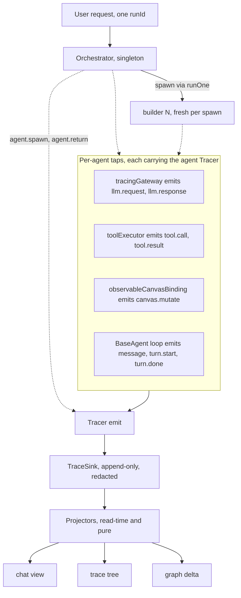

# Observability — spec

**Status:** design · **Branch:** `feat/agent-observability` (from `develop`)
**Assumption:** the `environment/` module is removed. This feature is **self-contained** — it defines its own logging port, sinks, and clock, and depends on nothing in `environment/`. Former environment duties unrelated to tracing (session storage, the gateway's clock) are out of scope here.
**Companion docs:** [interfaces](./trace-interfaces.md) (exact types) · [scenarios](./trace-scenarios.md) (oracles).
**Grounded in:** `agents/{baseAgent,subAgentRunner,orchestratorAgent}.ts`, `tools/toolExecutor.ts`, `canvas/{canvasBinding,engineCanvasBinding}.ts`, `llm/llmGateway.ts`.

## Purpose

One legible record of a multi-agent run, answering three questions:

1. **Chat history** — every message (user / assistant / tool-call / tool-result) for **every** agent.
2. **Attribution** — which agent did what, was asked what, returned what — including orchestrator↔specialist handoffs.
3. **Graph delta** — canvas state before and after each user request.

## Core idea — emit once, derive every view

Every agent emits structured events to an injected **Tracer**. Events accumulate as one append-only stream; the three views are **pure read-time projections** of that stream. No view is maintained live during a run. This is event sourcing: one source of truth, many read models.

## Principles (locked)

The design is chosen to satisfy these; any change must keep them.

- **Dependency inversion / Ports & Adapters.** The agent core depends only on the `Tracer` _port_. Where bytes land (file, memory, localStorage) is a `TraceSink` _adapter_ the host supplies. The core imports no IO. → unit-testable, and web/terminal parity is free.
- **Interface segregation.** `Tracer` is two methods (`emit`, `child`); `TraceSink` is one required (`write`). No consumer sees a member it does not use. (Contrast the removed reporter's `log/debug/info/warn/error/flush/close`.)
- **Null Object.** `NoopTracer` is the default value of every `tracer` dep. No agent ever writes `if (tracer)`; tracing is always safe-on.
- **Single responsibility — split three ways.** (a) `Tracer` _binds context_, `TraceSink` _transports_ — never the same object. (b) _Identity-binding_ (the spawner), _turn-binding_ (the loop), and _wrapping_ (the agent) are three responsibilities in three places, so none is overloaded.
- **Open/closed.** New event kinds and new sinks need no change to agents. Decorators (`tracingGateway`, `observableCanvasBinding`) add instrumentation without editing the wrapped code.
- **DRY / Rule of Three.** One emit path. `BaseAgent` self-wraps its deps once, so every current and future subclass is instrumented identically — no per-agent duplication.
- **YAGNI.** No OTel SDK, no live spans, no diff engine, no non-file sinks now (see _Deferred_).
- **Structured logging with bound context** (the pino / OpenTelemetry idiom). `child(context)` is the propagation mechanism; field names follow the OTel GenAI semantic conventions for later portability to a real trace viewer.
- **Determinism (FIRST).** The clock (`now`), the spawn-id counter (`nextSpawnId`), and the sink are all injected — a run is reproducible and assertable.

## Components

```
trace/
  tracer.ts         Tracer, TraceEvent, TraceContext, NoopTracer
  sink.ts           TraceSink, TraceRecord
  createTracer.ts   createTracer(sink, now?, context?)
  sinks.ts          memorySink, jsonlSink, redactingSink, fanoutSink
  redact.ts         redact(record)
  project/          toTraceTree, toTranscripts, toGraphDiff
llm/tracingGateway.ts               LlmGateway decorator  → llm.*
canvas/observableCanvasBinding.ts   CanvasBinding decorator → canvas.mutate
```



## How it plugs in — create → child → inject → wrap

The tracer is threaded exactly like the existing abort signal (`signalHolder` / `onTurnSignal` in `orchestratorAgent.ts`) — a per-turn holder, published by the loop, read by the spawn seam. Three responsibilities:

1. **The spawner binds identity** (who am I). Identity is known by the creator, not the agent. `runOne` mints `agentId = agentType#N`, builds `childTracer = parentTracer.child({ agent name, agent id, flowPath })`, emits `agent.spawn`/`agent.return`, and injects `childTracer` into the child's deps. The root (orchestrator) binds its own identity at construction and mints `runId` per `send()`.
2. **The agent self-wraps its deps** (in the `BaseAgent` constructor), through a `() => Tracer` accessor pointing at a per-agent holder — so the turn number can advance without re-wrapping: `tracingGateway(deps.gateway, get)`, `observableCanvasBinding(deps.binding, get)`, `createToolExecutor({ registry, tracer: get })`.
3. **The loop advances turn** — each iteration sets `holder.current = identity.child({ turn: i })` and emits `turn.*`. The spawn provider reads `() => holder.current` and passes it into `runner.fanOut`, where `runOne` (responsibility 1) recurses.

The **tracer tree mirrors the agent tree** — that is what makes attribution fall out for free.

### Seams

| Emits                          | Plugged into                                    | File                                    |
| ------------------------------ | ----------------------------------------------- | --------------------------------------- |
| `llm.request` / `llm.response` | `tracingGateway` decorator (per agent)          | new `llm/tracingGateway.ts`             |
| `tool.call` / `tool.result`    | `toolExecutor.dispatch`                         | `tools/toolExecutor.ts`                 |
| `message`, `turn.*`            | `BaseAgent` send-loop                           | `agents/baseAgent.ts`                   |
| `canvas.mutate`                | `observableCanvasBinding` decorator (per agent) | new `canvas/observableCanvasBinding.ts` |
| `agent.spawn` / `agent.return` | `subAgentRunner.runOne`                         | `agents/subAgentRunner.ts`              |

## Concurrency

Sub-agents run concurrently on the shared canvas (`Promise.all` in `orchestratorAgent.ts:186` and `subAgentRunner.ts:132`). Attribution holds because:

- **Per-agent wrapping.** Each agent has its own tracer + its own gateway/binding wrappers, so events are attributed by construction, not by timing.
- **Attribution, not adjacency.** Every record self-identifies via bound context + `toolCallId`; projectors never rely on line order or timestamps to pair events.
- **Unique instance id.** The run-monotonic `agentId` (`builder#3`) disambiguates same-type siblings.
- **File order is authoritative.** Sink writes are synchronous, so append order is emission order; `ts` is advisory only.

## Runtime compatibility (web + terminal)

Identical core; only the sink adapter differs.

| Layer                            | Terminal (node)                  | Web (browser)                                                    |
| -------------------------------- | -------------------------------- | ---------------------------------------------------------------- |
| Tracer · decorators · projectors | shared                           | shared                                                           |
| Sink                             | `jsonlSink(write → append file)` | `fanoutSink(memorySink(), localStorageSink)` for the reactive UI |
| View                             | printed                          | React components                                                 |

## Removing the environment — impact

- The removed trace pieces map 1:1: `AgentTraceReporterSupportable → Tracer`, `NoopAgentTraceReporter → NoopTracer`, `BufferAgentTraceReporter → memorySink()`, `redactSecrets → redact` (used by `redactingSink`).
- `environment.now` → `createTracer`'s injected `now` (default `Date.now`).
- The gateway's own `environment.traceReporter` debug is dropped (superseded by `tracingGateway`); its `environment.now` timing moves to an injected clock — a gateway refactor tracked with the environment removal, not here.
- Out of scope: session storage and any other non-tracing former-environment duty.

## Reused vs new

| Reused (unchanged)                                       | New                                                                   |
| -------------------------------------------------------- | --------------------------------------------------------------------- |
| `LlmGateway`, `CanvasBinding`, `ToolExecutor` interfaces | `trace/` module (tracer, sinks, projectors)                           |
| `BaseAgent` loop shape, `runOne` spawn flow              | `tracingGateway`, `observableCanvasBinding` decorators                |
| `signalHolder` / `onTurnSignal` idiom (mirrored)         | `tracer` dep on `BaseAgentDeps` / `SubAgentRunnerDeps`; `nextSpawnId` |

## Deferred (YAGNI)

- OTel SDK / live OTLP export (field names already align).
- First-class spans / duration-tree (derive from file order + correlation).
- A graph-diff engine (diff the two snapshots in the projector).
- Non-file sinks beyond memory/localStorage; sampling; retention.
- A rendered viewer UI (consumes the same records later).
