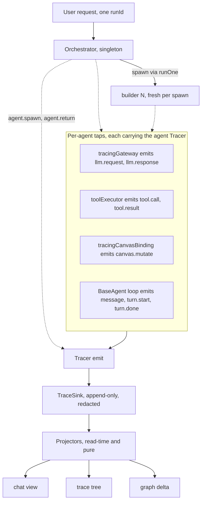

# Observability — spec

**Status:** design · **Branch:** `feat/agent-observability` (from `develop`)
**Assumption:** the `environment/` module is removed. This feature is **self-contained** — it defines its own logging port, sinks, and clock, and depends on nothing in `environment/`. Former environment duties unrelated to tracing (session storage, the gateway's clock) are out of scope here.
**Grounded in:** `agents/{baseAgent,subAgentRunner,orchestratorAgent}.ts`, `tools/toolExecutor.ts`, `canvas/{canvasBinding,engineCanvasBinding}.ts`, `llm/llmGateway.ts`.

## Purpose

One legible record of a multi-agent run, answering three questions:

1. **Chat history** — every message (user / assistant / tool-call / tool-result) for **every** agent.
2. **Attribution** — which agent did what, was asked what, returned what — including orchestrator↔specialist handoffs.
3. **Graph delta** — the canvas before → after, both as a cumulative whole-session delta and one per turn, naming which nodes (id + type) and edges (source → target) were added / removed / changed.

## Core idea — emit once, derive every view

Every agent emits structured events to an injected **Tracer**. Events accumulate as one append-only stream; the three views are **pure read-time projections** of that stream. No view is maintained live during a run. This is event sourcing: one source of truth, many read models.

## Principles (locked)

The design is chosen to satisfy these; any change must keep them.

- **Dependency inversion / Ports & Adapters.** The agent core depends only on the `Tracer` _port_. Where bytes land (file, memory, localStorage) is a `TraceSink` _adapter_ the host supplies. The core imports no IO. → unit-testable, and web/terminal parity is free.
- **Interface segregation.** `Tracer` is two methods (`emit`, `child`); `TraceSink` is one required (`write`). No consumer sees a member it does not use. (Contrast the removed reporter's `log/debug/info/warn/error/flush/close`.)
- **Null Object.** `NoopTracer` is the default value of every `tracer` dep. No agent ever writes `if (tracer)`; tracing is always safe-on.
- **Single responsibility — split three ways.** (a) `Tracer` _binds context_, `TraceSink` _transports_ — never the same object. (b) _Identity-binding_ (the spawner), _turn-binding_ (the loop), and _wrapping_ (the agent) are three responsibilities in three places, so none is overloaded.
- **Open/closed.** New event kinds and new sinks need no change to agents. Decorators (`tracingGateway`, `tracingCanvasBinding`) add instrumentation without editing the wrapped code.
- **DRY / Rule of Three.** One emit path. `BaseAgent` self-wraps its deps once, so every current and future subclass is instrumented identically — no per-agent duplication.
- **YAGNI.** No OTel SDK, no live spans, no diff engine, no non-file sinks now (see _Deferred_).
- **Structured logging with bound context** (the pino / OpenTelemetry idiom). `child(context)` is the propagation mechanism; field names follow the OTel GenAI semantic conventions for later portability to a real trace viewer.
- **Determinism (FIRST).** The clock (`now`), the spawn-id counter (`nextSpawnId`), and the sink are all injected — a run is reproducible and assertable.

## Components

```
trace/
  tracer.ts         Tracer, TraceEvent, TraceContext, NoopTracer
  sink.ts           TraceSink, TraceRecord
  createTracer.ts   createTracer(sink, now?, context?)
  sinks.ts          memorySink, jsonlSink, redactingSink, fanoutSink
  redact.ts         redact(record)
  project/          toTraceTree, toTranscripts, toGraphDiff
llm/tracingGateway.ts               LlmGateway decorator  → llm.*
canvas/tracingCanvasBinding.ts   CanvasBinding decorator → canvas.mutate
```



## Interfaces (exact types)

TypeScript, `libs/agent/src`.

### The port — what the agent core depends on

```ts
// trace/tracer.ts
export interface TraceContext {
    runId?: string; // one per user request (root key)
    'gen_ai.agent.name'?: string; // persona TYPE: 'orchestrator' | 'builder' | block type
    'gen_ai.agent.id'?: string; // INSTANCE: 'orchestrator' (singleton) | 'builder#3' (per spawn)
    flowPath?: string; // instance-id tree; root = flowId, child = '<flowId>:builder#3'
    turn?: number; // think/act loop index
    [k: string]: unknown; // open for event-specific extension
}
export interface TraceEvent {
    name: string;
    level?: 'debug' | 'info' | 'warn' | 'error'; // default 'debug'
    fields?: Record<string, unknown>;
}
export interface Tracer {
    emit(event: TraceEvent): void;
    child(context: TraceContext): Tracer; // NEW tracer stamping `context` on every event
}
```

### The sink boundary + factory + sinks

```ts
// trace/sink.ts
export interface TraceRecord {
    ts: number;
    name: string;
    level: 'debug' | 'info' | 'warn' | 'error';
    context: TraceContext; // accumulated across child() calls
    fields: Record<string, unknown>;
}
export interface TraceSink {
    write(record: TraceRecord): void; // synchronous append — order is authoritative
    flush?(): void;
}

// trace/createTracer.ts
export const createTracer = (sink: TraceSink, now?: () => number, context?: TraceContext): Tracer;
export const NoopTracer: Tracer; // does nothing; its children do nothing — the default `tracer` dep

// trace/sinks.ts + trace/redact.ts
export const memorySink = (): TraceSink & { records: TraceRecord[] };
export const jsonlSink = (write: (line: string) => void): TraceSink;
export const redactingSink = (inner: TraceSink): TraceSink; // sanitize secret-looking keys at the boundary
export const fanoutSink = (...sinks: TraceSink[]): TraceSink;
export const redact = (record: TraceRecord): TraceRecord; // deep copy; key|token|secret|password|... → '[redacted]'
```

### The seams — decorators + executor

Each takes a `() => Tracer` accessor (not a fixed tracer) so per-turn context advances without re-wrapping — mirroring the `() => signalHolder.current` idiom in `orchestratorAgent.ts`.

```ts
export const tracingGateway = (inner: LlmGateway, getTracer: () => Tracer): LlmGateway; // llm.request before, llm.response after
export const tracingCanvasBinding = (inner: CanvasBinding, getTracer: () => Tracer): CanvasBinding; // canvas.mutate per mutating method; readGraph passes through
export const createToolExecutor = (getTracer?: () => Tracer): ToolExecutor; // default () => NoopTracer; tool.call / tool.result around dispatch
```

### Event vocabulary

Context is on every record; the table lists each event's `fields`.

| `name`                     | level       | `fields`                                       |
| -------------------------- | ----------- | ---------------------------------------------- |
| `llm.request`              | debug       | `messageCount`, `toolCount`                    |
| `llm.response`             | debug       | `durationMs`, `usage`, `toolCallCount`         |
| `llm.error`                | error       | `durationMs`, `reason`                         |
| `tool.call`                | debug       | `toolCallId`, `name`, `args`                   |
| `tool.result`              | debug       | `toolCallId`, `ok`, `data?`, `error?`          |
| `message`                  | debug       | `role`, `content`, `toolCalls?`, `toolCallId?` |
| `canvas.mutate`            | debug       | `op`, `nodeId?`, `edgeId?`                     |
| `agent.spawn`              | info        | `agentType`, `task`                            |
| `agent.return`             | info        | `agentType`, `completed`, `summary`            |
| `turn.start`               | debug       | `turn`, `graph?` (root only)                   |
| `turn.step`                | debug       | `turn`                                         |
| `turn.done` / `turn.error` | debug/error | `turn`, `graph?` (root only), `error?`         |

### Projectors + the trace bundle — pure, read-time

```ts
// trace/project/*.ts — input is TraceRecord[]; nothing runs during a turn.
export interface TraceNode { agentType: string; agentId: string; flowPath: string; records: TraceRecord[]; children: TraceNode[]; }
export interface ChatEntry { role: 'user' | 'assistant' | 'tool'; text: string; toolCalls?: Array<{ name: string; args: unknown }>; toolCallId?: string; }
export interface AgentTranscript { agentType: string; agentId: string; flowPath: string; chat: ChatEntry[]; }
export interface NodeChange { id: string; type: string; } // "which node" + its block type
export interface EdgeChange { id: string; sourceNodeId: string; sourcePortId: string; targetNodeId: string; targetPortId: string; } // "which edge" as source → target
export interface GraphSnapshot { nodes: Array<{ id: string } & Record<string, unknown>>; edges: Array<{ id?: string } & Record<string, unknown>>; } // structural canvas snapshot (no engine coupling)
export interface GraphDiff { runId: string; before: GraphSnapshot; after: GraphSnapshot; // runId, or 'session' for the cumulative diff
    addedNodes: NodeChange[]; removedNodes: NodeChange[]; changedNodes: NodeChange[];
    addedEdges: EdgeChange[]; removedEdges: EdgeChange[]; } // each change self-describes, not a count
export interface GraphDiffProjection { cumulative: GraphDiff | null; perTurn: GraphDiff[]; } // whole session + one per turn

export const toTraceTree   = (records: TraceRecord[]): TraceNode | null;         // nest by flowPath prefix; keep file order
export const toTranscripts = (records: TraceRecord[]): AgentTranscript[];        // ONE per gen_ai.agent.id; fold `message` records
export const toGraphDiff   = (records: TraceRecord[], runId?: string): GraphDiff; // omit runId ⇒ cumulative whole-session delta

// trace/agentTrace.ts — the one switch that turns a flag into a ready-to-inject tracer + read-back
export interface TraceProjections { transcripts: AgentTranscript[]; tree: TraceNode | null; diff: GraphDiffProjection; }
export interface AgentTrace { tracer: Tracer; records: () => TraceRecord[]; project: () => TraceProjections; }
export const createAgentTrace = (enabled: boolean): AgentTrace; // enabled=false ⇒ NoopTracer + empty projections
```

## How it plugs in — create → child → inject → wrap

The tracer is threaded exactly like the existing abort signal (`signalHolder` / `onTurnSignal` in `orchestratorAgent.ts`) — a per-turn holder, published by the loop, read by the spawn seam. Three responsibilities:

1. **The spawner binds identity** (who am I). Identity is known by the creator, not the agent. `runOne` mints `agentId = agentType#N`, builds `childTracer = parentTracer.child({ agent name, agent id, flowPath })`, emits `agent.spawn`/`agent.return`, and injects `childTracer` into the child's deps. The root (orchestrator) binds its own identity at construction and mints `runId` per `send()`.
2. **The agent self-wraps its gateway + executor** (in the `BaseAgent` constructor) through a `() => Tracer` accessor pointing at a per-agent holder, so the turn number advances without re-wrapping: `tracingGateway(deps.gateway, get)`, `createToolExecutor(get)`. The **canvas binding is wrapped one level up, at injection by the spawner** — `tracingCanvasBinding(deps.binding, () => childTracer)` in `subAgentRunner` — because the child's edit tools capture `deps.binding` directly, so wrapping there covers both the tools and the agent's own reads. (The write-free orchestrator is constructed directly, so its binding stays unwrapped — it emits no `canvas.mutate`.)
3. **The loop advances turn** — each iteration sets `holder.current = identity.child({ turn: i })` and emits `turn.*`. The spawn provider reads `() => holder.current` and passes it into `runner.fanOut`, where `runOne` (responsibility 1) recurses.

The **tracer tree mirrors the agent tree** — that is what makes attribution fall out for free.

### Seams

| Emits                          | Plugged into                                 | File                                 |
| ------------------------------ | -------------------------------------------- | ------------------------------------ |
| `llm.request` / `llm.response` | `tracingGateway` decorator (per agent)       | new `llm/tracingGateway.ts`          |
| `tool.call` / `tool.result`    | `toolExecutor.dispatch`                      | `tools/toolExecutor.ts`              |
| `message`, `turn.*`            | `BaseAgent` send-loop                        | `agents/baseAgent.ts`                |
| `canvas.mutate`                | `tracingCanvasBinding` decorator (per agent) | new `canvas/tracingCanvasBinding.ts` |
| `agent.spawn` / `agent.return` | `subAgentRunner.runOne`                      | `agents/subAgentRunner.ts`           |

## Concurrency

Sub-agents run concurrently on the shared canvas (`Promise.all` in `orchestratorAgent.ts` / `subAgentRunner.ts`). Attribution holds because:

- **Per-agent wrapping.** Each agent has its own tracer + its own gateway/binding wrappers, so events are attributed by construction, not by timing.
- **Attribution, not adjacency.** Every record self-identifies via bound context + `toolCallId`; projectors never rely on line order or timestamps to pair events.
- **Unique instance id.** The run-monotonic `agentId` (`builder#3`) disambiguates same-type siblings.
- **File order is authoritative.** Sink writes are synchronous, so append order is emission order; `ts` is advisory only.

## Runtime compatibility (web + terminal)

Identical core, decorators, projectors, **and sink** — every entry point builds the same `createAgentTrace(enabled)` (a `redactingSink` over a `memorySink`). Only two things differ per runtime: the enable-flag source and how the projections are read back. (`jsonlSink`/`fanoutSink` exist as building blocks but are not part of the default `createAgentTrace` wiring.)

| Layer                                   | Node (harness · terminal)                                            | Web (browser)                                   |
| --------------------------------------- | -------------------------------------------------------------------- | ----------------------------------------------- |
| Tracer · decorators · projectors · sink | shared (`createAgentTrace`)                                          | shared (`createAgentTrace`)                     |
| Enable flag                             | `AGENT_TRACE` (harness) · `--trace`/`AGENT_TRACE` (terminal)         | DEV, or `?trace=1` / `localStorage.agentTrace`  |
| Read-back                               | rendered to a file (`*.transcript.log` / `agent-terminal.trace.log`) | `window.__flowAgentProjections()` (dev tooling) |

## Using it — turn tracing on, read the projections

**Mental model — this is the part to get.** As the agent runs, its tracer fills an **in-memory buffer** (a redacted record stream). **Projecting** is a _pure read_ of that buffer into the three views — you do it _after_ (or during) a run, over whatever has accumulated so far. There is no separate "projector command" you run against a live run. Instead:

- **Node (harness):** you run **one** command; when `AGENT_TRACE=1`, the harness projects the buffer for you at the end and **writes the result into a log file**. You just open the file.
- **Web (browser):** nothing is written to disk — you call a **console function** whenever you want a snapshot of the buffer.

Tracing is **one switch**: `createAgentTrace(enabled)` (`trace/agentTrace.ts`) turns a "should we trace?" flag into a ready-to-inject `Tracer` whose buffer reads back as the three projections. `enabled === false` ⇒ `NoopTracer` + empty projections (production default, zero cost). Only the **flag source** differs per runtime; capture + projection are identical.

### Node (scenario harness) — projected automatically into a file

One command runs the scenario, and with `AGENT_TRACE=1` appends the three projections to the saved transcript. You never invoke a projector yourself — you read the file.

**1. Run a scenario, traced** (needs `GEMINI_API_KEY` in repo-root `.env.local`, auto-loaded):

```bash
AGENT_TRACE=1 RUN_LIVE=1 BENCH_OUT="$(pwd)/bench-runs" \
  npx nx test @flows/agent --skip-nx-cache -- integration.live -t "T4.build-pipeline"
# drop -t "…" to run (and trace) every scenario
```

**2. Open the result** — the three projections are at the **bottom**, under `trace · 1/3 … 3/3` headers:

```bash
bench-runs/latest.transcript.log
```

| Env var                                     | Effect                                                                          |
| ------------------------------------------- | ------------------------------------------------------------------------------- |
| `RUN_LIVE=1`                                | **Required** to hit the real API; unset ⇒ the live suite stays offline/skipped. |
| `AGENT_TRACE=1`                             | Capture the trace and append the three projections to the transcript.           |
| `GEMINI_API_KEY`                            | In repo-root `.env.local` (loaded on import); or inline as a command prefix.    |
| `BENCH_OUT=<dir>`                           | Where the run is written (default `<cwd>/bench-runs`).                          |
| `GEMINI_MODEL` · `BENCH_N` · `LIVE_VERBOSE` | model override · runs per scenario · also stream the transcript to the console. |

Each run writes `latest.{json,txt,transcript.log}` + a timestamped triple under `BENCH_OUT`. Use `nx test` (not bare `npx vitest`) so the workspace resolves `@flows/*` deps.

> `npx nx test @flows/agent -- projectors` runs the projector **unit tests** (pure functions over hand-written records — no key, no live run). It verifies the projectors; it does **not** project a real run.

### Terminal (interactive) — projected to a file on `/trace` or exit

`yarn agent:terminal` drives the orchestrator by hand (two-pane: live canvas JSON + chat). Add `--trace` (or set `AGENT_TRACE=1`) to capture the session.

```bash
AGENT_TRACE=1 yarn agent:terminal        # or: yarn agent:terminal --trace  [--trace <file>]
# …drive some turns, then type /trace to write the projections — or just /quit (it writes on exit)
```

Both `/trace` and exit write **`agent-terminal.trace.log`** (override with `--trace <file>`) — the same three `trace · N/3` views the harness produces, over everything captured so far. Same one switch (`createAgentTrace`), same renderer (`trace/renderProjections.ts`); only the flag and the output path differ.

### Web (browser) — projected on demand in the console

Nothing is written to a file. The tracer fills the in-memory buffer as you use the panel; you read a snapshot whenever you want by calling a console function — during or after a turn.

1. **Start the app in dev** (`nx serve web`). Tracing is auto-on in DEV; in any other build add `?trace=1` to the URL or run `localStorage.agentTrace = '1'` in the console, then reload. (Source: `useAgentTrace.ts`.)
2. **Open a flow in the editor** so the agent panel mounts (it is DEV-gated there), then **send it a message** and let the turn finish.
3. **Open DevTools → Console** and call:

```js
window.__flowAgentProjections(); // { transcripts, tree, diff } — a snapshot of everything captured so far
window.__flowAgentTrace(); // the raw redacted record stream (level · event · ts)
```

Expand the returned object in the console. Call it again after another message for an updated snapshot — the buffer **accumulates for the page's lifetime**, and a reload clears it. (Off ⇒ these functions are absent.)

### The three projections

One record stream, three read-time views (`trace/project/`):

| View            | Projector       | Reads as                                                                                                                                                                       |
| --------------- | --------------- | ------------------------------------------------------------------------------------------------------------------------------------------------------------------------------ |
| **Transcripts** | `toTranscripts` | one chat per agent instance — every user / assistant / tool turn, verbatim (never truncated), tool calls inline.                                                               |
| **Trace tree**  | `toTraceTree`   | the agent call tree (who spawned whom), each node tagged with its per-event-type record counts.                                                                                |
| **Graph diff**  | `toGraphDiff`   | the canvas before → after — a **cumulative** whole-session delta plus one **per turn** — **naming which** nodes (`id (type)`) and edges (`source:port → target:port`) changed. |

## Removing the environment — impact

- The removed trace pieces map 1:1: `AgentTraceReporterSupportable → Tracer`, `NoopAgentTraceReporter → NoopTracer`, `BufferAgentTraceReporter → memorySink()`, `redactSecrets → redact` (used by `redactingSink`).
- `environment.now` → `createTracer`'s injected `now` (default `Date.now`).
- The gateway's own `environment.traceReporter` debug is dropped (superseded by `tracingGateway`); its `environment.now` timing moves to an injected clock — a gateway refactor tracked with the environment removal, not here.
- Out of scope: session storage and any other non-tracing former-environment duty.

## Reused vs new

| Reused (unchanged)                                       | New                                                                   |
| -------------------------------------------------------- | --------------------------------------------------------------------- |
| `LlmGateway`, `CanvasBinding`, `ToolExecutor` interfaces | `trace/` module (tracer, sinks, projectors)                           |
| `BaseAgent` loop shape, `runOne` spawn flow              | `tracingGateway`, `tracingCanvasBinding` decorators                   |
| `signalHolder` / `onTurnSignal` idiom (mirrored)         | `tracer` dep on `BaseAgentDeps` / `SubAgentRunnerDeps`; `nextSpawnId` |

## Deferred (YAGNI)

- OTel SDK / live OTLP export (field names already align).
- First-class spans / duration-tree (derive from file order + correlation).
- A graph-diff engine (diff the two snapshots in the projector).
- Non-file sinks beyond memory/localStorage; sampling; retention.
- A rendered viewer UI (consumes the same records later).
