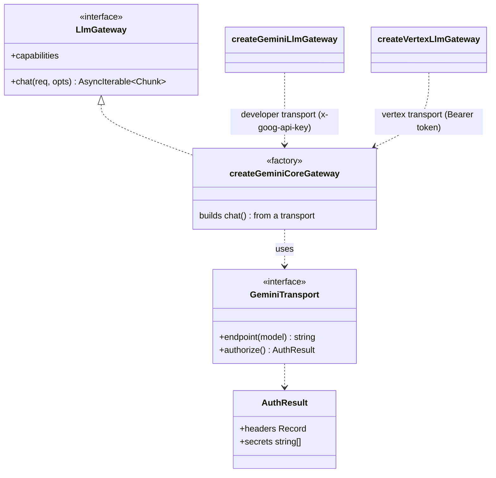

# Change note — run the agent on Vertex AI (Gemini Enterprise Agent Platform)

**Status:** design → conform. **Scope:** the LLM gateway + the live-spec wiring only. The agent core, the
metering Meter, and every offline test are untouched.

## Why

We currently call the **Gemini Developer API** (`generativelanguage.googleapis.com`, `x-goog-api-key`). The
Google Cloud **$300 / 90-day trial credit does not pay for that API** — the free-trial terms exclude
"Gemini API in AI Studio". The credit _does_ cover first-party Gemini called through **Vertex AI**, and Vertex
also gives real billing/observability surfaces (Cloud Monitoring `token_count`, per-SKU Billing reports,
BigQuery export) that the AI Studio key has no equivalent for. So we add a Vertex transport and make the live
specs able to use it.

The request/response body — including the `usageMetadata` block our Meter sums — is **identical** between the
two APIs. Only two things differ: the **endpoint URL** and the **auth mechanism**. That is exactly the seam we
split on.

## The one real difference: auth

|                        | Developer API (today)                    | Vertex AI (added)                                                                              |
| ---------------------- | ---------------------------------------- | ---------------------------------------------------------------------------------------------- |
| Host                   | `generativelanguage.googleapis.com`      | `{location}-aiplatform.googleapis.com` (or `aiplatform.googleapis.com` for `global`)           |
| Path                   | `/v1beta/models/{model}:generateContent` | `/v1/projects/{project}/locations/{location}/publishers/google/models/{model}:generateContent` |
| Auth header            | `x-goog-api-key: <key>` (static)         | `Authorization: Bearer <token>` (**expires ~1h**)                                              |
| Body + `usageMetadata` | —                                        | **same shape**                                                                                 |

The load-bearing consequence: a Vertex access token is **not a static string** — it expires. So the gateway
cannot take an `apiKey: string`; it takes an **async token provider** `getAccessToken: () => string | Promise<string>`,
invoked once per `chat()` call so a real implementation can refresh. This mirrors how the gateway already
_injects_ its HTTP port instead of importing `fetch`: we do **not** pull an auth SDK into the library. The
caller supplies the token however it likes (a service account via `google-auth-library` in production; an env
token from `gcloud auth print-access-token` for a benchmark run).

> Vertex "express mode" keeps an API-key style call, but it draws on a **separate** free quota, **not** the
> $300 credit — so it does not serve the goal and we do not use it.

## End-state design

The gateway file is refactored so the ~100 lines of body-build → request loop → response parse → `usageMetadata`
mapping → chunk yield live **once**, parameterized by a tiny transport:

```
GeminiTransport
  endpoint(model): string                                  // where to POST
  authorize(): { headers; secrets } | Promise<…>           // how to auth + what to scrub from errors
```

`authorize()` returns the per-request auth **headers** _and_ the **secrets** to redact from any error body
(the static key, or the freshly-fetched token) — so redaction is uniform whether the secret is fixed or
dynamic.



Two public factories, each just building a transport and delegating to the core:

- `createGeminiLlmGateway(options)` — **unchanged behavior**: developer transport, `x-goog-api-key`, provider
  `'gemini'`. All existing callers keep working byte-for-byte.
- `createVertexLlmGateway(options)` — vertex transport: `Authorization: Bearer`, regional endpoint, provider
  `'vertex'`. Options: `{ environment, http, project, location?, getAccessToken, model?, baseUrl?, generation? }`
  (`location` defaults to `global`).

**Principles.** DRY / rule-of-three: the shared chat generator is written once (was one impl; now one core,
two thin transports — no copy). SOLID open/closed: Vertex is added without editing the developer path. DIP:
auth is an injected function, not a hard dependency — the library stays HTTP-port-injected and headless-testable.

## Live-spec wiring (DRY the 5 duplicates)

Five live specs (`eval-benchmark`, `builder`, `property`, `locator`, `integration`) each inline the same
`apiKey ? createGeminiLlmGateway({…}) : undefined`. Replace with one resolver:

```
resolveLiveGateway({ model, generation }): LlmGateway | undefined
  LLM_PROVIDER=vertex            → force Vertex   (requires VERTEX_PROJECT + VERTEX_ACCESS_TOKEN)
  LLM_PROVIDER=gemini|developer  → force Developer (requires GEMINI_API_KEY)
  else auto:
    VERTEX_PROJECT + VERTEX_ACCESS_TOKEN set → Vertex (draws the $300 credit)
    else GEMINI_API_KEY set                  → Developer API (unchanged default)
    else                                     → undefined (spec skips)
```

Each spec becomes `const gateway = resolveLiveGateway({ model, generation }); const SKIP_LIVE = !gateway || !RUN_LIVE;`.
Backward compatible: with no Vertex env, behavior is exactly as before. **Both providers stay first-class** — the
Developer API path (`createGeminiLlmGateway`) is intact, and `LLM_PROVIDER` lets two runs pin different providers.

### Running both providers in parallel (separate quota pools)

The Developer API and Vertex draw from **independent quota pools**, so run them side by side in two shells to
double throughput — one benchmark half on each:

```
# terminal 1 — Developer API (its own key + quota)
LLM_PROVIDER=gemini RUN_LIVE=1 npx vitest run <spec>
# terminal 2 — Vertex (DSQ, draws the $300 credit)
LLM_PROVIDER=vertex VERTEX_PROJECT=<proj> VERTEX_LOCATION=us-central1 \
  VERTEX_ACCESS_TOKEN="$(gcloud auth print-access-token)" RUN_LIVE=1 npx vitest run <spec>
```

The saved scorecard/filenames are tagged with the provider (`liveProvider()`), so parallel runs don't collide.

### Easing Dynamic Shared Quota (429s)

Gemini 2.5 on-demand has **no fixed per-project rate limit** — it's Dynamic Shared Quota (shared pool), so a
cold project can 429 on bursts. Token-per-minute quota is unlimited; only request admission is shared. Mitigate
with **`BENCH_PAUSE_MS`** (eval-benchmark only): a pause after each (scenario × design) cell, default 0, e.g.
`BENCH_PAUSE_MS=8000` for a Vertex run. There is no quota to raise; a region (`us-central1`) + spacing + warm-up
is the lever (Provisioned Throughput is the only guaranteed-capacity option, and it's paid, not the credit).

### How to run on Vertex

1. Create a GCP project on the trial, **enable the Vertex AI API + billing** (billing enabled ≠ charged during
   the trial — the credit pays).
2. Get a short-lived token and export it (valid ~1h; re-export when it lapses):
    ```
    VERTEX_PROJECT=<your-project> VERTEX_LOCATION=us-central1 \
    VERTEX_ACCESS_TOKEN="$(gcloud auth print-access-token)" \
    RUN_LIVE=1 npx vitest run libs/agent/src/__tests__/harness/scenarios/eval-benchmark.live.spec.ts -t "T0.config.*strategy-1-fanout"
    ```
    (`VERTEX_*` belong in the gitignored `.env.local`, or the shell as above.)
    > **429 on a fresh project?** Gemini 2.5 on-demand uses Dynamic Shared Quota, and the `global` endpoint can
    > return `429 Resource exhausted` on a brand-new project even with billing enabled. Use a **regional**
    > `VERTEX_LOCATION` (e.g. `us-central1`) — verified working where `global` 429'd. (The code default is still
    > `global`, Google's recommended endpoint once the project is warm; override per run.)
3. Reconcile: our Meter's `totalTokens` ↔ Cloud Monitoring `aiplatform.googleapis.com/publisher/online_serving/token_count`
   ↔ Cloud Billing per-SKU `$` — three independent views.

## Price correction (found while researching, applies on both APIs)

The metering price table's cached-input rate is stale: current published Gemini 2.5 Flash caching is
**$0.03/M**, not `$0.075/M` (a 90% discount, not 75%) — true on Vertex _and_ the Developer API. Input
`$0.30/M` and output `$2.50/M` are still correct. Also: the implicit-cache **minimum for the 2.5 family is
2,048 tokens** (not 1,024). Fix the `cachedPerM` constant + its pinned test; input/output unchanged.

## Verification

- Offline (always): `npx tsc --noEmit -p libs/agent/tsconfig.json`; `nx test @flows/agent` stays green with
  every live spec skipped (no `RUN_LIVE`). New `VertexLlmGateway.spec.ts` (scripted HTTP) asserts the regional
  **and** `global` URL shapes, the `Authorization: Bearer` header (token never in the URL), token redaction in
  an error body, and that `usageMetadata` parses unchanged.
- Live (opt-in, needs the token): one `T0.config` cell on Vertex, then reconcile as above.

## Reused vs new

- **Reused, unchanged:** `toGeminiRequest`, `GeminiResponse` + `usageMetadata` mapping, the retry/empty-STOP
  loop, chunk yielding, `redactText`, `createGeminiLlmGateway`'s public contract, the Meter, all offline specs.
- **New:** `GeminiTransport` + shared `createGeminiCoreGateway` (extracted, not duplicated); `createVertexLlmGateway`
    - `VertexLlmGatewayOptions`/`VertexLlmGateway`; `harness/liveGateway.ts`; `VertexLlmGateway.spec.ts`.
- **Edited:** the 5 live specs (use the resolver); `llm/index.ts` (export the Vertex factory); the price
  constant + its test.
