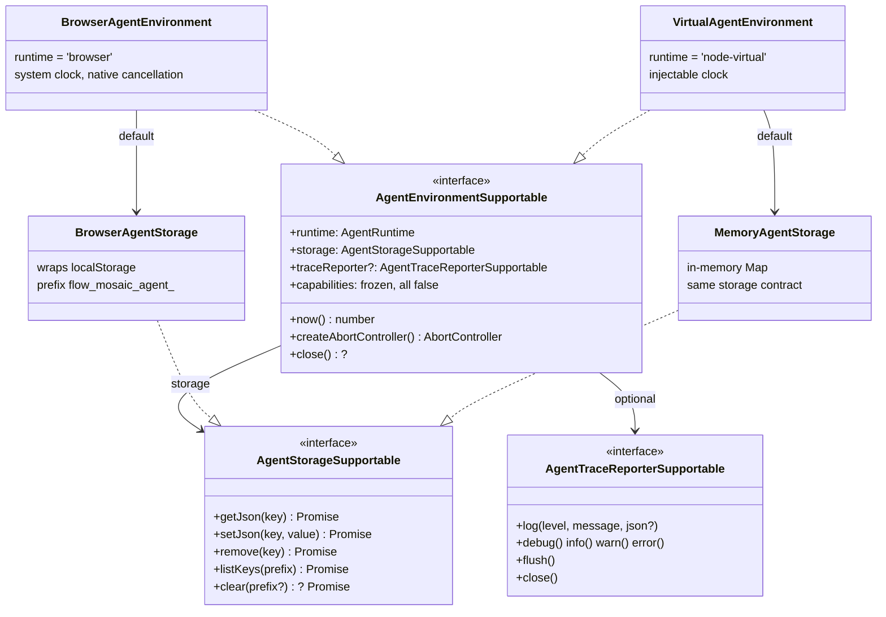
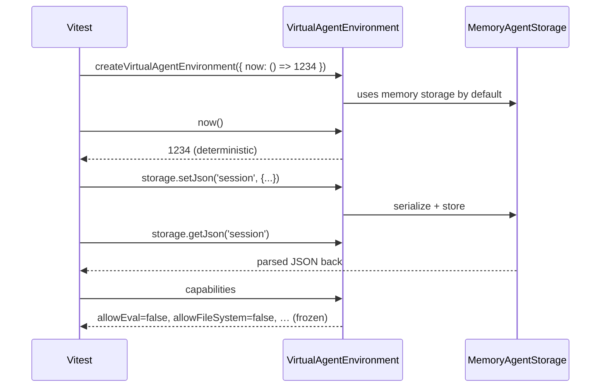
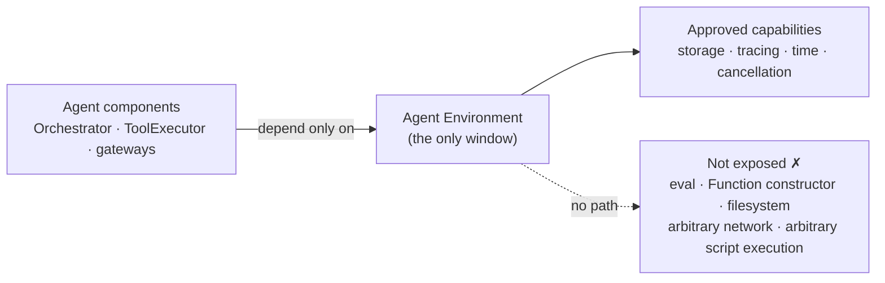

# Agent Environment Foundation

## 1. Summary

The Agent Environment defines a narrow runtime capability boundary for future Browser Agent
components. In this initial slice, it exposes the minimum runtime capabilities needed by
higher-level agent layers — runtime identity, storage, tracing, time, and cancellation — and
declares forbidden capabilities (eval, Function constructor, filesystem, arbitrary network,
arbitrary script execution) as immutable `false` flags in the interface itself, so the
restriction is part of the contract rather than a convention.

These five capabilities are not a universal standard and not the complete Browser Agent
interface map; they are the minimum runtime surface required for this Environment slice. The
result is a **restricted capability boundary** — not a full sandbox.

## 2. Requirements

- Runs on a **browser** JS runtime and a **virtual Node** runtime (for tests).
- `localStorage` is reachable **only** through the Storage interface.
- Never exposed: eval, the Function constructor, filesystem, arbitrary network, arbitrary script execution.

## 3. Problem

Agent code will be driven by untrusted LLM output. If it reaches directly for browser globals:

- **No enforceable boundary** — "the agent cannot do X" becomes a scattered convention.
- **Not testable** — code that accesses `localStorage`/`window` directly cannot run
  deterministically in Node.
- **Unauditable coupling** — every component invents its own access to state, time, and logging.

A single runtime contract addresses these issues by centralizing approved runtime access.

## 4. Concept: restricted runtime capability boundary

**Usable runtime capabilities** (what agent components receive through the environment):

|                  |                                                           |
| ---------------- | --------------------------------------------------------- |
| Runtime identity | `'browser' \| 'node-virtual'`                             |
| Storage          | JSON key-value store, the only path to persistent state   |
| Tracing          | leveled log sink with secret redaction                    |
| Time             | `now()`, injectable for deterministic tests               |
| Cancellation     | `createAbortController()` to stop work at a safe boundary |

**Capability declarations** (not an additional runtime power): the `capabilities` object is a
frozen, all-`false` declaration of forbidden capabilities. It grants nothing at runtime; it
records in the type system what the environment will not provide.

**Not reachable through the environment** (separate layers, or forbidden outright):

Agent Panel · LlmGateway · ToolExecutor · Orchestrator · canvas mutation ·
flow creation/switching · arbitrary JS execution · filesystem

## 5. Main interfaces

Both runtimes implement the same contract, so future agent components can run against the
browser runtime in the editor and the virtual runtime in CI without changing their
environment-facing code.

## 6. Virtual environment test sequence

The virtual environment is demonstrated through the test path rather than a UI surface.

## 7. Security boundary

Scope clarification: this constrains what future agent code can access through the Environment
interface. It does not sandbox all JavaScript running in the application.

## 8. Completed (acceptance criteria)

- [x] A single Environment interface (`AgentEnvironmentSupportable`, team `*Supportable` style),
      implemented by two runtimes — browser and node-virtual.
- [x] No forbidden capability is exposed — eval, Function constructor, filesystem, arbitrary network,
      arbitrary script execution; flags are literal `false` and frozen (test-verified).
- [x] Persistent state flows only through `AgentStorageSupportable`; browser keys are namespaced
      `flow_mosaic_agent_` (with `listKeys`/`clear` scoped to it), and memory storage passes the same
      shared contract spec.
- [x] Trace reporter (noop + buffered) redacts secret-looking fields before any log sink.
- [x] Typecheck clean and `npx nx test @flows/agent` passes (the environment suite runs within the lib's full test run).

## 9. Status: connected

The Orchestrator/ToolExecutor stack now runs on this Environment: session state persists through its
storage port and lifecycle events flow through its trace reporter, so higher-level agent logic uses
storage, tracing, time, and cancellation through the same runtime boundary (see §11).

## 10. Build & compatibility

- Typecheck, `npx nx test @flows/agent`, `npx nx build @flows/agent`, and `npx nx build @flows/web`
  all pass (build output under `libs/agent/dist`, not tracked in git).
- The runtime source uses no Node-only APIs (`fs`, `path`, `child_process`, `process`) and no
  `eval`/`Function` constructor, keeping the package browser-safe.

## 11. Real-browser verification (manual)

The Environment must be verified through the actual app flow — a real agent run in the real
AgentPanel UI — **not** by the DevTools console and **not** by calling
`runAgentEnvironmentSelfCheck()`. The app wires `createBrowserAgentEnvironment` into the agent
session (`useAgentEnvironment`), persists session state through the Environment's storage port,
and emits lifecycle trace events via `withGatewayTracing`. A dev-only harness route
(`/dev/agent-harness`) exercises this by driving the **orchestrator** (via `useAgent`) over an
in-memory canvas binding — no editor auth needed.

The harness gateway is the backend-proxied `createGenerateApiLlmGateway` (its result arrives over
the flow socket), the same gateway the real editor uses. Tool calls are still pending in the socket
layer, so the run is **wired but not yet functional end-to-end** — the orchestrator turn is driven
and the Environment ports (storage + tracing) are exercised, but the tool round-trip (e.g. an actual
`move_node`) does not complete yet.

Steps (real Chrome, dev server running):

1. Open **`/dev/agent-harness`** (dev-only route; the observability panel is rendered by the app
   itself, not the console).
2. In the AgentPanel, type any request and send. The scenario asks the orchestrator to move the
   text-input node right; the request drives an orchestrator turn through the Generate API gateway.
3. **Environment storage (real namespace):** in DevTools → Application → Local Storage →
   the dev origin, confirm the key **`flow_mosaic_agent_session:agent-harness`** exists — written
   by the run itself, through `BrowserAgentStorage`. (Inspecting storage is passive observation,
   not console-triggering. The harness's own "storage keys" line shows it as `session:agent-harness`
   because the storage port strips the `flow_mosaic_agent_` prefix — same key.)
4. **Trace events (real run):** the harness "trace events" list shows the run lifecycle emitted by
   `withGatewayTracing` (`agent.run.start`, `llm.chat.start`, …) as the orchestrator turn is driven
   through the Environment's trace reporter.
5. **Persistence:** reload the page. The in-memory node resets (the harness binding is not
   persisted), but the **transcript reappears** — proof the session round-tripped through the
   Environment storage.

This verification does **not** call `runAgentEnvironmentSelfCheck()` and does **not** use the
DevTools console to trigger behavior — the run is driven entirely from the AgentPanel UI. The same
path runs in the real editor (`FlowEditorPage`, which mounts `FlowAgentPanel`), differing only in
the canvas binding (engine-backed vs. in-memory); both drive the orchestrator over the same Generate
API gateway.

### Follow-up (not in this PR)

Automating this as a Playwright/Chromium test is a planned follow-up, not implemented here. The
harness already exposes stable hooks for it — `data-testid` surfaces (`node-position`,
`storage-keys`, `trace-events`) and a read-only `window.__flowAgentTrace()` snapshot (level +
message + ts only, no payloads) — so once the socket-layer tool round-trip lands, the future spec
can assert the storage key (`flow_mosaic_agent_session:agent-harness`), the trace lifecycle, and
the resulting node move without new app changes.
