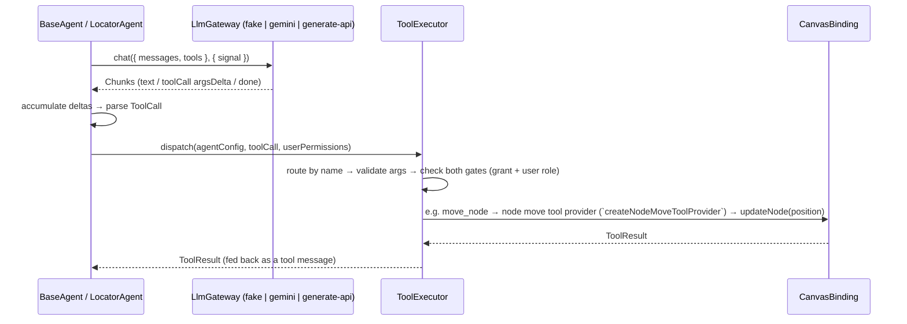

# LlmGateway — Shared Contract and Providers

## 1. Summary

The LLM access layer is now one shared contract, reconciled between the gateway work
and the agent design: `LlmGateway.chat()` — provider-neutral chat messages and
tool definitions in, an async stream of `Chunk`s (text deltas, tool-call arg deltas, a
final `done`) out. `BaseAgent` and the `ToolExecutor` consume exactly this
contract; the fake gateway proves the tool-call path deterministically; Gemini 2.5 Flash
is the first HTTP provider behind it, with function-calling.

The former `LlmGatewaySupportable.complete()` interface is retired — one contract,
no duplicate surface.

## 2. The shared contract

```ts
interface LlmGateway {
    /** Optional capability metadata; absent means unspecified — do not assume tool support. */
    readonly capabilities?: LlmGatewayCapabilities; // { toolCalls: boolean }
    chat(req: ChatRequest, opts?: { signal?: AbortSignal }): AsyncIterable<Chunk>;
}

interface ChatRequest {
    messages: ChatMessage[]; // roles: system | user | assistant | tool
    tools: ToolDef[]; // JSON-Schema parameters + required capability
    stream?: boolean;
}

interface Chunk {
    text?: string;
    toolCall?: { id: string; name: string; argsDelta: string };
    done?: boolean;
    usage?: { inputTokens?: number; outputTokens?: number }; // on the done chunk when reported
}
```

Capability metadata answers "can this gateway/model emit tool calls?" before a request is
built: the fake gateway and the Gemini gateway both declare `{ toolCalls: true }`; the app's
Generate API gateway declares `{ toolCalls: false }` and rejects requests carrying tool
definitions or tool messages.

## 3. How a tool call flows



Verified deterministically (no real provider): a scripted fake-gateway response carrying
`move_node { nodeId, by: { dx: 10, dy: 0 } }` flows through the executor and moves the
text-input node 10px right — the meeting's verification case — and the same call is
denied when the agent lacks the `canModifyCanvas` grant. The shipped tool set now spans
node read (`list_nodes` + `describe_node`), move (`move_node`), config
(`set_properties`), and rename (`rename`), plus the orchestrator's catalog, `list_agents`, and
`spawn` tools; property/rename tools are no longer a later slice.

## 4. Implementations

| Gateway                       | Where                            | Tool calls                 | Notes                                                                                           |
| ----------------------------- | -------------------------------- | -------------------------- | ----------------------------------------------------------------------------------------------- |
| `createFakeGateway`           | `libs/agent/src/llm/fakeGateway` | yes (scripted)             | Deterministic test double; backs the agent/executor suites.                                     |
| `createGeminiLlmGateway`      | `libs/agent/src/llm`             | **yes** (function-calling) | First HTTP provider; see §5.                                                                    |
| `createGenerateApiLlmGateway` | `apps/web` (Leon)                | **no** (text-only)         | eureka-flows-api adapter; see §6. The live panel/harness gateway — result over the flow socket. |

## 5. Gemini provider (function-calling)

- Implements `chat()` over the **HttpRequest port** — never global `fetch`; a backend
  proxy becomes a `baseUrl` override or another port implementation, with no gateway change.
- Auth via the `x-goog-api-key` **header** — never in the URL; the key appears in neither
  error messages (error bodies are key-redacted before throwing) nor traces (trace
  redaction also guards secret-looking fields). Test-verified.
- Uses the Agent Environment for tracing and time; cancellation flows through the
  request's `AbortSignal`.
- System messages map to `systemInstruction`; assistant turns to the `model` role.
- The provider call is not streamed: the buffered response is re-emitted as chunks — any text,
  then each `functionCall` as a tool-call chunk, then a `done` chunk carrying usage tokens.
- `capabilities.toolCalls = true`; it maps `ToolDef`s to Gemini `functionDeclarations`, sends
  prior tool calls/results as `functionCall`/`functionResponse` parts, and streams each response
  `functionCall` back as a tool-call `Chunk` — the same shape the fake gateway emits, so the agent
  loop is unchanged.

## 6. Generate API gateway (eureka-flows-api adapter foundation, item 7)

`createGenerateApiLlmGateway` (`apps/web/src/app/features/flows/utils/`) is the frontend
adapter foundation for GenAI through **eureka-flows-api**, per Claire's Generate API spec.
It implements the shared `chat()` contract — same as every other gateway — and is
**text-only** (`capabilities.toolCalls = false`; requests carrying tool definitions or
tool messages are rejected, same as Gemini).

**What real-API smoke testing established** (against the actual dev backend, `flw-d1` /
`wss-d1`, `connection` param fresh and matching the live socket, `transport=1` set):

- The HTTP `POST /runs/0/generate` ACKs with **200**.
- The ACK body is **not** the model's answer: inner `StatusCode: 202` (async acceptance),
  empty `text`/`output.content`, an AWS-SDK-shaped `$metadata`, and a `$run` record with
  run-lifecycle fields (`creditState`, `processType`, `finishedAt`, `executedAt`).
- **No `json:manifest` / `json:chunk` / `json:complete` WS frames were observed** within
  ~15s of the ACK, on a socket confirmed to receive raw frames (ping/pong) throughout.

Given that, this gateway **does not** implement an inline-body fallback — the inline body
is demonstrably not the model's answer, and treating it as one would silently return
run-acceptance metadata to callers. Instead:

- The gateway depends on a small local `GenerateReceiver<T>` interface
  (`wait(connectionId, fire): Promise<T>`) — a structural stand-in for whatever the real
  socket-layer receiver turns out to be (e.g. `ProxyTransportReceiver`). **No such receiver
  exists in `libs/socket` yet**; wiring one in, and injecting it via `getConnection()`, is
  the real socket work this gateway is waiting on.
- Readiness is guarded hard: `chat()` throws a clear error if the socket isn't connected,
  if `connectionId` is missing, or if no `generateReceiver` is available — read fresh on
  every call (never cached), per the spec's "use the latest `connectionId` after reconnect"
  rule.
- Request mapping: system messages join with `\n\n` into `system`; a single user message
  becomes a plain string `prompt`; multi-turn user/assistant messages become
  `prompt.content` as `GenerateContent[]` (assistant → `model` role). Response mapping:
  `output.content` (string) → one text chunk, then `done` with `usage.promptToken` →
  `inputTokens` / `completionToken` → `outputTokens`; a non-string `output.content` (image)
  throws a text-only error.
- **Tested with fakes only** — a scripted `GenerateReceiver` and a spied `post` function.
  No real backend call is made in tests, and none has been made through this gateway code
  path (only through the throwaway smoke-test hooks used to gather the facts above).
- **Now wired into the panel and the dev harness** — `FlowAgentPanel`
  (`FlowAgentPanel.tsx`) and `AgentHarnessPage` (`/dev/agent-harness`) both construct this
  gateway to drive the orchestrator; its result arrives over the flow socket.

**Do not claim this adapter is live end-to-end.** It is verified: (a) against the real
Generate HTTP endpoint at the smoke-test level (ACK/environment/params), and (b) against
fakes at the gateway-contract level. It has **not** been verified to deliver an actual
model answer, because no real receiver exists yet to prove that leg.

## 7. Future providers and the proxy backend (TODO)

- **Provider targets behind the same contract:** OpenAI (GPT), Claude, OpenRouter,
  DeepSeek, GLM, Qwen. None are implemented yet.
- **Proxy backend:** OpenAI (and likely others) cannot be called reliably from the
  browser due to CORS and key-security constraints. Direction: a backend proxy —
  adapting **eureka-flows-api** together with Claire — reached through the same
  HttpRequest port. Not built yet; deliberately deferred until a provider that requires
  it is scheduled.
- **Generate WebSocket receiver:** the real socket-layer receiver (`libs/socket`) that
  reassembles `json:manifest`/`json:chunk`/`json:complete` frames into a `GenerateResponse`
  does not exist yet — see §6. This is the actual blocker on a live Generate result.

## 8. Verification status (honest scope)

- Unit + integration tests pass in `libs/agent` (environment, storage contract, http port,
  gemini gateway incl. function-calling, self-check, canvas tools, executor, orchestrator /
  block agents / builder, spawn + roster, and the scenario harness) and in `apps/web` (includes
  the Generate API gateway's fake-only suite and the real-browser Environment verification tests).
- Typecheck, `nx build agent`, and `nx build web` pass on this branch.
- **The default suite makes no live provider call** — Gemini and the Generate API gateway are
  exercised against scripted/fake responses. A **gated** live spec (`scenarios.live.spec.ts`,
  skipped unless `GEMINI_API_KEY` is set) drives the real Gemini gateway end-to-end when run
  manually; the Generate API gateway still has no live receiver (§6). The real-API smoke testing
  that established §6's facts used throwaway dev-only hooks, not this gateway.
- **No full editor E2E has been run.** The Environment self-check
  (`runAgentEnvironmentSelfCheck`) remains callable in the browser as a smoke check for
  localStorage and trace; `/dev/agent-harness` covers a manual real-browser Environment
  verification driving the orchestrator through `createGenerateApiLlmGateway`; a real
  editor/E2E pass is a follow-up step.
