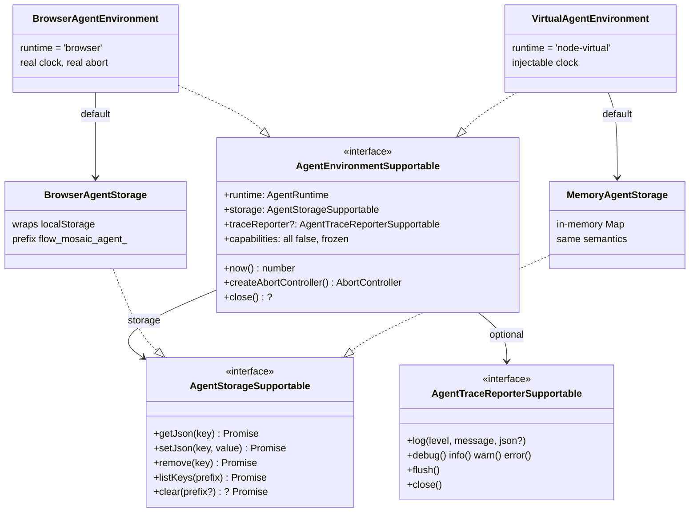
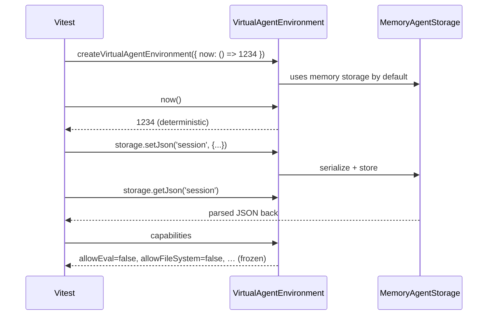
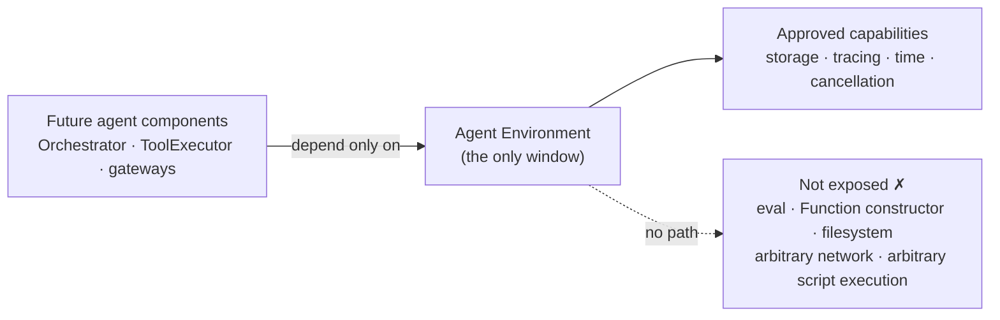

# Agent Environment

## 1. Summary

Every future Browser Agent component will get its world through **one narrow interface**:
the Agent Environment. It provides exactly five things — runtime identity, storage, tracing,
time, and cancellation — and deliberately nothing else. The forbidden operations (eval, Function
constructor, filesystem, arbitrary network, arbitrary script execution) are declared in the
interface itself as immutable `false` flags, so the restriction is part of the contract, not a
convention. It is a **restricted capability boundary** — not a full sandbox yet.

## 2. Requirement

- Browser JavaScript runtime ✓
- Virtual Node.js runtime for tests ✓
- localStorage only through a Storage interface ✓
- Not exposed by the environment:
    - eval ✓
    - Function constructor ✓
    - filesystem ✓
    - arbitrary script execution ✓

## 3. Problem

Agent code will be driven by untrusted LLM output. If it reaches directly for browser globals:

- **No enforceable boundary** — "the agent can't do X" becomes a scattered convention.
- **Not testable** — code that grabs `localStorage`/`window` can't run deterministically in Node.
- **Unauditable coupling** — every component invents its own access to state, time, and logging.

One narrow contract fixes all three.

## 4. Concept: restricted runtime boundary

**Inside** (all the agent gets):

|                  |                                                       |
| ---------------- | ----------------------------------------------------- |
| Runtime identity | `'browser' \| 'node-virtual'`                         |
| Storage          | JSON key-value, the only path to persistent state     |
| Tracing          | leveled log sink, secrets redacted                    |
| Time             | `now()`, injectable for deterministic tests           |
| Cancellation     | `createAbortController()` for Stop at a safe boundary |
| Capability flags | frozen, all-`false` declaration of what is forbidden  |

**Outside** (not in this slice, not reachable through the environment):

Agent Panel · LlmGateway · ToolExecutor · Orchestrator · canvas mutation ·
flow creation/switching · arbitrary JS execution · filesystem

## 5. UML — main interfaces

Same interface, two runtimes — future agent code is written once and runs unchanged against the
same contract in the editor and in CI.

## 6. UML — virtual environment test sequence

## 7. Security boundary

Honest framing: this constrains what agent code can do **through the environment**. It is a
restricted capability boundary for future agent components — not a sandbox of all JS in the app.

## 8. What is done

- [x] Environment interface (`AgentEnvironmentSupportable`, team `*Supportable` style)
- [x] Browser environment
- [x] Virtual Node.js environment (the 07.10 goal)
- [x] localStorage wrapper, namespaced `flow_mosaic_agent_` (follows the app's `flow_mosaic_` convention)
- [x] Memory storage with the same storage contract (proven by a shared contract spec)
- [x] Trace reporter (noop + buffered) with secret redaction
- [x] Frozen, compile-time-`false` capability flags
- [x] 42 tests passing + typecheck

## 9. What is not done

- [ ] Agent Panel
- [ ] LlmGateway
- [ ] ToolExecutor
- [ ] Orchestrator
- [ ] FlowAdapter / canvas integration
- [ ] Full sandbox (this slice is the capability boundary, not a sandbox)

## 10. Acceptance criteria

- [x] One Environment interface (`AgentEnvironmentSupportable`, team `*Supportable` style)
- [x] Two runtimes behind it: browser and node-virtual
- [x] No forbidden capability exposed — eval, Function constructor, filesystem, arbitrary
      network, arbitrary script execution; flags are literal `false` and frozen (test-verified)
- [x] Persistent state only through `AgentStorageSupportable` (no direct localStorage access)
- [x] Browser keys namespaced `flow_mosaic_agent_`; `listKeys`/`clear` scoped to that namespace
- [x] Both storage implementations pass the same shared contract spec
- [x] Trace entries redact secret-looking fields (API keys never land in logs)
- [x] Typecheck and `npx nx test agent` green (42 tests)

## 11. Review questions

1. Final interface naming — align with Lucas's docs (e.g. `allowEval` vs other capability names)?
2. Package location — confirm `libs/agent/src/environment` (`@flows/agent`)?
3. Storage prefix — confirm `flow_mosaic_agent_` as the final direction?
4. Should clock/abort stay inside the Environment, or become separate interfaces later?
5. Is key-name-based redaction enough for now, or add value-pattern scanning before gateway work?
