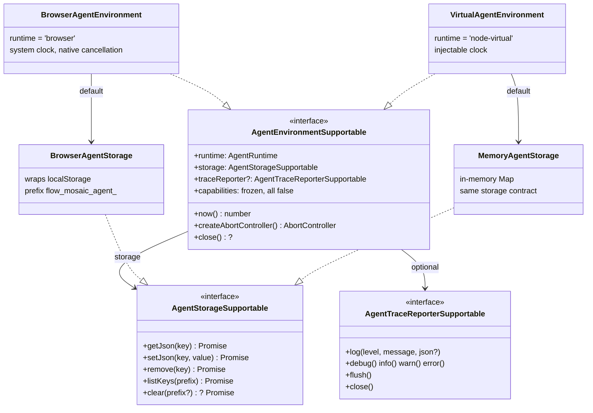
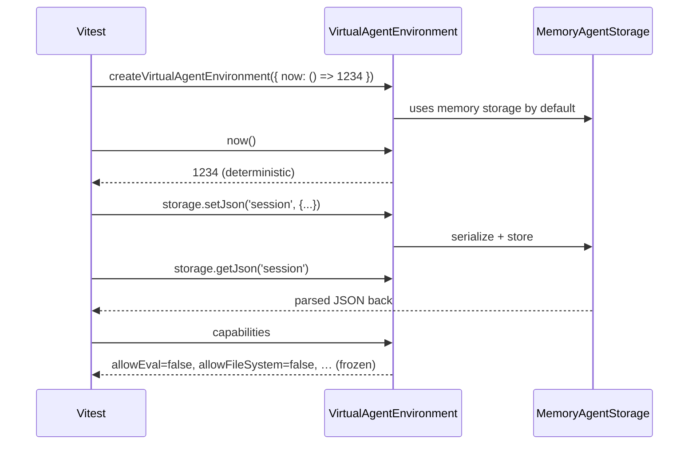
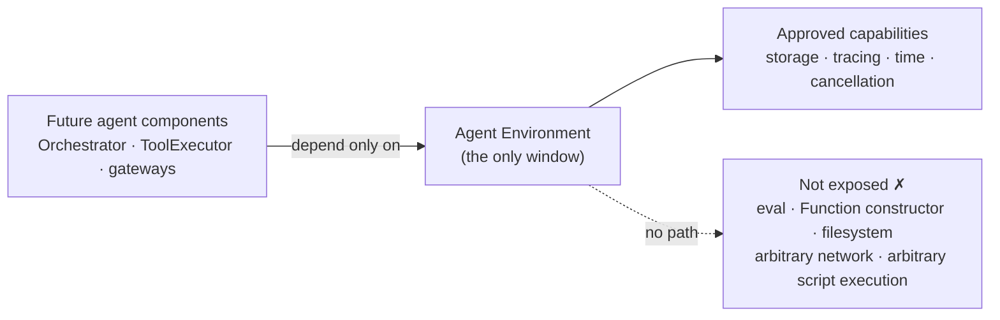

# Agent Environment Foundation — Review Brief

## 1. Summary

The Agent Environment defines a narrow runtime capability boundary for future Browser Agent
components. In this initial slice, it exposes the minimum runtime capabilities needed by
higher-level agent layers — runtime identity, storage, tracing, time, and cancellation — and
declares forbidden capabilities (eval, Function constructor, filesystem, arbitrary network,
arbitrary script execution) as immutable `false` flags in the interface itself, so the
restriction is part of the contract rather than a convention.

These five capabilities are not a universal standard and not the complete Browser Agent
interface map; they are the minimum runtime surface required for this Environment slice. The
result is a **restricted capability boundary** — not a full sandbox.

## 2. Meeting requirements addressed

- Browser JavaScript runtime ✓
- Virtual Node.js runtime for tests ✓
- localStorage only through a Storage interface ✓
- Not exposed by the environment:
    - eval ✓
    - Function constructor ✓
    - filesystem ✓
    - arbitrary network ✓
    - arbitrary script execution ✓

## 3. Problem

Agent code will be driven by untrusted LLM output. If it reaches directly for browser globals:

- **No enforceable boundary** — "the agent cannot do X" becomes a scattered convention.
- **Not testable** — code that accesses `localStorage`/`window` directly cannot run
  deterministically in Node.
- **Unauditable coupling** — every component invents its own access to state, time, and logging.

A single runtime contract addresses these issues by centralizing approved runtime access.

## 4. Concept: restricted runtime capability boundary

**Usable runtime capabilities** (what agent components receive through the environment):

|                  |                                                           |
| ---------------- | --------------------------------------------------------- |
| Runtime identity | `'browser' \| 'node-virtual'`                             |
| Storage          | JSON key-value store, the only path to persistent state   |
| Tracing          | leveled log sink with secret redaction                    |
| Time             | `now()`, injectable for deterministic tests               |
| Cancellation     | `createAbortController()` to stop work at a safe boundary |

**Capability declarations** (not an additional runtime power): the `capabilities` object is a
frozen, all-`false` declaration of forbidden capabilities. It grants nothing at runtime; it
records in the type system what the environment will not provide.

**Out of scope for this slice** (not reachable through the environment):

Agent Panel · LlmGateway · ToolExecutor · Orchestrator · canvas mutation ·
flow creation/switching · arbitrary JS execution · filesystem

## 5. UML — main interfaces

Both runtimes implement the same contract, so future agent components can run against the
browser runtime in the editor and the virtual runtime in CI without changing their
environment-facing code.

## 6. UML — virtual environment test sequence

The virtual environment is demonstrated through the test path rather than a UI surface.

## 7. Security boundary

Scope clarification: this constrains what future agent code can access through the Environment
interface. It does not sandbox all JavaScript running in the application.

## 8. Completed in this slice

- [x] Environment interface (`AgentEnvironmentSupportable`, following the team `*Supportable` convention)
- [x] Browser environment implementation
- [x] Virtual Node.js environment aligned with the 07.10 goal
- [x] localStorage adapter namespaced `flow_mosaic_agent_` (consistent with the app's `flow_mosaic_` convention)
- [x] Memory storage satisfying the same storage contract (verified by a shared contract spec)
- [x] Trace reporter (noop and buffered) with secret redaction
- [x] Frozen, compile-time-`false` capability flags
- [x] 42 tests passing and typecheck clean

## 9. Intentionally out of scope for this slice

The following are deferred by design, not missing:

- [ ] Agent Panel
- [ ] LlmGateway
- [ ] ToolExecutor
- [ ] Orchestrator
- [ ] FlowAdapter / canvas integration
- [ ] Full sandbox (this slice establishes the capability boundary only)

## 10. Acceptance criteria

- [x] A single Environment interface (`AgentEnvironmentSupportable`, team `*Supportable` style)
- [x] Two runtimes implement it: browser and node-virtual
- [x] No forbidden capability is exposed — eval, Function constructor, filesystem, arbitrary
      network, arbitrary script execution; flags are literal `false` and frozen (test-verified)
- [x] Persistent state flows only through `AgentStorageSupportable` (no direct localStorage access)
- [x] Browser keys are namespaced `flow_mosaic_agent_`; `listKeys`/`clear` are scoped to that namespace
- [x] Both storage implementations pass the same shared contract spec
- [x] Trace entries redact secret-looking fields before reaching any log sink
- [x] Typecheck and `npx nx test agent` pass (42 tests)

## 11. Recommended next step

After alignment on naming, package location, and storage prefix, the next implementation slice
should connect the Environment into the future Orchestrator/ToolExecutor execution context, so
higher-level agent logic can use storage, tracing, time, and cancellation through the same
runtime boundary.

## 12. Review questions

1. Confirm final interface and capability-flag naming against Lucas's documentation (e.g. `allowEval`).
2. Confirm the package location: `libs/agent/src/environment` (`@flows/agent`).
3. Confirm `flow_mosaic_agent_` as the final storage key prefix.
4. Decide whether clock and cancellation remain part of the Environment interface or become
   separate interfaces in a later slice.
5. Decide whether key-name-based redaction is sufficient for now, or whether value-pattern
   scanning is required before gateway work.
