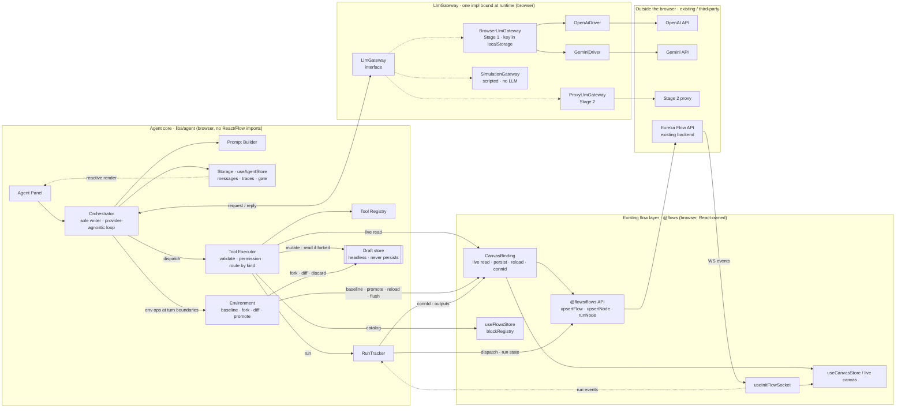

# Architecture & design

> ⚠️ **Superseded on specifics — supporting material.** Predates the authoritative redesign; where they disagree, **[workflow-logic.md](workflow-logic.md)** (behavior) and **[component-interfaces.md](component-interfaces.md)** (shapes) win. Kept for context, not as an implementation source.

> Part of the [Agent Chat spec](README.md) · Prev: [User stories](02-user-stories.md) · Next: [Data models & interfaces →](04-data-models.md)

## High-level architecture

**All-browser, gateway-pluggable.** The entire agent — reasoning loop, tool execution, orchestration
— is React/TypeScript running **in the browser**; no new backend is built. The orchestrator talks to
LLMs through **one universal `LlmGateway` interface** and is **provider-agnostic** — it never knows
whether GPT, Gemini, or a simulation answered. Two independent axes sit behind that interface:

- **Provider normalization** — translating the universal request into each provider's native API and
  normalizing tool-calls/streaming back. This lives **inside** the gateway, as per-provider **drivers**
  (`OpenAiDriver`, `GeminiDriver`, …), matching the app's existing `openai | gemini` support
  (`aiBlockUtils`). Only the **provider APIs themselves** (OpenAI's, Gemini's) are external — we don't
  build those; we do build the normalization.
- **Transport / staging** — _where_ the call goes and _where the key lives_: the `LlmGateway`
  implementation is swappable (Stage 1 browser vs Stage 2 proxy vs simulation).

Tool execution reaches the flow world through a **Tool Interface** (Registry + Executor) and an
**Environment** — never the live canvas or React directly (locked decision 8). **Mutations run
against a forked, headless Draft** of the canvas store (nothing the user sees) and reach the live flow
only on **promote**, after the user Accepts the plan. Live structural reads, the promote writes,
reload, and the socket connection id all go through a React-owned **`CanvasBinding`**; runs go through
a **RunTracker**. So the user watches structural changes land on the live canvas at **promote**, not
as the agent works; only _runs_ stream live.

**Delivery stages (the reason for the interface):**

- **Stage 1 (now):** `BrowserLlmGateway` — provider drivers in the browser call each provider's API
  (OpenAI, Gemini) **directly**, using a BYO key from `localStorage`. Zero backend. Ships the feature.
- **Stage 2 (later):** `ProxyLlmGateway` — the same interface, backed by a proxy that holds the key and
  does provider routing **server-side** (and may meter reasoning on the Credit ledger). Swapping the
  implementation leaves the orchestrator, executor, drivers, and UI untouched.
- Always available: `SimulationGateway` for tests/offline/demos (NFR-10).

_Dotted edges into the gateway = alternatives: exactly one `LlmGateway` implementation is bound at
runtime (Stage 1 now, Stage 2 later, Simulation in tests). Provider drivers live only inside
`BrowserLlmGateway`; in Stage 2 that normalization moves into the proxy. The agent core imports
nothing from React or Flow — it reaches the live, React-owned canvas only through the injected
`CanvasBinding` (and the Draft, which is a headless instance of the flow layer's own store)._

**Loop (one user turn):** on `send`, the Orchestrator resolves permissions and snapshots a baseline
(no draft yet). It then runs the reasoning loop: `gateway.createChatCompletion([history + snapshot +
tool defs])` → the assistant message may contain `tool_calls` → the Executor validates and routes each
by kind (reads and `use_skill` resolve immediately; the **first mutate lazily forks the Draft**; runs
go through the RunTracker behind the run gate) → tool results feed the next `createChatCompletion` →
repeat until final text or the iteration cap (EC-8). When the loop ends, if a Draft exists the
Orchestrator finalizes the **plan** (diff → explanation → **plan gate** → on Accept, **promote**).
See [Lifecycle](workflow-logic.md#lifecycle-containment).

**What's reused vs new:** _Execution_ (`runNode`/`runFlow`) and _credit display_
(`getCreditBalance`) reuse the existing backend untouched — no new server surface. The _only_ gap the
existing backend can't fill is the agent's **reasoning** (there is no chat-completions endpoint), which
is exactly what the gateway supplies. A server-orchestrated **autonomous** mode remains a documented
Phase 2 (would reuse the `CodexTraceStage` pipeline).

## Components and responsibilities

New code lives in a feature lib plus a web feature, mirroring how `flows`/`socket` are structured.

The component set and their typed contracts are authoritative in
[workflow-logic.md § Components](workflow-logic.md#components) and
[component-interfaces.md](component-interfaces.md); the table below maps each to a proposed location.

| Component                  | Location (proposed)                                             | Responsibility                                                                                                                                                                                                                                                                               |
| -------------------------- | --------------------------------------------------------------- | -------------------------------------------------------------------------------------------------------------------------------------------------------------------------------------------------------------------------------------------------------------------------------------------- |
| **`@flows/agent` lib**     | `libs/agent/src`                                                | Framework-agnostic core: orchestrator, tool registry + executor, environment, run tracker, prompt builder, gateway. Depends on `@flows/flows`. **No React coupling in the core** — it reaches the live, React-owned canvas only through the injected `CanvasBinding`.                        |
| Orchestrator               | `libs/agent/src/orchestrator.ts`                                | **Sole writer/coordinator.** Owns the turn, the reasoning loop, and every gate (plan + run). Calls the Tool Executor for LLM tools and the Environment for turn-boundary ops; enforces the iteration cap. Imports nothing from Flow or React.                                                |
| Prompt Builder             | `libs/agent/src/prompt.ts` (+ `snapshot.ts`)                    | Pure function assembling the `ChatCompletionRequest` (system prompt, history, tool defs, skill index, and the compact structural snapshot on the first iteration — NFR-4).                                                                                                                   |
| Tool Registry              | `libs/agent/src/tools/*.ts`                                     | Declarative catalog: `name`, `description`, params schema, `requires` (permission flag), `kind` (`read`/`mutate`/`execute`/`meta`), `execute`, `summarize`. Split by capability (`read.ts`, `mutate.ts`, `execute.ts`, `meta.ts`). Pure metadata + logic; imports nothing from React.        |
| Tool Executor              | `libs/agent/src/executor.ts`                                    | Per-call choke point: validate args → check `FlowPermissions` → route to the kind-scoped surface → normalized `ToolResult`. Enforces the affected-target run precondition before a run reaches the RunTracker.                                                                               |
| Environment                | `libs/agent/src/env/environment.ts`                             | Owns the Draft store and the `CanvasBinding`; the only component that touches the draft or the live flow. Turn-boundary ops (not LLM-callable): `resolvePermissions`, `snapshotBaseline`, `fork`, `diff`, `checkDrift`, `promote`, `switchToVersion`, `discardDraft`.                        |
| CanvasBinding              | interface in `libs/agent/src/env`; impl in `apps/web/.../agent` | Platform-specific, **React-owned** adapter giving the Environment a live structural read, the **awaited** human persistence primitives, a reload, an autosave flush, and the live socket `connection` id. Desktop wraps `WorkflowCanvasRef`; mobile wraps the live store. Injected at mount. |
| RunTracker                 | `libs/agent/src/env/runTracker.ts`                              | Turns socket-driven run completion into an awaitable so a run tool returns a finished result; backs the execute surface.                                                                                                                                                                     |
| Draft store                | (headless instance of `@flows/flows` `useCanvasStore`)          | `createCanvasStore()` vanilla instance — real reducers, never persists. Forked lazily on first mutate, discarded at turn end.                                                                                                                                                                |
| Skill Registry             | `libs/agent/src/tools/skills.ts`                                | Playbooks exposed via the `use_skill` meta-tool + a skill index in the prompt.                                                                                                                                                                                                               |
| Storage (`useAgentStore`)  | `libs/agent/src/store.ts` (Zustand)                             | Reactive Zustand session store the Panel subscribes to: messages, the turn `phase` (with any pending gate), and `pendingRunIntent`. Persistence to localStorage is via its `StorageInterface` port (component-interfaces §7.3), not a channel the Panel touches.                             |
| `useAgent` hook            | `libs/agent/src/hooks/useAgent.ts`                              | Wires the orchestrator to React: current flow id, permissions, **constructs and injects the `CanvasBinding`**, streams updates into the store.                                                                                                                                               |
| **`LlmGateway` interface** | `libs/agent/src/gateway/types.ts`                               | Universal, provider-agnostic contract (`createChatCompletion`, streaming; canonical shape mirrors OpenAI chat-completions). The seam the orchestrator codes against.                                                                                                                         |
| Gateway implementations    | `libs/agent/src/gateway/{browser,proxy,simulation}.ts`          | `BrowserLlmGateway` (Stage 1, drives provider drivers with a `localStorage` key), `ProxyLlmGateway` (Stage 2, proxy holds key + routes providers), `SimulationGateway` (scripted, no LLM). Selected by config.                                                                               |
| Provider drivers           | `libs/agent/src/gateway/drivers/{openai,gemini}.ts`             | Translate the universal request to/from each provider's native API (tool-calling, streaming). Used **inside** `BrowserLlmGateway`; the external dependency is the provider API only.                                                                                                         |
| **Agent Panel UI**         | `apps/web/src/app/features/agent/`                              | Transcript, composer, streaming trace view, the **plan approval card**, and the **run-confirm gate**. Pure view — emits `send`/`resolvePending`, renders from the store. Uses `@flows/ui-kit`.                                                                                               |
| Header toggle              | `apps/web/src/app/features/flows/components/Header*`            | Button to open/close the panel.                                                                                                                                                                                                                                                              |

---

Prev: [User stories](02-user-stories.md) · Next: [Data models & interfaces →](04-data-models.md)
