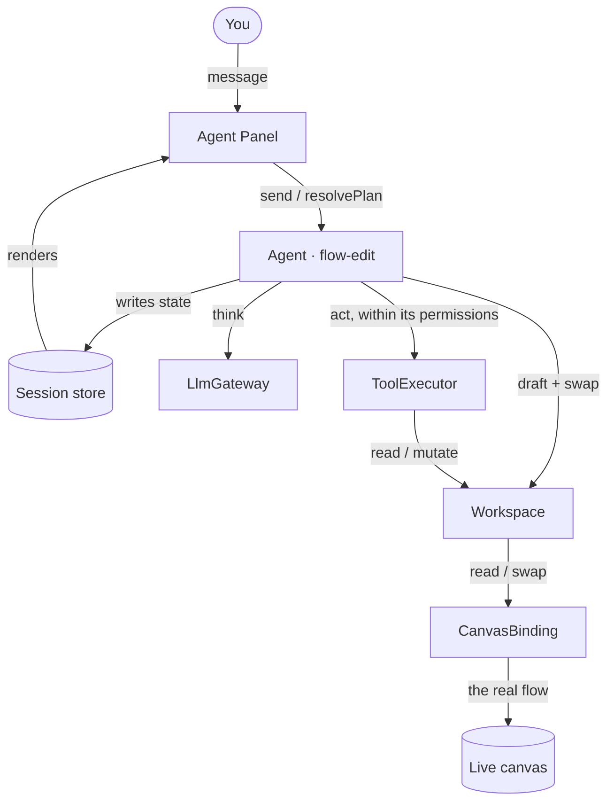
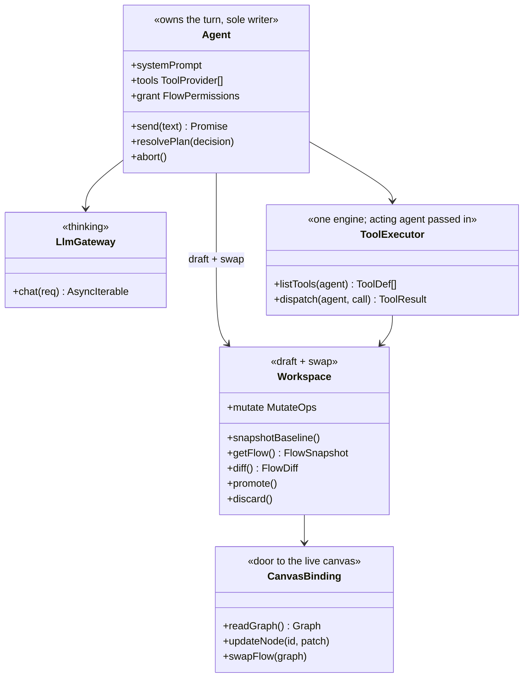
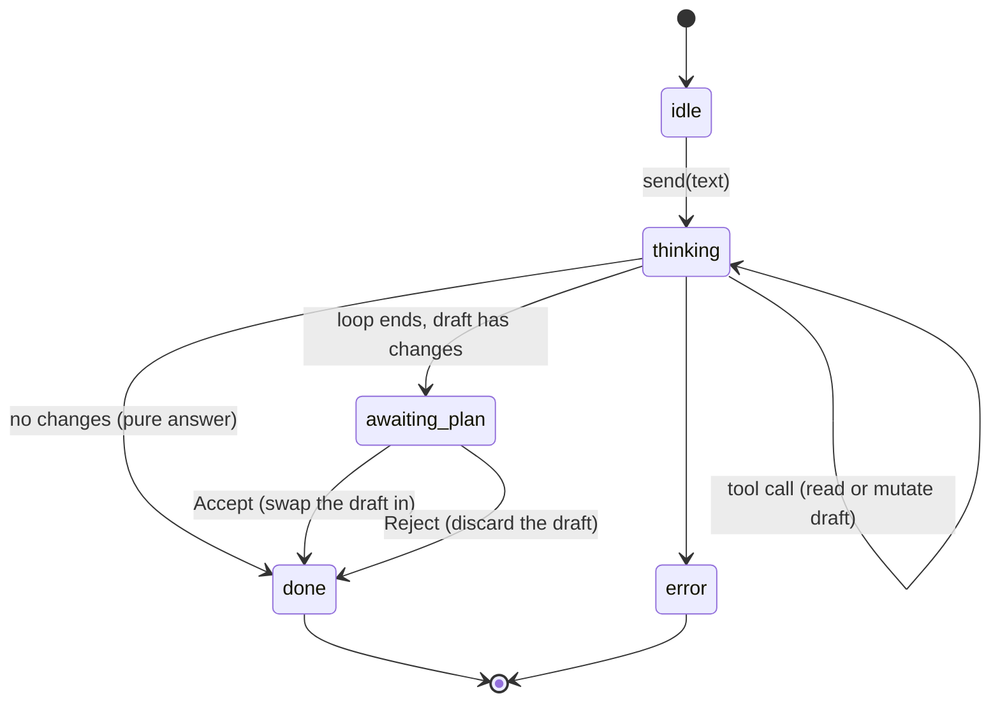
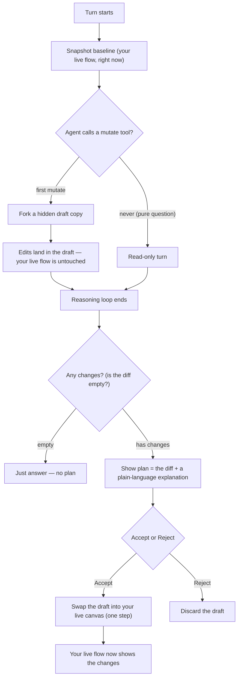

# Agent Chat — In-Browser Flow Agent

A chat agent that lives in the Eureka Flow editor and **builds and edits flows for you in plain
language** — it can add, remove, reconfigure, **rename**, and **move** blocks. You describe what you
want; it reads your flow, works out the changes on a private copy, and shows you exactly what it will
do. Nothing changes on your canvas until you click **Accept** — and when you do, it simply **swaps**
the new version in.

> This is the friendly tour. For interfaces and precise behavior, see **[SPEC.md](SPEC.md)**.
> Scope of this first version: **generate + edit** flows on the frontend. Running flows and saving
> durably to the server come later (see _What's not here yet_).

Under the hood there's **one agent — the flow-edit agent — and it owns the turn** end to end: you send
it a message, it works, it shows you a plan. Here, "agent" means _a single capability_ (a persona +
its tools + its permissions) — not a manager of other agents. There's deliberately **no orchestrator
layer yet**: with one agent, a router would just be a pass-through, so the Panel talks straight to the
agent. When a second capability arrives (a Q&A helper, a "run it" agent), we add a small router above
the agents to pick one per turn — see _What's not here yet_.

---

## What it can do

- **Generate** — "build a flow that fetches an article and summarizes it."
- **Edit** — "add an email step after the summary," "rename this node to _Summarize_," "line these
  three nodes up," "remove the translate block."

## What's not here yet

- **Running flows** (execute / troubleshoot) — deferred to the next milestone.
- **Saving durably to the server** — this version applies changes on the **frontend** (a flow swap);
  wiring them through to permanent backend storage is the next step.
- **Multi-user co-editing** — v1 assumes you're the only editor of your flow.
- **Undo/redo of an agent change** — you Accept or Reject a whole plan (a back-and-forth toggle is
  easy to add later, since we keep a copy of your original flow).
- **More than one agent** — per-agent permissions are in place, but only the flow-edit agent ships
  now. A second agent (a Q&A helper, a "run it" agent) is what brings in the router/orchestrator layer.

---

## The big picture

You talk to the **Panel**. The **Agent** owns the turn and is the only thing that writes state. It's
configured with three things — how it should think (its prompt), what it can call (its tools), and
what it's allowed to do (its permissions) — and leans on three helpers to do the work: the
**LlmGateway** to think, the **ToolExecutor** to act (checking those permissions), and the
**Workspace** to hold the draft and swap it in. The Workspace reaches the real canvas through one
door: the **CanvasBinding**.



Notice the little loop on the left: **Panel → Agent → store → Panel**. Data flows one way. The Panel
only sends commands and renders what's in the store; it never touches the flow itself. (When there's
more than one agent, a thin router slots in between the Panel and the agents — but that's later.)

## The pieces (UML)



## Agents & permissions

An **agent** is just a small bundle: a **prompt** (how it thinks), a set of **tools** (what it can
call), and a **permission grant** (what it's allowed to do). Today there's exactly one — the
**flow-edit agent** — and it owns the turn directly. The bundle is what varies when more agents come;
the wiring around it stays put.

Permissions live **on the agent**, not globally. Every tool says which capability it needs (adding a
block needs "modify canvas," rename needs "edit config," and so on). Before running a tool, the
ToolExecutor checks it against the agent's grant — and against what **you** are allowed to do in this
flow (owner / editor / viewer). An agent can never do more than you could by hand. That's why this
scales cleanly: a future read-only "Q&A" agent simply carries an empty grant and can't touch your
flow, while the flow-edit agent is granted the canvas edits it needs.

## How a turn works

The agent thinks and acts in a loop: it asks the model, the model calls tools, the tools edit a
**draft** (never your live flow), and this repeats until the model is done. Then you get a plan — and
on Accept, the draft is swapped in.

```mermaid
sequenceDiagram
    actor User
    participant Panel as Agent Panel
    participant Agent as Agent (flow-edit)
    participant LLM as LlmGateway
    participant Tools as ToolExecutor
    participant WS as Workspace
    participant Canvas as CanvasBinding

    User->>Panel: "add a summarizer after the fetch"
    Panel->>Agent: send(text)
    Agent->>WS: snapshotBaseline()
    Note over Agent,Tools: one shared ToolExecutor; the agent is passed in each call so its grant is checked
    loop think and act
        Agent->>LLM: chat(agent prompt + history + tool defs)
        LLM-->>Agent: tool call (add_node, update_node, connect, ...)
        Agent->>Tools: dispatch(agent, call)
        Tools->>WS: mutate (forks the draft on the first edit)
        WS-->>Tools: result (e.g. tempId)
        Tools-->>Agent: ok
    end
    LLM-->>Agent: final text
    Agent->>WS: diff()
    WS-->>Agent: FlowDiff
    Agent-->>Panel: show plan (awaiting your decision)
    User->>Panel: Accept
    Panel->>Agent: resolvePlan("accept")
    Agent->>WS: promote()
    WS->>Canvas: swapFlow(draft)
    Agent-->>Panel: done
```

## The turn's lifecycle

A turn moves through a few simple states. A pure question (no edits) skips straight to an answer; an
editing turn stops at `awaiting_plan` and waits for you. Because applying is a single swap, there's no
separate "committing" state.



## Draft → plan → swap (the safety story)

This is the heart of the design. Edits go to a **hidden draft copy** of your flow. At the end, the
difference between the draft and your original flow _is_ the plan you review. Accept **swaps the draft
in** as your live flow; Reject throws the draft away.



Why a draft? Because it makes "never touch the live flow by accident" free: the draft is a headless
copy of the canvas with no save wiring attached, so edits stay in the draft until you Accept — and
Accept applies the **exact** draft you reviewed, so what you saw is what you get. (Details in
[SPEC.md §8](SPEC.md#8-the-draft-model-why-its-safe).)

## A worked example

You're looking at a flow that fetches an article. You type:

> **"Summarize the article, rename the fetch node to _Get article_, and email the summary to me."**

1. The agent reads your flow and the block catalog (`get_flow`, `list_blocks`).
2. On a draft it renames the fetch node (`update_node` → label), adds a **Summarize** block wired
   after it, then an **Email** block after that (`add_node`, `connect`) — your canvas hasn't changed.
3. It shows a plan: _"Renamed 1 node, +2 nodes, +2 connections — summarizes the article text and
   emails the result to you,"_ with the diff.
4. You click **Accept**. The draft is swapped into your canvas, and your flow now shows the renamed
   node and the two new blocks in place.

---

**Next:** the interfaces and exact behavior live in **[SPEC.md](SPEC.md)**.
