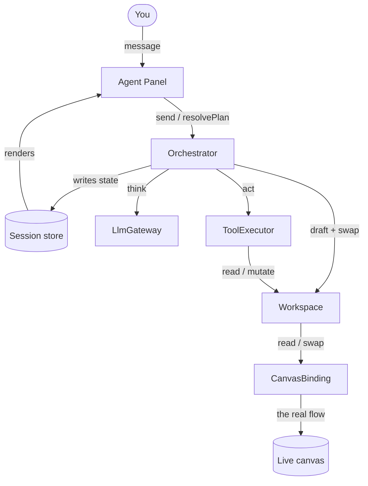
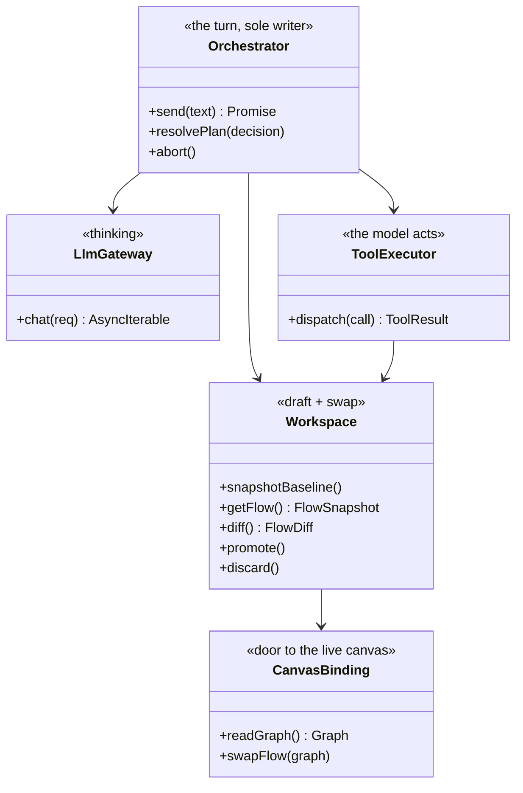
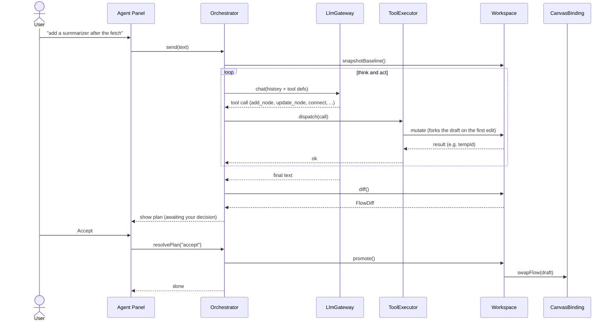
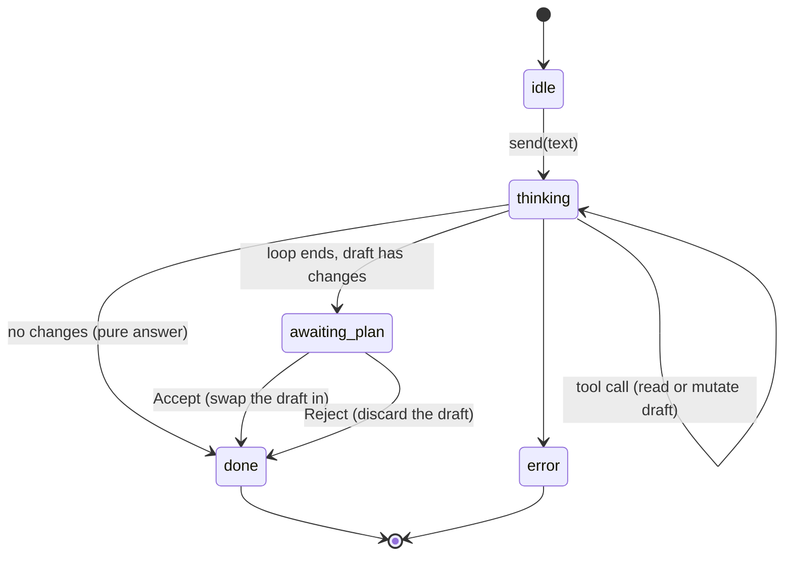
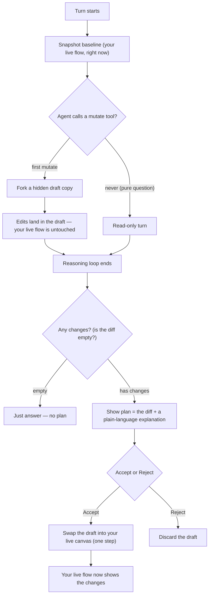

# Agent Chat — In-Browser Flow Agent

A chat agent that lives in the Eureka Flow editor and **builds and edits flows for you in plain
language** — it can add, remove, reconfigure, **rename**, and **move** blocks. You describe what you
want; it reads your flow, works out the changes on a private copy, and shows you exactly what it will
do. Nothing changes on your canvas until you click **Accept** — and when you do, it simply **swaps**
the new version in.

> This is the friendly tour. For interfaces and precise behavior, see **[SPEC.md](SPEC.md)**.
> Scope of this first version: **generate + edit** flows on the frontend. Running flows and saving
> durably to the server come later (see *What's not here yet*).

---

## What it can do

- **Generate** — "build a flow that fetches an article and summarizes it."
- **Edit** — "add an email step after the summary," "rename this node to *Summarize*," "line these
  three nodes up," "remove the translate block."

## What's not here yet

- **Running flows** (execute / troubleshoot) — deferred to the next milestone.
- **Saving durably to the server** — this version applies changes on the **frontend** (a flow swap);
  wiring them through to permanent backend storage is the next step.
- **Multi-user co-editing** — v1 assumes you're the only editor of your flow.
- **Undo/redo of an agent change** — you Accept or Reject a whole plan (a back-and-forth toggle is
  easy to add later, since we keep a copy of your original flow).

---

## The big picture

You talk to the **Panel**. The **Orchestrator** runs the turn and is the only thing that writes state.
It leans on three helpers — the **LlmGateway** to think, the **ToolExecutor** to let the model act,
and the **Workspace** to hold the draft and swap it in. The Workspace reaches the real canvas through
one door: the **CanvasBinding**.

Notice the little loop on the left: **Panel → Orchestrator → store → Panel**. Data flows one way. The
Panel only sends commands and renders what's in the store; it never touches the flow itself.

## The pieces (UML)

## How a turn works

The agent thinks and acts in a loop: it asks the model, the model calls tools, the tools edit a
**draft** (never your live flow), and this repeats until the model is done. Then you get a plan — and
on Accept, the draft is swapped in.

## The turn's lifecycle

A turn moves through a few simple states. A pure question (no edits) skips straight to an answer; an
editing turn stops at `awaiting_plan` and waits for you. Because applying is a single swap, there's no
separate "committing" state.

## Draft → plan → swap (the safety story)

This is the heart of the design. Edits go to a **hidden draft copy** of your flow. At the end, the
difference between the draft and your original flow *is* the plan you review. Accept **swaps the draft
in** as your live flow; Reject throws the draft away.

Why a draft? Because it makes "never touch the live flow by accident" free: the draft is a headless
copy of the canvas with no save wiring attached, so edits stay in the draft until you Accept — and
Accept applies the **exact** draft you reviewed, so what you saw is what you get. (Details in
[SPEC.md §8](SPEC.md#8-the-draft-model-why-its-safe).)

## A worked example

You're looking at a flow that fetches an article. You type:

> **"Summarize the article, rename the fetch node to *Get article*, and email the summary to me."**

1. The agent reads your flow and the block catalog (`get_flow`, `list_blocks`).
2. On a draft it renames the fetch node (`update_node` → label), adds a **Summarize** block wired
   after it, then an **Email** block after that (`add_node`, `connect`) — your canvas hasn't changed.
3. It shows a plan: *"Renamed 1 node, +2 nodes, +2 connections — summarizes the article text and
   emails the result to you,"* with the diff.
4. You click **Accept**. The draft is swapped into your canvas, and your flow now shows the renamed
   node and the two new blocks in place.

---

**Next:** the interfaces and exact behavior live in **[SPEC.md](SPEC.md)**. Earlier, more detailed
design iterations are archived under [`archive/`](archive/) for reference.
