# Agent Chat — Workflow Logic Diagrams

> Visual companion to **[`workflow-logic.md`](workflow-logic.md)**. These diagrams convey the whole design at a high level _without_ reading the prose spec. Each cites the section it renders.
>
> Diagrams are **UML** rendered with [Mermaid](https://mermaid.js.org) (component, sequence, state-machine, and activity types). They render inline on GitHub and in VS Code's built-in Markdown preview.
>
> **Reading order** follows one turn's life: `Overview → Draft vs. Live → Turn → Tool dispatch → Plan lifecycle → Promote → Run lifecycle`, with `Drift`, `Build-and-run`, and `Gate` as cross-cutting concerns.

---

## Legend

| Notation                          | Meaning                                                        |
| --------------------------------- | -------------------------------------------------------------- |
| solid arrow                       | direct call / command                                          |
| dashed arrow                      | reactive render / async result / return                        |
| **green** node                    | **Draft** — headless, in-memory, **never persists**            |
| **red** node                      | **Live** — the real, persisted flow (the only thing that runs) |
| **yellow** node (flowcharts only) | **Gate** — a hard stop waiting for an explicit user click      |

Two worlds run through every diagram: **Draft** (where the agent edits safely) and **Live** (the persisted flow that actually runs). The one rule of the whole design — _nothing reaches Live without an explicit user click_ — is why every write path funnels through a yellow **Gate**.

> **Note on yellow in sequence diagrams (§7, §8, §9, §11):** Mermaid renders _every_ sequence-diagram `Note` box in a default yellow. Those are **annotations / side commentary**, not Gates — the "yellow = Gate" convention above applies **only to the flowcharts**. In particular, the commit path (§7) contains yellow note boxes but has **no gate** (the gate already happened at Accept, before promote begins).

---

## 1. Overview — component architecture

The whole agent — reasoning loop, tools, orchestration — is React/TypeScript **in the browser**; no new backend. Four bands: the **agent core** (`libs/agent`, no React/Flow imports), the pluggable **`LlmGateway`** (one impl bound at runtime), the existing **flow layer** (`@flows`, React-owned), and **outside-the-browser** dependencies. The Orchestrator is the **sole writer**; it reaches the live canvas only through the **`CanvasBinding`** seam, and the LLM only through the gateway — so it never knows whether OpenAI, Gemini, or a simulation answered. _(§ Components, § Locked decision 8; mirrors [`03-architecture.md`](03-architecture.md))_

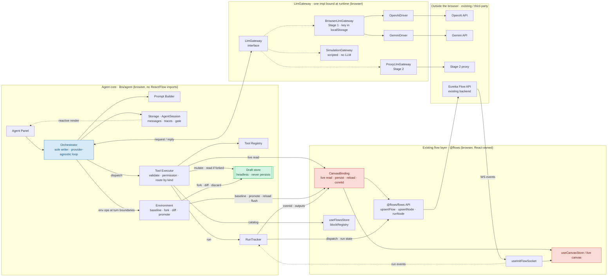

_Dotted edges into the gateway = alternatives: exactly **one** `LlmGateway` impl is bound at runtime (Stage 1 now, Stage 2 later, Simulation in tests). Provider drivers live only inside `BrowserLlmGateway`; in Stage 2 that normalization moves into the proxy._

**Takeaways:**

1. **One outbound LLM seam.** The Orchestrator codes against `LlmGateway` only; provider drivers and key/transport staging sit behind it, so swapping Stage 1 → Stage 2 leaves the core untouched.
2. **The Executor reaches Live two ways:** `CanvasBinding` for live structural reads, `RunTracker → @flows API` for runs. The Environment reaches Live only through `CanvasBinding` (baseline, promote, reload, flush).
3. **Draft (green) and Live (red) are different objects;** only **promote** copies Draft changes into Live. Structural changes appear on the live canvas at promote — only _runs_ stream live (backend `WS events → socket → store / RunTracker`).

---

## 2. The two worlds — draft vs. live

The same tool surface is used all turn; only _where_ an edit lands changes. Structural reads follow the draft **once it is forked**, and fall back to **Live before that**. Runtime reads and runs always hit **Live**. _(§ The draft model, § Read targeting)_

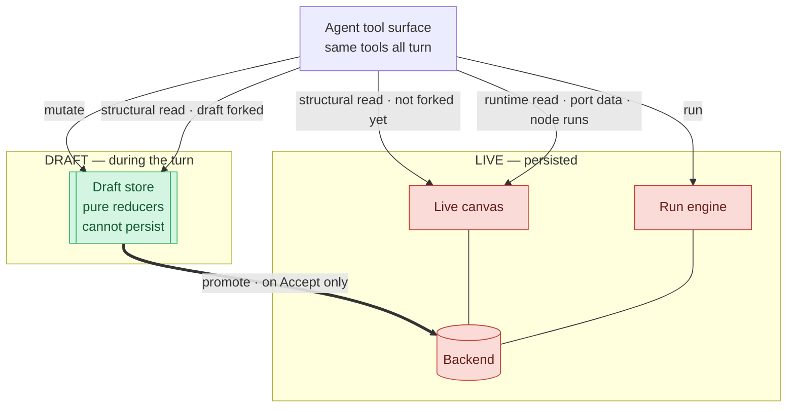

|                         | Where edits go                              | Persists? |
| ----------------------- | ------------------------------------------- | --------- |
| During the turn         | headless **Draft** store                    | **No**    |
| On **Accept** (promote) | **Live** canvas via `CanvasBinding.persist` | **Yes**   |

---

## 3. Lifecycle scopes — containment (not sequence)

Each deeper scope pulls in more components and runs **inside** the outer one. S6 nests inside the loop; S5 runs after the loop but still inside the Turn. _(§ Lifecycle)_

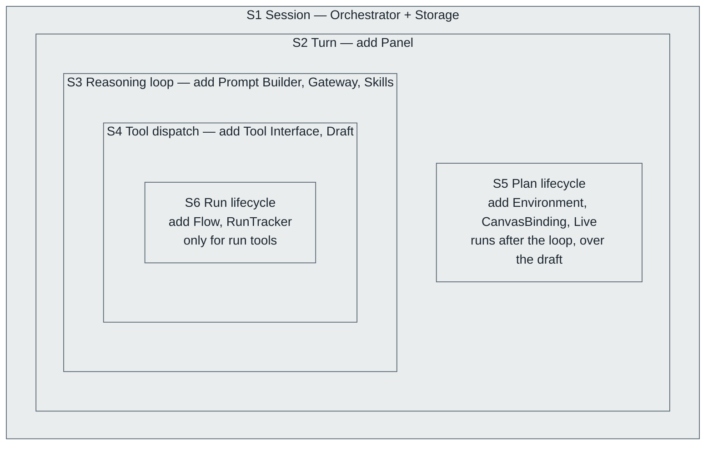

---

## 4. Turn control flow (S2)

The spine: everything between one `send` and the final answer. _(§ S2 Turn, § S3 Reasoning loop)_

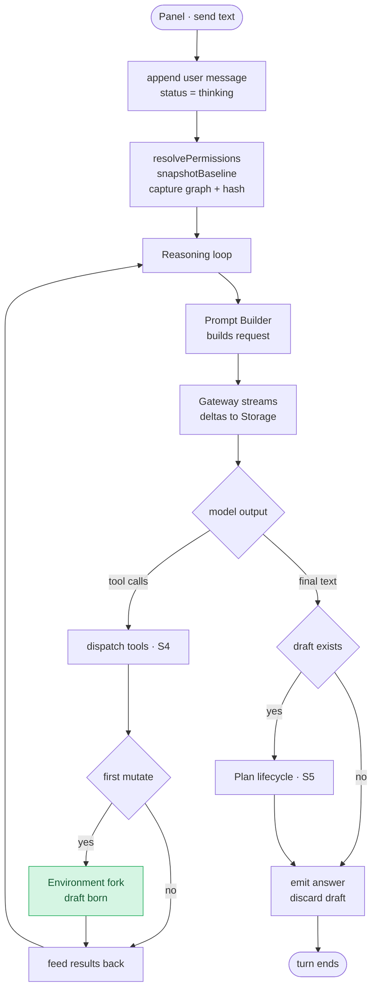

> The per-turn **iteration cap** bounds the loop and persists across in-turn re-entry (see [Build-and-run](#10-build-and-run-in-one-prompt)).

---

## 5. Tool dispatch (S4) — routing by kind

The Executor is the per-call choke-point: validate, permission-check, then route to exactly one surface. _(§ S4 Tool dispatch, § Read targeting)_

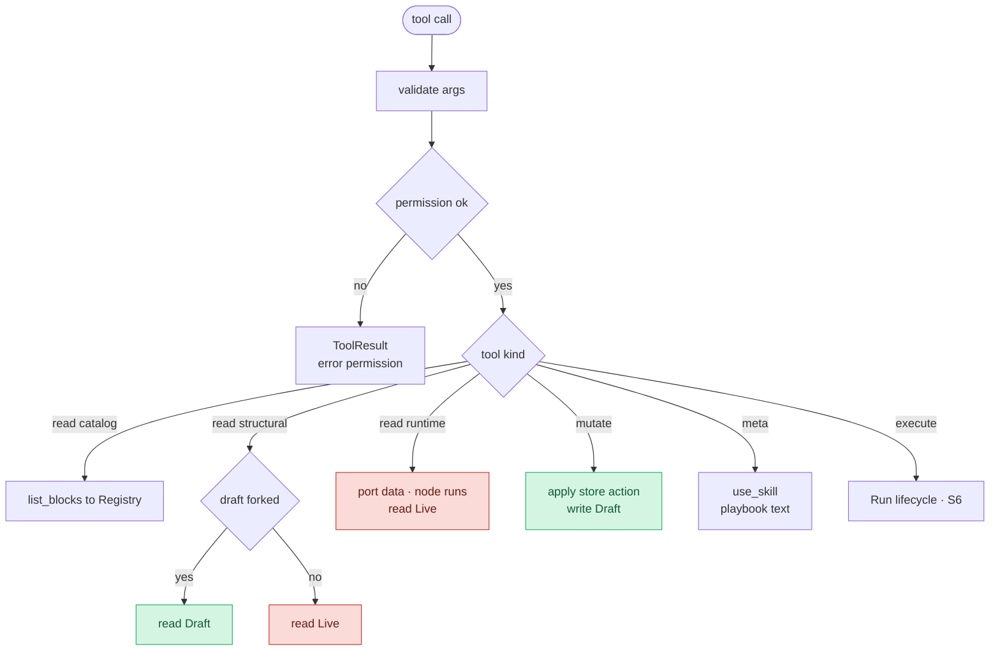

**Run precondition — a run may only dispatch against targets the un-promoted draft has not affected:** _(§ Runs require unaffected targets)_

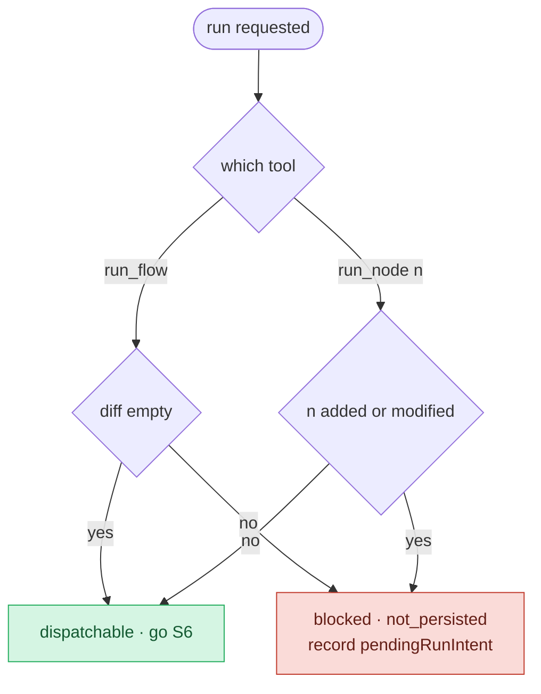

> A `run_node` on a node the draft **did not** touch fires immediately — mid-build troubleshooting is never over-blocked.

---

## 6. Plan lifecycle (S5) — draft to live

The accumulated draft becomes a reviewable plan and, on Accept, becomes live. The key insight: **the diff _is_ the operation set**, so "presented" and "applied" can never drift. _(§ S5 Plan lifecycle)_

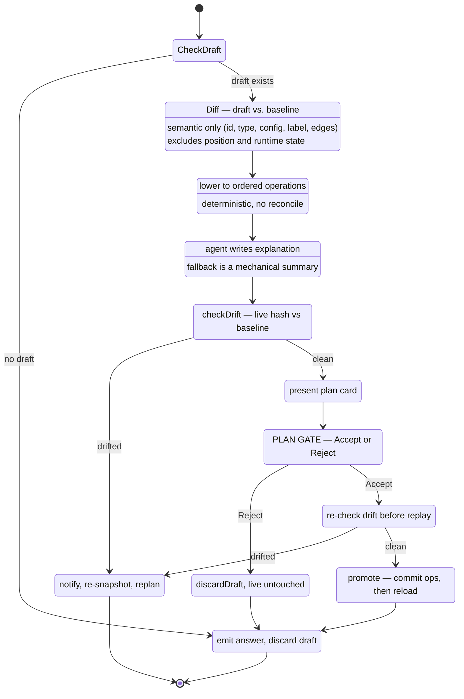

**What is (and isn't) in the diff:** _(§ S5.2)_

| Included — semantic, reviewable         | Excluded                                               |
| --------------------------------------- | ------------------------------------------------------ |
| node `{ id, type, config, label }`      | position (rides on the `add` op)                       |
| edge `{ src node/port, tgt node/port }` | run state, `inputData`/`outputData`, timestamps, `seq` |

---

## 7. Commit path (promote)

The only place draft structure becomes live. Ops replay **one at a time** through **awaited** human persistence primitives (via `CanvasBinding.persist`), teardown before build-up, so each server id is known before it is referenced and every write lands before the reload. _(§ The commit path)_

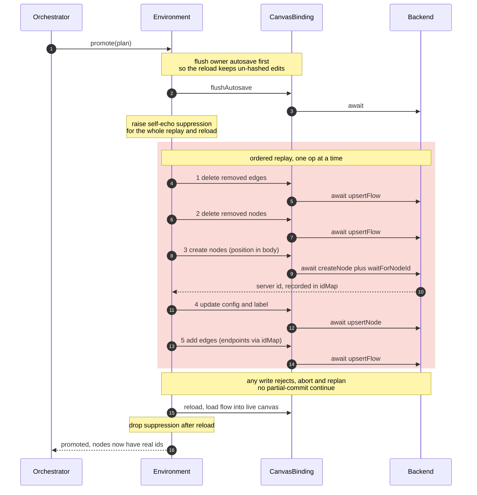

> **Revert is an id-preserving version toggle, not native undo.** Keep the pre- and post-promote snapshots; to switch, `diff(current, target)` and commit it — tombstone nodes only in `current`, **re-add nodes only in `target` by their original id** (the backend resurrects tombstones), update shared nodes in place. Ids stay stable, so edges re-key and run history / port refs survive. _(§ Commit path → revert)_

---

## 8. Run lifecycle (S6) and RunTracker

Runs hit the **live** flow, so they are gated — but **once per turn**, not per call. Dispatch is fire-and-forget at the API level; **RunTracker** turns the socket completion into an awaitable so one tool call returns a finished result. _(§ S6 Run lifecycle, § Run tracking)_

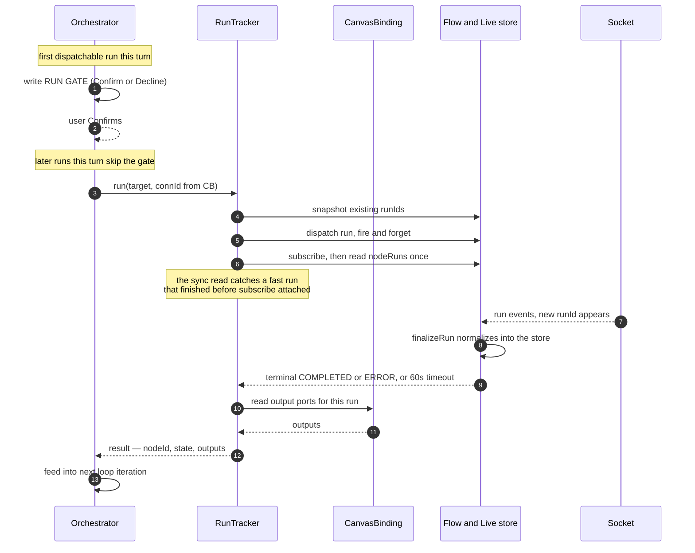

> **`run_flow` splits dispatch from wait:** the **dispatch set** is the input-stereotype nodes (the same derivation the human _Run All_ button uses); the **wait set** is the nodes that actually enter `RUNNING` (bounded by 60 s). Waiting on the dispatch set alone resolves too early; waiting on all nodes stalls on untaken branches.
>
> The socket **connection id** must come through `CanvasBinding.getConnectionId()` (a live getter) — it is React state that changes on reconnect and lives in no store. Without this bridge, every run times out at 60 s.

---

## 9. Concurrency and drift (owner + agent)

v1 supports only the owner + their own agent. The draft forks once, so live edits during a turn never corrupt the in-flight draft — the risk is only at **promote**. Drift is a change to the **semantic content hash** (position excluded, so a cosmetic drag never marks a plan stale). _(§ Concurrency & drift)_

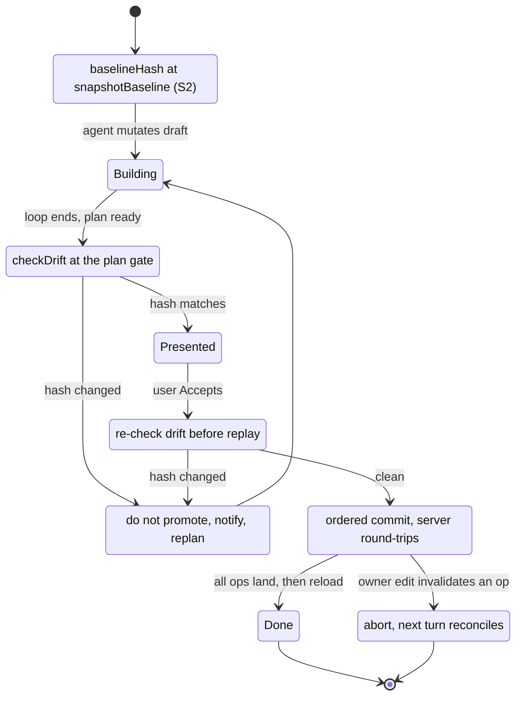

**Two free safety nets cover the dangerous cases:** the **pre-replay drift re-check** catches anything the owner changed between Accept and promote, and **abort-on-rejection** catches a mid-replay edit that invalidates an op (e.g. deleting a node a `connect` references). The residual case — a mid-replay owner edit that invalidates _no_ op (an add, or an edit to an untouched node) — would be silently dropped by the authoritative reload. Closing it needs a transient owner-lock (new UI machinery), so v1 defers it under the single-editor assumption.

---

## 10. Build-and-run in one prompt

"Build these steps and run my flow" in a single prompt. The trigger is **explicit, not inferred**: it fires only because a run was _blocked_ by the un-promoted draft and recorded as a `pendingRunIntent`. _(§ Build-and-run in one prompt)_

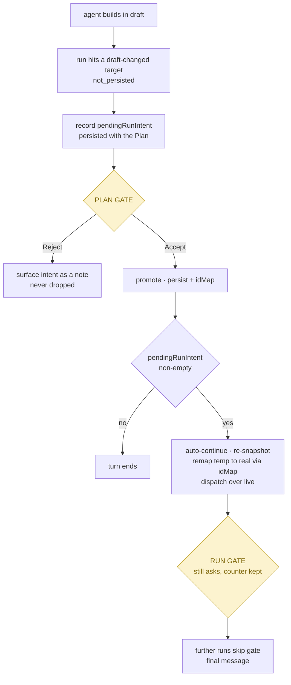

> `pendingRunIntent` is **persisted alongside the Plan** so a reload during the plan gate does not silently drop the "…and run it" half.

---

## 11. Gate — the shared suspend/resume primitive

Both the plan gate (Accept/Reject) and the run gate (Confirm/Decline) are the _same_ mechanism. There is one `pending` slot; the two gates are time-disjoint within a turn, so they never collide. _(§ Gate, § UI-sync)_

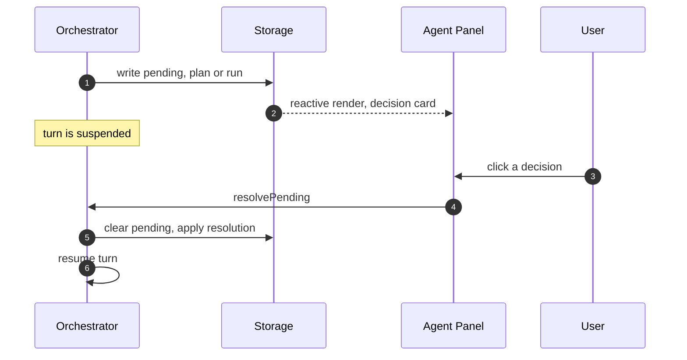

---

## The one rule — no persistent auto-approve

_(§ Locked decision 1)_

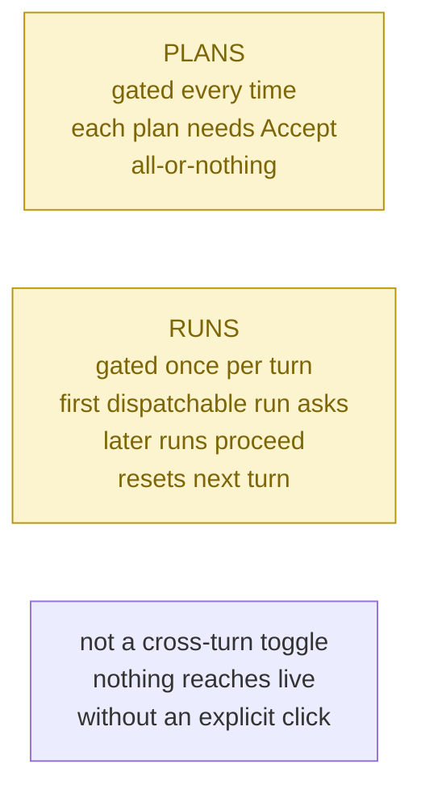
